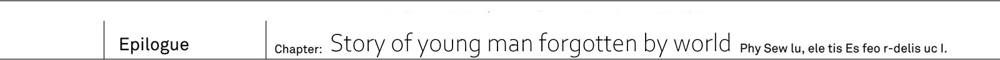
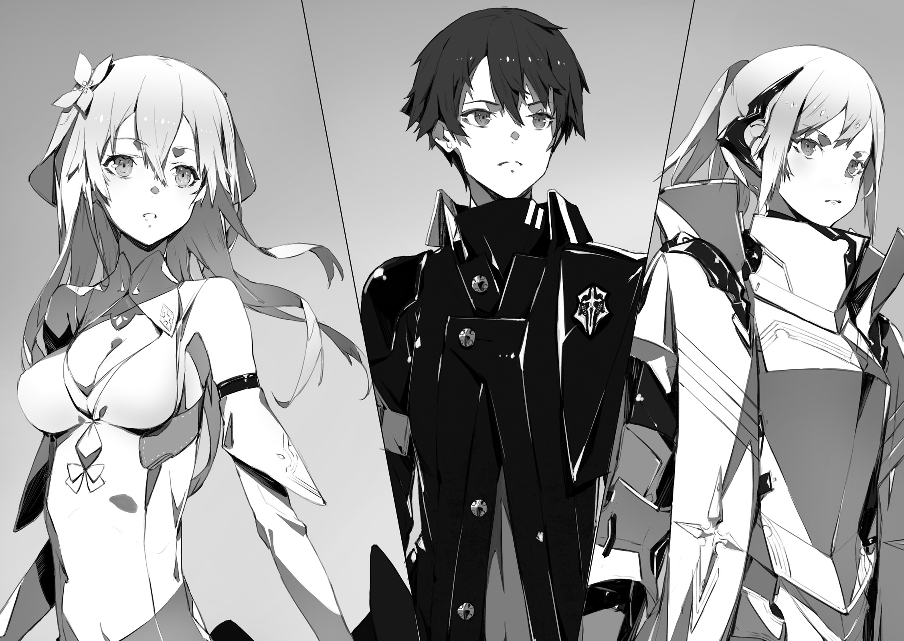

Demon Hero Dark Empress Vanessa fell...
Which lead demons to withdraw from Federation's capital.
News about humanity greatest [counter-attack] spread through Urza Federation in the blink of eye.
Moreover it even reached outside of its borders:

- To Schultz Resistance Army that fought against cryptids west of Federation;
- To Yurun Resistance Army that fought against spirits south of Federation;
- To Io Resistance Army that fought against foreign gods east of Federation.

Through Resistance Army, the news of Vanessa's fall will spread among humans on these territories.

On other hand Urza Federation Resistance Army...
As they accomplished recapture of capital, fatigue of fierce battles started to pile up on them.
Soldiers, who usually start their day as soon as sun starts to rise, showed no sign of waking up this morning.
And walking out of this sleepy camp...

"Thank you"

Capital Urzak, which was finally taken back after 30 years, completely changed.
Burned and destroyed buildings from war time.
And roads which were ruined by magical beasts.
From the cracks on these roads could be seen previously unknown plants.

"Even if it is only this ruined landscape, but it is thanks to you two that we're able to walk on surface.
And again thanks to you Demon Hero has been defeated."

Light Knight Jeanne, although wearing her armour, returned back to being simple 17 years old girl.
While her subordinates were dead asleep from fatigue of last battle, she took along her bodyguard Fairin on walk through capital avenues.

"Still, even though you played crucial role, you never showed yourself in public?"

"Well, let's leave it at that.
Truth to be told, when it comes to Vanessa, I doubt we'd be able to defeat her once more."

Responding with bitter smile, Kai exchanged glances with Rinne besides him.
Aside from Rinne's mixed race, Kai told Jeanne everything without trying to lie.
About his counter-attack using blackout.
About so-called rasterrizer monster.
And about Vanessa having the same memories about Great War as him.

"But I was able to learn something I needed to know."

Dark Empress Vanessa told that.

[With World Reincarnation happened, there is someone tampered with this world. Look for him!]

[He should be among three remaining hero.]

For both Kai and Rinne these words were shocking.

_I though it was us who fell under this [unusual phenomena]_

_And both me and Rinne just appeared in different world._

But if they'd believe Vanessa's words.
Then it was actually reverse, and the world itself fall under this unusual phenomena, while Kai and Rinne were able to escape it.
If that's the case then how should they resolve this problem?
Obviously by finding the culprit behind alternation of the world.
At the present moment, they had no leads, other than Vanessa's words.

"Kai, Rinne."

Jeanne picked up her pace.
As if in order to move apart from her bodyguard Fairin.

"Thanks to retake of this land, we will be able greatly increase our activity.
First we're going to move Resistance headquarters here.
And we'll be revive the landscape to look beautiful once more, like 30 years ago."

"Yeah..."

"...But still."

She then stopped.

"I think it will be done without me."

"What do you mean?"

"I will leave capital reconstruction to our staff.
Rather than me, who is so young, someone who knew capital 30 years ago would be more suitable for this work.
It should be fine without me."

"...Then..."

"What Jeannya is going to do?"

Besides Kai, Rinne, who was silent until now, looked straight into humans commander eyes.

"You'll retire now that demons are driven away?"

"No."

His childhood friend Jeanne looked excited.

"I'm planning to leave this Urza."

And then she turned around.
She was still wearing her armour.
But she decided to take off hair clip, that she used while pretending to be a male, and let her hair loose.

"There are three other territories remaining.
They are dominated by various other races: cryptids, spirits and foreign gods.
And there is resistance armies that fight against their dominance."

"And we're going to cooperate with other Resistance armies in order to help them develop large-scale strategies."

The last words were said by female bodyguard.

"Early this morning, we already had talks about united front.
News about demon hero fall set world on fire.
And..."

"I want you to come together with me."

Jeanne stopped for a moment.
There was standing government palace, glittering from morning sun light.

"I'm asking this as leader of Urza Resistance.
Kai, Rinne, you who were able to defeat Dark Empress, if it is you, then maybe you'll be able to do the same thing as in your world."

"...By that you mean?"

"Ending Great War."

With only four of them here, Jeanne placed her hand on chest as if declaring her plan to counter attack four races.

"I'll take command myself.
For you, who is our best war potential, I'll become the best commander.
That's why let's fight together, if it you, then I believe we'll be able to change the world."

"..."

"Ah... But of course I'll be sure to reward you handsomely! For example..."

"No, no, I didn't mean like I don't want to."

Interpreting silence as refusal, Jeanne quickly became flustered.
To her in such state, Kai responded with wry smile.

"I'm just surprised. You really became great, Jeanne."

"Eh?"

"You really became splendid girl.
The you that I know had quite an ambition, but still was kid that chased after dad's back."

"[Embarrassment sounds]!? What are you saying!?"

Jeanne cried in response, with red face.

"Just where you see a kid in me!?"

"Well, I'm telling you truth.
Even during training you would talk about private matters over communication device."

"Lies! Such world cannot exist, I always conduct myself properly..."

"Hope one day you'll be inclined to talk like that." _TL Note:_ I'm a bit unsure if he means here like original Jeanne or currently cute and embarrassed Jeanne :)

Moving from panicking girl, Rinne, who was besides him, showed quite fine smile on her face.
[Isn't it great?] - her expression was telling that.
Nothing would be more reassuring than Urza Resistance going to expedition.

_Both me and Rinne knows little about current world._

_Moving outside of Urza Federation territory would be certainly dangerous._

Actually, Kai would gladly welcome Jeanne's help.
It would certainly help in fight against remaining three heroes

"Rinne, you're ok with it too?"

"Yup, I'm fine as long as I'm with Kai."

Said girl who slowly leaned towards him.

"But, we need to revert this world back as soon as possible.
This world is somewhat scary."

"...Yeah, I know."

Kai nodded in response to girl who tightly hold onto his clothes.
3 heroes remained:

- Foreign gods have their hero **Heaven Lord Alfreyja**
- Cryptids have their hero **Fang King Rath=IE**
- Spirits have their hero **Spirit Sovereign Rikugen Kyouko**

Among these three, someone changed the world for his goals.

"Sid, surely you know, right...?"

Human hero was no longer in this world.

[<ruby>He<rt>Sid</rt></ruby> predicted that strange phenomena is going to happen with world.]

[It is something you do not know. There were hidden, forbidden _records_.]

Why Prophet Sid left Code Holder to his enemy.
Why Prophet Sid was able to foresee World Reincarnation.

_Sid..._

_Just what you knew these hundred years ago._

There was something in this world.
Someone, who definitely had ill intent, alternated the world.
And Sid was able to foresee it.

"I just have to do.
In your place, which is no longer belong to this world, I'll end Great War.
Which might be a bit too much for me to say though..."

With bitter smile, he looked up at towering the great building.
Urza Government Palace.
The proof of their fight.
There was evidence that humanity took back capital from hands of demon hero.

"I'll find the culprit behind it.
Regardless who it is, I'll not back down.
And..."

It was challenge.
To the next hero.
To mighty races that dominate this world.

"I'll take back our world.
I'll show it to you, <ruby>hero<rt>Sid</rt></ruby>."

This is a story of young boy, who has been forgotten by the world, and who is going to challenge the truth of the world.
This is the beginning of his adventure.

-------------------------------------------------------------------------------

Afterword
---

Thank you for picking “Why does no one remember my world?”.
This is author, Sazane Key.

How was the first volume of “Why does no one remember my world?”?

For protagonist of the story it is quite rough start.
Being forgotten by his childhood friend, and comrades.
Moreover as soon as he becomes aware, he gets attacked by demon.
And then he gets involved into battle for humanity survival.
But from now on I intend to create story of enjoyable travel and deepening bonds with heroines.

Step by step I want to do my best to create story of young boy challenging world's [forbidden].

Now then, the second volume is planned for October 25th.
You can look forward to story of travel with heroines and even more intense battles.
But there is still some time until October.
So if you'd like, there is another Sazai series I'd like to introduce you to.

Published by Fujimi Shobo

"Kimi to Boku no Saigo no Senjo, Aruiha Sekai ga Hajimaru Seisen"

This is heroic fantasy story about hostility between young swordsman and witch heroine.
It received quite positive feedback.
It is story on which I'd like to focus together with "Naze Boku" this year.

Kadokawa Novel 0 series

"World enemy" Latest second tome will be on sale at August 15th.

This is the story of humanity strongest hunter.
It is too well received series, which have been completed.
If you're interested, by all means try it.

"Kimi Sen" latest second volume is planned for July.
And "World enemy" latest second volume is scheduled for publication on August.
Both being well received, I'm sure book stores would be happy to get their hands on its.

Now there are not much pages left.
At last, I'd like to give my thanks.

To neco-sensei for creating most stylish and colourful illustrations for my work.

To my editor N-kun who continued to support me since my previous works.

And above all, I'd like to give my thanks to you, reader of this work.

Well, then I hope to see in second volume which will be published at October.

_At aftetoon of approaching summer, Sazane Kei_

TL Afterword
---

Well, so here we're at the end of first volume.
I tried my best to give as accurate as possible translation.
But to be honest with you, despite the story being quite enjoyable, it was occasionally very difficult job.

Why you may ask?
Because Sazane-sensei writing style can be quite difficult.
I don't want to be rude to him of course, after all I'm not proficient in japanese.
But some segments of story, on rare occasions, are impossible to translate properly.
So while I did my best to be as correct and literal as possible, some parts were phrased differently to make reading easier.
But I can promise that 95% of this translation is faithful to original, with remaining 5% requiring me to take another look.
And I'd like to apologize for my bad english, it is better than my japanese, but still it is bad.

Now how about I give you my impressions?

First of all, my translation was done in parallel with my reading.
Which of course somewhat dumped the enjoyment as I had to carefully read and translate each sentence.
But I must say that overall first volume quickly builds good foundation for story.
As sensei mentioned in his Afterword further story will resolved around two main topics:

- Building relations with waifus;
- Some intense fights;

Fun fact: both main girl and osananajimi are quite good girls.
In fact as far as I know both of these types tend to be utter shit, yet Sazane-sensei made them literally the best girls.

Personally I like the most Jeanne in both current and true world.
But Rinne is pretty noice too, I mean despite being quite short, first volume already built enough affection for Rinne.
And then there is Vanessa, with her unexpected twist.
Who would think that she is actually not exactly bad guy in the story?
Especially considering how badass she acted from the beginning.

For these who is sad about her fate...
It is but my guess, but I'm pretty sure we'll see her once more.
Who knows, maybe she'll have actual fun with hero-kun ;)

There is another comment I'd like to make: about illustrations.
I do enjoy neco-sensei style, but I found that in manga both Fairin and Vanessa made quite better.
Especially Fairin, who in manga retains her cool poker face.
On other hand I prefer Jeanne and Rinne in ranobe illustrations, so I wouldn't say manga 100% better.
But I do suggest to read manga which already covers first volume (at least I found this much scans online)
I also added quite a lot illustrations from manga, as there are just too many cute girls to miss :)

Anyway, next is Volume 2.
At the moment of writing there is already six volumes which means I have a lot to read and translate.
So you can look forward as I intend to continue translating as I'm reading this work.
