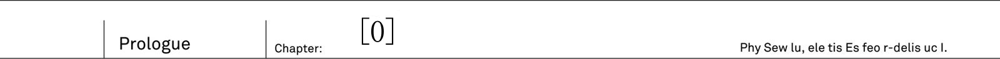
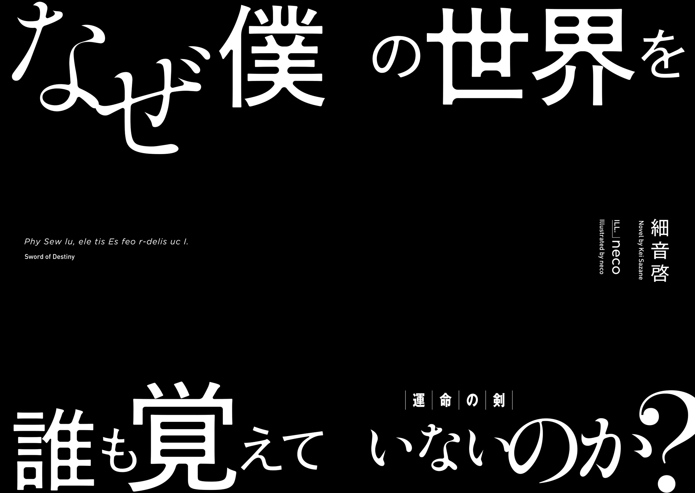

The maiden looked like an angel.
And yet she also looked like a demon.

On her back was pair of wings with jet black, like a crow, feathers at its roots.
But as you go on closer to edges, these wings were dyed in pure white colour of snow.

Gradients of black and white.
From the maiden's back, wings, that hold traits of both angels and demons, were growing.

If you'd compare her appearance... A tenma?
No, such race doesn't exist.
As far as young man knew: both angels and demons vanished from the face of the earth since long ago.
Then just who is this girl?

"----"

Chains jingle.
At the sound of chains that were binding the girl, the young man - Kai - came back to his senses.

The winged girl was bound to round pillar, as if crucified.
Both her hands and legs were bound by chains, so that she would be unable to escape.

"...m?"

Then, the girl who hang her head, raised her face.
Even though her eyes were covered by chains, she still felt the presence of approaching young man.

"Who is that... Over there...?"

The girl spoke in human language.
She, who is clearly not a human, faced him.

"Who, you ask..."

_Just who are you yourself_ is what he wanted to ask, but was unable to do it due his nervousness.
The young man swallowed breath and looked up

"Rinne"

"...Rinne? Is that your name?"

She nodded in response
In that moment, a drop of tear flow from her eyes.

"...Please..."

"Please?"

"...Help me. Remove these chains...."

Before she could finish the sentence, the girl lost her consciousness and her head hang down

_Help you?_

A non-human who is asking a human for help?
In known to him history, humans had to fight a great war against other races, including angels and demons.
So to say, there was a bad blood.
It is highly likely that the instance she is freed, her attitude will change and she is going to attack him.
If he is to consider his safety, she should be left alone until her true nature can be ascertain.
That is only natural, but...

"Got it"

The young man grasped a sword tightly in his right hand and approached the girl.
Even if it is a trap.

_I'm at my limit being alone in this world for so long_

Approaching the crucified girl, he carefully aimed, to make sure to not harm her, and swung down his sword.
With that, the winged girl has been freed.
Fragments of shattered chains have been scattered on floor, and then the freed girl has collapsed on floor.

"...Just what's going on? Where is here? Who is this girl?"

He lifted her in his arms

She is unexpectedly light, and just feeling of her soft skin made him to remember his hesitation.

_The young man who has been forgotten by world_

Kai gritted his teeth and cried with grief in his voice:
"Why no one remembers the true world...!"

