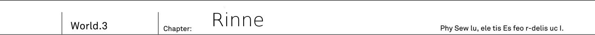
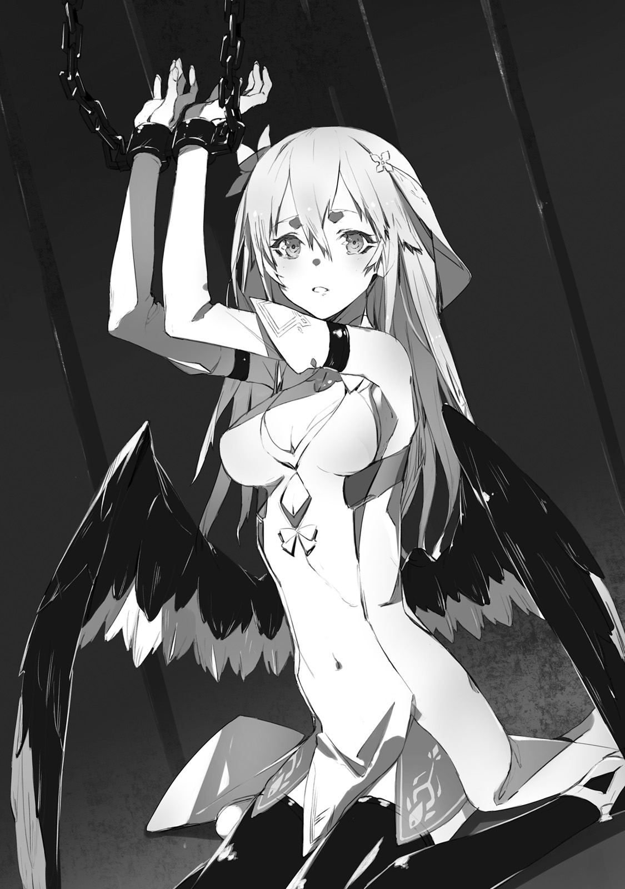

There was a blond girl, bound to a pillar.

"Please... Help..."

She pleaded with hoarser voice, that resembled a shriek.
To her desperate plea, Kai could not utter even a single word in response.
He was at loss.

_This girl..._

_Definitely not human, but what exactly is her race!?_

On her back, wings could be seen.
At their roots, her wings were black as colour of raven's feather.
But as you go on, her feathers become pure white as snow.
Gradients of black and white.
Demon? Or is she angel specimen from cryptid race?
_TL Note:_ Wait, angels belong to cryptid race? Might be author weird mistake or maybe Kai is being mistaken?

"Angel or demon..."

Tenma?
There is no such race...
But girl's wings makes it looks like a mix breed between angle and demon.

"..."

Chains jingle.
At the sound of chains that were binding the girl, Kai - came back to his senses.

"You... who are... you?"

Thinking that her voice didn't reach since there was no response.
She mustered in desperation to move her lips again.

"Who, you ask..."

Kai responded with strained voice.
It was him who wanted to ask that.
Just who was she to be here and in such horrible situation.

"...Rinne"

"Rinne? Is that your name?"

"..." - she gave a nod in response.

_TL Note:_ Well, illustration doesn't really reflect the actual scene it would seem.
As she was supposed to be have her body bounded to pillar and covered in chains.

"Please.. He..lp..."

"Hey!?"

Before girl could even finish, she fainted and her head hanged down.

_Helping her, huh? Guess she wants me to sever these chains._

_But asking me(human) to do that._

There is a chance that he would be attacked once he'll get closer.
It could be a trap after all.
But Kai hesitated only for a few seconds.

"...Got it"

He felt the same pressure as when he faced the demon at 9th Terminal.
But there was no malicious intent from this girl.
Still, he finally found some clue about this place.
Maybe she knows something about this place.

"I'm going to help you right now, but don't attack me."

Kai looked over at girl and raised his Drake Nail.
He aimed at chains that bound the girl, by the name Rinne, to pillar.
And swung down with all of his strength.

Sound of metallic clank could be heard.
As the sound echoed through the place, Kai opened his eyes.

"It is this hard!? What kind of durability is that!?"

Despite these chains being no thicker than a finger, under the Drake Nail attack it didn't even had a single crack.

"Then..."

He placed his finger on trigger and swung bayonet downward.
At the same time bright red spark appeared at chains and started to expand.

Simplified Drake Bullet exploded.
To avoid injuring the girl, he moved to the back of pillar and aimed at chains there.
But, from a dense smoke emerged chains without a single crack on them.

"...Impossible..."

The explosive power that could bring down even demon, couldn't even scratch it.
These chains, which looked so thin that even could be torn apart by his own hands, were so thick as if under spell.

"If it doesn't work, then how I'm supposed to do it..."

In Kai hands was only his bayonet.
If it is not enough, then how he is going to destroy these chains?

"...Wait a sec. There was this voice before."

At that time inside graveyard, aside from Rinne's he heard some other voice of old man.
That voice said to not let go of sword.
That's sword name is...

"Code Holder?"

_TL Note:_ jp. `世界座標の鍵` I'm still not sure if furigana Code Holder is for `鍵` part too, but for now I decided to omit it anyway.

In that instance.
The bayonet in his right hand, started to shine like a sun.

"Hot!?... This is!?"

Drake Nail started to emit light.
It's dark blade become semi-transparent.
Both gun parts and guard of his sword too somehow transformed into Sid's sword which he saw in graveyard.

_As if responding to sword's name, it transformed._

And after it settled down.
In Kai's hand was Shining Sword.
This semi-transparent blade looked as beautiful as most expensive jewel.
And also like a big key.
If Drake Nail couldn't even scratch these chains, then how about this hero's sword...?

"Please!"

He swung down Code Holder.
Sound of metallic clank could be heard.
With the sound of bells ringing, the fragments of chains fell down.
Dazzling line severed chains that bound girl.
Winged girl was falling down.

"..."

"Hey...!? What happened? Where is this place? Who is this girl?"

Kai grabbed the falling girl who lost her consciousness.
Her body was surprisingly light.
And as his hands touched her bare skin, he become almost flustered.
He decided to lay her on floor.

"This girl ears" - He looked at her again and noticed - "are elf's"

Under her silky golder hair could be seen ears that were a bit rounded like that of humans.

_Elf's ears? No, If memory serves right they should be longer._

_It feels like something between elf's and human's_

She had elf ears, and then on her back were wings like that of angel and demon.

"She has features of elves and angels which belong to foreign gods I think.
Then she is half between demons and foreign gods?
Still, other than she looks like a human..."

Yes, surprisingly the fallen winged girl looks like a human.
She has lovely and charming appearance, with cute cheeks and small lips.
He can also feel allure of young girl from her.
Her chest, which moves up and down with each breath, is surprisingly stands out for her delicate figure.
Back of her white clothes has curve that shows her wast.
If it wouldn't be for wings, one would think she is 16 years old young girl.
To add, she had mysterious charm.

_TL Note:_ I must say, author description of girls is sometimes quite weird in their details.

"Is she a mix between human, foreign gods and demons? No... That's impossible"

There were no cases of children being born from parents of different races.
Then, what about this girl Rinne?

"...Ugh...Ugh..."

Her body started moving and her shoulders slightly shake.
Afterwards, her closed eyes started slowly opening.
The pair of eyes, that were looking at him, had colour of deep green, just like jewel.

"Hey... Did you wake up?"

"...."

Her eyes were wide open.
Surprisingly, the girl stood up with angry expression on her face.

"Vanessaaaaaaaaaaaaaaaa!
How dare you to lock me up
I still haven't lost to you!"

Girl's wings spread her things and pointed towards Kai.
She looked like she was preparing to fight.

"Do you think such weak pawn of yours could stop me!?
Don't joke with me!
Stop hiding and shows yourself, Vanessa!
Aren't you demon's hero!"

"Eh!? Wait a bit!"

"Real fight starts now!"

The girl shouted the name of Dark Empress Vanessa.
The name of demon who ruined Federation's cities.

_She has grudge against demons..._

_But why she points her anger towards me!?_

"Wait, it is misunderstanding! I'm not demon, in first place you..."

"Shut up!Shut up! Bring Vanessa here right now!"

She violently shakes her neck and rises both of her hands.
From palms of her hands, circular patterns of various colours starts shining.

"Magic!?"

But what is this exactly.
It is different from magic of various races.
In case of demons its colour would be black or purple.
And both elves and angels would have white colour.
At least that is what been known from Great War records.
But what is this mix of dozens, no, hundreds of colours on top of each other.

"Lowly demon, such as you, is not a worthy enemy for me!"

Light of this magic started fired off.

"Ugh... Elf bullet..."

Kai prepared his bayonet, but then he froze still.
Drake Nail started changing into Sid's sword.
Aside from _simplified elf bullet_, that was stored in his bayonet, he had no means to oppose this magic.
Magic's light filled his vision.
And in that moment...

"Code holder severs the _Fate_. Now, cut fate of meaningless deaths out of the world."

To his surprise, gentle female voice could be heard from the sword.

"Ugh!"

There was no time to ask questions, so he swung Code Holder.
Sid's sword.
The shining sword cut in half Rinne's colourful magic.

Like with a sound of ringing bells magic has vanished.
As if it was a dream, sparks of her magic disappeared one by one entirely.

"...Magic vanished?" - said Kai who swung the Sid's sword himself.

Sword that can cut magic.
Any magic that is directly hit, as if it wasn't even there in first place, vanishes.

And then the girl who fired the magic:
"...Impossible."

Rinne was standing still in shock.
Kai looked over Code Holder in his hand.

"What was that!? Since when you damn demons use such weapons!"

"I told you already, I'm not demon"

"Eh?"

"Completely lost your sense and couldn't even hear me...?
Look, I'm human, don't you see?
No demon's wings or tails."

He spread both of his hands to show it.
It seems all of her anger started to fade.

"I helped you, so I'd hope you understand that I'm at least not your enemy."

"...You, helped me?"

"Who else you think? There are no one here except us."

"..."

She started folding back her wings.
Now Kai wings were almost no longer visible, which he interpreted as her no longer being hostile.

"I'm sorry, due to my grudge against demons..."

She started to apologise with shivering voice.
But quickly girl groaned and fall to her knees.

"Are you dizzy...?"

"Yeah. Since I've been unconsciousness until now and seeing bright light." - answered Rinne who moved her hand up to gesture towards her forehead.

She is definitely not human, but that gesture was so human-like.

"Before you mentioned Vanessa, did you mean demon's hero?"

"..." - Rinne gave a nod.

"She is the one responsible for locking me up here.
That's why I thought here would be only her underling."

"And just where you saw a demon in me?"

"I had no idea! I...am different from other races, so I was bit uneasy"

Saying that, Rinne's wings became so small that were hidden behind her golden hair.

"If you're different, does it mean you're not demon?"

"Tenma..."

Coincidently, the name, Rinne gave, was the one that came to Kai's mind.

"...is what they call it"

"That sounds like, it actually has different name"

"Isn't it fine!? Race doesn't really matter, ok?"

Rinne shouted.
She doesn't want to touch this subject.
As if she was thinking so, pupils of her eyes were quickly moving.

"Allow me to thank you for saving me.
And I'm sorry for attacking you.
But about race... I'm not going to talk.
This is not a pleasant subject for me."

"I understand"

"I'm glad to hear it"

Her response felt as overly polite.
But seeing her relaxed face, made Kai think that she was being honest here.

"Hey, human, you're...?"

"Kai"

Trying to not show a bitter smile, Kai gave her name.
Certainly it is his race, but he finds it difficult to be called like that.

"I'm not used to be called human"

"...I'm Rinne"

Seems like she doesn't remember giving her name already when she was bound by chains.
And introduces herself once again.

"There is something I'd like to ask.
Where are we right now?
You mentioned that you fought with demon's hero.
And then got locked up here."

"Yeah, but I don't know where we are exactly."

Rinne looked behind her at the pillar where she has been bound until recently.
And then, as if being vigilant against something, she looked around.

"I had one-to-one fight with Vanessa, and then I've been locked up here..."

"One-to-one!?"

Rinne said something unbelievable.

_Her opponent was demon's hero, wasn't it?_

_Not only fighting against such opponent, but even surviving is quite unbelievable._

In addition to being locked up here, she also has wings of demon and angel.
Considering she doesn't like talking about her race, it is not difficult to imagine that Rinne is quite special existence.

"...Could it be, you're pretty strong?"

"Fufufu, am I not cool?"

Rinne puffed up her chest with pride.

"I'm pretty strong.
I can single handedly deal with big group of demons, if there is no strong ones among them"

_TL note:_ Let's be real, that's not actually all that impressive.

"So you used this strength in your merciless attack against me?"

"Didn't I already apologise for it!?
Really, it was just misunderstanding."

Both her face and ears became red.
Her elvish ears bounced sideways, likely because she is upset.

_TL Note:_ Don't really get this part about her ears: `エルフに似た耳がぴょこんと横に跳ねたのは`

"But that was really dangerous.
I thought you were Vanessa's underling so went all out.
I'm glad you were able to defend against it."

"What would happen if I wouldn't be able...?"

"Well, you'd be minced in like hundred small pieces..."

"Isn't that overkill!?"

"Hey, hey, but how you were able to defend yourself against my magic?"

"M? Well, truth to be told I'm not sure myself, but..."

He glanced at hero's sword.
It is believed that once Prophet Sid thought with this sword in Great War.

_I always wondered how exactly single sword was enough to challenge four heroes..._

_Guess I got my answer just now._

Sword's voice said to use it to cut _Fate_.
And with that he cut down Rinne's magic _fate_ of killing him.
It is certainly unbelievable, but there were already so many strange and abnormal things going on...
There is no choice but to accept this as it is.

"I think this sword..."

"Yeah, this sword...?"

Behind the Rinne who were nodding in encouragement.
Out of nowhere dark whirlpool appeared in air.
And it started to expand.
From there _something_ appeared.

"Fate idiosyncratic body ■■■ is awakening. Risk to New World is estimated as the highest."

"Initiating sealing process with rasterrizer..."

The girl, whose body is covered with various cracks just like that of ravaged marionette, appears.
Her appearance resembles that of human.
But on her right shoulder is tentacle that resembles body of snake.
And on her back could be seen skeletal wings.
While her face feels quite similar to Rinne, she is different from Rinne.

_She is different from Rinne..._

_What is this shivering feeling?_

Even holding Code Holder, he couldn't suppress his shaking hand.

"This thing!"

Rinne raised her voice and jumped away.

"This thing... appeared when I've been fighting with Vanessa.
And then it locked me up here."

"Then it is demon?"

If it is Vanessa's servant then it is without doubts a demon... But was it really so?
If this monster serves Vanessa, it is strange that there were no information on it in their records.

"Let's run! There!"

Rinne made a quick decision.
She beckoned him towards back of three pillars and they run towards it.

"I've been dragged here from the back of altar.
There should hole..."

But then shadow appears over Rinne's head.

"Rinne! Above!"

"...Eh?"

There appeared another black whirlpool.
From it monster's right tentacle emerged with terrific speed.
Before she could even react, she has been caught by it.

"Fate idiosyncratic body ■■■ is captured"

Girl's scream echoed through the place.

"Commencing Zero Code"

_TL Note:_ Check following section with original

Myriads of black whirlpools appear.
Hundreds, thousands of mini black holes, that were used by monster, appear.
Instantly they all follow towards Rinne.
Then they start erasing her.
Her body, as if being rubbed by eraser, starts disappearing.

"Ah... AH!? No... Nooo!"

Rinne moved her hand towards Kai, as if asking to save her.
But soon enough her hand were covered by this black whirlpools and disappeared.
If it remains like that, her body will completely disappear, just before his eyes.

"...Don't joke with me!"

His anger surpassed all of his fear.

_In this ridiculous world..._

_Right before my eyes is real monster... But so what!_

There he had hero's sword.
And Kai himself desperately trained for the day when he'll have to face powerful non-human enemy.
Regardless of what kind of enemy it is, he only have to fight.
It is only natural yet he...
He was only angry at his weak self cowering in fear.

"I'll stop you myself!"

He tightly gripped his shining sword.

"Sid, I'll borrow your sword!"

Kai readied his shining blade, and aimed his swing at monster's tentacle that captured Rinne.
...Free Rinne!
Flash.
Like clouds, black whirlpools started moving away.

".....!?" _TL Note:_ Monster surprise

The monster, whose tentacle has been cut off, staggered.

"Code Holder... World's will... Forbidden's sword... Why here...!?"

"Here, Rinne!"

Kai pulled her in, without waiting.

"Can you run?"

"...I-I'm fine!"

"Let's go then! We don't need to deal with such monster!"

While holding her hand, Kai dashed towards back of the altar.
Towards where Rinne pointed previously.
There was...

"Here it is!"

Rift of light.
Kai and Rinne jumped into this floating door.

-------------------------------------------------------------------------------

Demon's graveyard.
In a blink of the moment, Kai found himself standing in dim halls.

"Hu..h... We escaped...?"

Will this strange monster follow us?
There is no sign of its appearance.
In this quiet darkness, only Kai and Rinne rough breathing could be heard.

"Rinne?"

She was laying down unmoving, or so he thought when...

"....!"

Rinne jumped and hugged crouching Kai.

"....It was scary... my...body...it was chilling..."

She was almost crying.
Rinne was shaking while clinging onto Kai's neck.

"Really... It was really...So...Scary..."

"..."

"...I'm...Not...Lying..."

"Yeah, Same here. I too felt it was quite dangerous."

Kai put his hands on clinging girl's back.
Couldn't blame her for it.
Being attacked by such monster.
If by any chance he would be few seconds late, Kai couldn't imagine what would happen.
Being shaken by it was only natural.

"Let's rest for now. Until you'll calm down."

Rinne remained silent.
She responded with a nod, and her hands, that were clinging onto him, tightly grasped with even more strength.

"...Warm..."

She muttered eventually.

"Mm?"

"It is first time... Something like that happened to me..."

He guessed that she means feeling another's body warmth.
But regardless he decided to ask.

"Friends?"

"No such thing."

Her response was pretty short.

"I always... been alone...
Friends... Parents... Nothing, I never had anything like that.
Before I became aware, I've been alone"

"..."

_Being alone in this world._

Kai frown hearing Rinne's words.
He already experienced on his own.
The pain that she felt, he felt it too.

_TL Note:_ A bit weird one `この少女の苦しみが痛いほどに伝わってきたからだ`, not sure if I understood it correctly.

_What a irony?_

_I'm not the only one._

Being cast aside by the whole world.
Who would expect to meet someone, who shared this pain, here.

"I... Have no idea about my own race.
That's why I've been always alone.
Because foreign gods, spirits and cryptids, all say: you're different."

"Demons too?"

"They are most cruel.
Disgusting hybrid is what they call me.
And there is no way we could have common ground.
So I had a quarrel with demons."

Which led to fight, eventually one-to-one against Vanessa.
This is more or less sums up her history up to now.

"I'm the same."

Hearing that, Rinne, who were embracing him, looked up.

"Kai too? But you're human, aren't you? There are lots of humans out there."

"There are no people I know.
I've been left alone.
So it is kinda similar."

His childhood friend Jeanne, his colleagues Saki and Ashlan.
All have forgotten about him.
In this world, his whole existence disappeared.

"...Left alone? Did they all die?"

"No, no, they are doing good.
It is just, no one remembers me.
Well... Maybe it is me who became strange."

"What do you mean?
Kai is pretty normal, no?"

"Well, If I'll say it, you're going to laugh."

"I'm not going though?"

Rinne, who were embracing him.

"I'm not going laugh at you, Kai. Because you didn't laugh at me too."

"...I don't believe that mankind lost."

Kai shook his head and continued.

"I remember it perfectly well.
Humans were the one who won Five Races Great War.
But I would never think that history would suddenly change.
Now humans lost.
Instead of humans, our cities are now occupied by demons."

"Eh? Wait, Kai."

Rinne stopped embracing him.

"What is going on? Demons are doing as they please..."

"M?"

"When I've been fighting Vanessa, nothing like that were happening..."

"What do you mean?"

"I mean demons occupying human cities.
Never heard about it happening."

She were spacing out in silence until some idea hasn't come to her.

"I think I remember it more or less like you.
Just before my fight with Vanessa, humans should have won in Great War, I think."

"How so!?"

"Because of human hero... I think. Well, Kai should know more about it, I think?"

Unbelievable.
Who would think that he would think such talk from Rinne, who was even of different race.

"Among humans appeared someone really strong.
Even demons were wary against human hero..."

"You know about Sid!?"

"Kya!"

Kai were holding Rinne now.

"Rinne, did you see Sid!?"

"Wa-wait Kai... Don't know him.
Never was interested in humans."

"Ah... Yeah I guess it is also true."

But in this world, both Saki and Ashlan said that no human hero exist.
So then Rinne, who knows about him, should be from the same world as him.
There is proof that his memory of history is not wrong.

"Kai?"

"...I'm glad..."

He moved his hands from Rinne and looked at ceiling.
Kai was relieved, his memories are not wrong.
There is a person who knows about the same history as he, himself.
Finally he was able to meet her.
In this absurd situation where humans lost war and demons occupied their cities.
Finally he was able to find at least one person.
Comrade who could understand pain of his solitude.

_TL note:_ I'm pretty sure she doesn't give a shit about humans losing war though... But oh well, let guy to dream :0

"Kai? What are you glad about?"

"We're comrades, comrades who share the same memory."

"...Comrades?"

She seemed lost at what to do.
Not surprising.
Until now she never saw her parents or the same kind.
And then suddenly meeting human who calls her a _comrade_.
It wouldn't be surprising being confused with just that.

"I'm relieved.
Just as you've been saved, Rinne,
your embrace saved me too."

_TL Note:_ This is weird, I'm not sure about it's correctness `ほっとしたってこと。さっきリンネが、助かったって俺に抱きついてきたのと同じ`.

"...Is that so?"

"Yeah, it seems now both of us are no longer alone."

Prophet Sid exists.
And the history where Sid brings victory in Great War is not wrong.
Even if all humans forgot truth, both he and Rinne knows correct history.
Comrades that share the same memories."

"...I'm no longer alone?"

"I'm here now. Not sure how reliable am I, though."

"..."

Rinne starts staring at Kai.
While crawling, she suddenly brings her face closer.

"...What is it?"

"You're the first to say such thing to me."

"I'm the same, it is first time I said such thing."

"I see..."

Saying so, Rinne smiled.

"Then, we're together, right?"

For her it was first time to show smile, so it was clumsy.

_TL Note:_ I think Kai just grabbed 99% of her flags, not even being aware of it.
