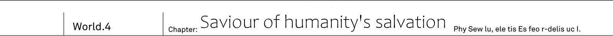
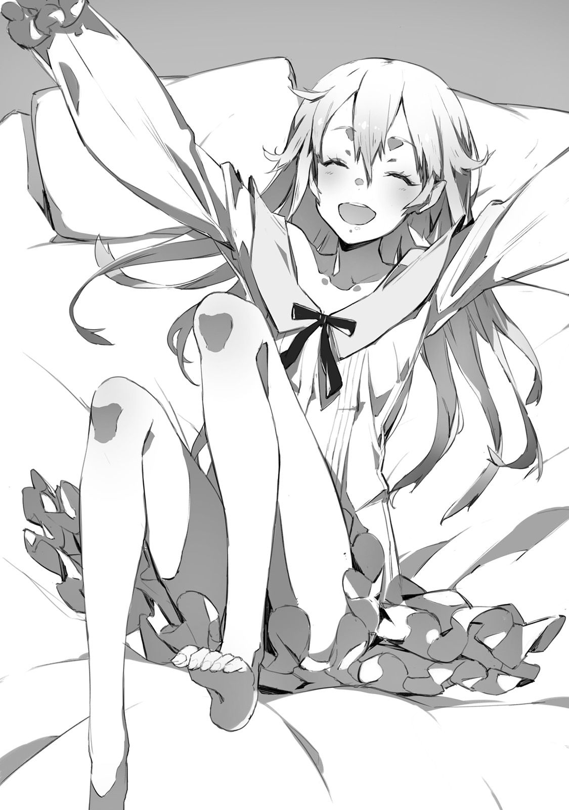
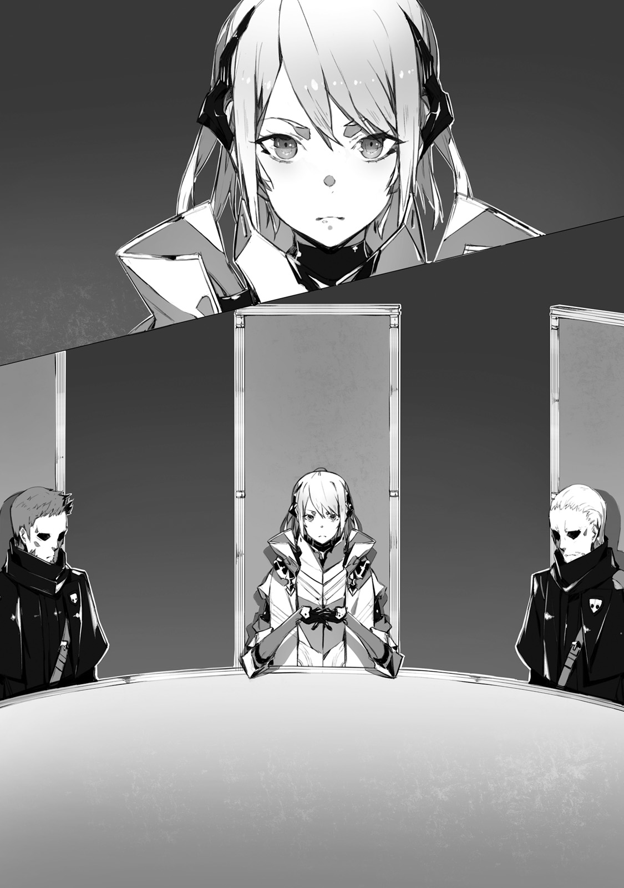
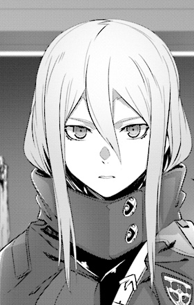
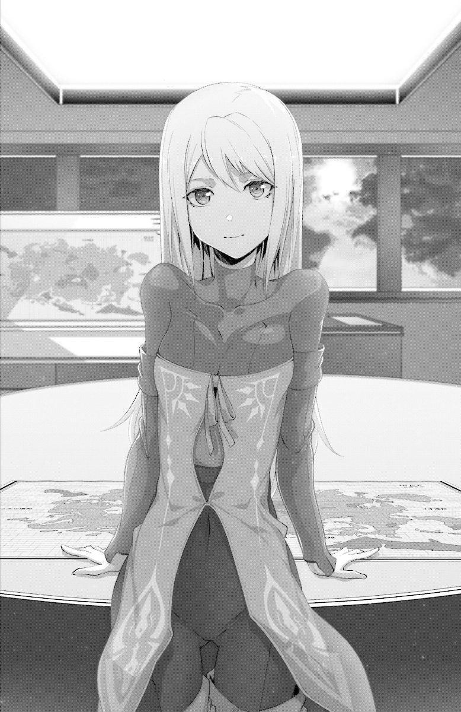
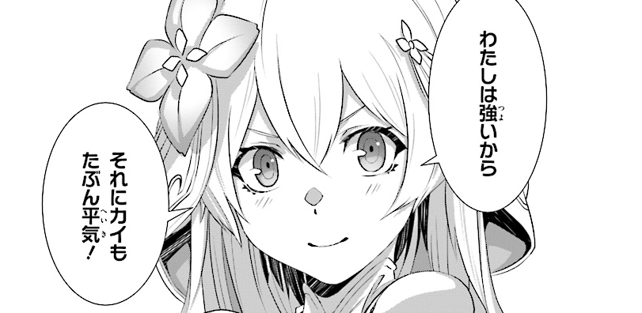

_TL Note:_ Chapter's title may need re-work `救いがたき人類を救うもの`

Outside of black pyramid.
He quickly shut his eyes on reflex from sunlight in the west.

"...This is not dream, everything is real."

Finding Sid's sword inside graveyard.
Freeing Rinne from that place and then escaping from the strange monster.
No one would believe such story.

"Even I still feel like I'm half asleep."

But it is undeniable truth.
After all, the girl herself is following him behind.

"Ugh, it is so bright! It is been a while since I saw sunlight."

Covering her eyes, Rinne exits the graveyard.
Under her golden hair could be seen pointy ears.
On her back are tenma's wings.
Mix of foreign god, demon and human.
At first glance she holds characteristics of these three races.

"Hey, Kai, where we are?"

With puzzled look on her face she starts looking over desert.

"This is desert in Urza Federation.
It is in northern part of continent.
You don't remember?"

"...No, I don't. I've locked up all this time."

Rinne looks over horizon from one end to another.

"This is where demons rule, right?
I don't see them around though."

"Majority of demons live in human cities.
In this place you can only find few of them."

This is what he learnt from Resistance's data.
Demons established their stronghold in Urza's capital Urzak.
And it is also the place where human slaves are living.

"This country's capital became stronghold of Vanessa, against whom you fought.
It is quite far away, but there still can be few of them."

"...Hey."

She folded back her wings and looked at sky.

"Kai, what were you doing up until now?"

"Me? Well, I was planning to come here, investigate graveyard."

The very moment he answered, before his eyes winged girl started to stagger.

"Rinne!? Hey!"

And just like that she fell to her knees and then collapsed onto ground.

"...Oh? It is strange, I feel weak..."

Her voice was trembling.
She tried to get up, but only collapsed once again.

"I suspect it is because you've been crucified all this time.
And then starting walking all of the sudden."

"...I, can I even stand on my own?"

"Don't be reckless."

He moves to help her to stand up.
He felt that she is so weak, as if she was just like a newborn baby.
Despite lending her a shoulder, her legs are still shaky.
Kai looks at her for some time in this state.

"Rinne, if you have nowhere to go, then let's come to my place together."

"At yours, Kai?"

"In your worn out state you cannot even stand without my support.
It is just impossible not going together.
Besides in our city there will be no risk of getting attacked by demons."

"...Me? Coming to human place?"

Her tone changes, likely because of this unexpected suggestion.
She casts her eyes down and thinks in silence.

"...Don't wanna."

She answers trying to imitate her vomiting blood.

"I cannot trust any of the races.
Demons, foreign gods, spirits and cryptids...
As soon as I'll get close to them, they'll sniff out that I'm _different_."

"Humans too?"

"...Yes, too... I don't like them."

"What about me?"

Rinne hesitated.

"...Kai... Helped me so..."

"Then I'm ok, right?"

"But, only Kai, other humans are different!"

"Then you only need to trust me.
If you'd think I'm lying, it is fine to just turn back for you.
That's would be more than enough."

"..."

Rinne said nothing and only gave silent affirmation.
Kai left graveyard and followed towards armoured car.

"I saw this thing before, it should be able to move?"

"It saves time to explain then.
Rinne, sit besides me.
Yes, yes, at this passenger's sit."

Wheels started turning and car went on.
Rinne who experiences _ride_ for the first time has become blue and sweat falls from her as waterfall.

"Rinne? Hey, Rinne?"

"W-wwhat! It moves! It moves and my buttocks feels itchy and unpleasant."

"It is vibrations from wheel's tire.
You'll get used soon."

"You lie! Even if it is Kai, I don't believe you... Stop and let me offffff!?"

Rinne, who was sitting besides him and forced to enjoy this ride, started shouting and screaming.
And at the end she started clinging to Kai, who were currently driving.

"Help me, Kaiii!"

"Wait, Rinne, be careful where you're stepping!
And don't touch lever! Car is going..."

Soon enough their screams echoed through the desert.

-------------------------------------------------------------------------------

<a href="#Part2" id="Part2" class="Bookmark"></a>

Urza Federation, 10th Terminal.
The armoured car is going through group of ruined buildings in town.
They ought to be vigilant as demons patrol it.

_There is high chance to get tailed by demons._

_Saki and Ashlan reminded me to make sure to not be found out_

The entrance to human city cannot be exposed.
So he had to be vigilant against being tailed while driving.
Now, Rinne can sense demon's magic power.

"Rinne, how is it?"

"It is ok. I do not sense demon's magic power." - said Rinne in passenger's seat.

She calmed from her first riding experience,
now she was peacefully sitting on her seat.

"Hey, Kai, there is a place where humans live?"

"Yeah, we'll see big building pretty soon, and we'll use it's underground to reach town."

"...It really become like that."

Roadway full of cracks.
Rinne reaches out from her seat to look at scenery filled with mountains of rubble.

"When I've been fighting Vanessa, demons were living at volcano in east."

"I, too, remember it like that."

Originally demons lived around around volcano.
At least that's how Kai's organization, MDA, records tell it.
His assumption was that at the time, which MDA's records about Great War were describing,
Rinne's fight against Vanessa has also restrained demons.

"Kai, you said that world has _changed_, didn't you?"

"Yeah, aside from Rinne no one believes me, though."

While they were in the car Kai told Rinne the story up until now.
From that time, when world suddenly changed.
Buildings, roads, people and everything else were sucked in air.
And from that moment humanity victory in Great War changed into defeat.

"Until yesterday, I still had my doubts.
But meeting Rinne cleared them all.
I'm not going to waver any longer."

"Waver? What do you mean?"

"This world is not ours.
We're in the world where Great War result has been reversed.
This is what I believe."

Now there he has a comrade who shares the same history, Rinne.
Her existence made him more confident.

"Anyway it is story only between us.
I think history, that both of us remember, is right one.
The history where human by the name Sid exists."

"Then what about the current one?"

"I think we can consider this world, where history is different, as world of _<span title="jp.別(different) but I think false sounds better">false</span> history_."

True history, and false history.
Without doubt the main difference between these two is "Prophet Sid existence and non-existence".
The world where Sid existed and Great Was has been won hundred years ago.
The world without Sid, where we lost chance to counter attack and 30 years ago suffered a defeat in Great War.
At that time it is highly likely that Kai witnessed phenomena of these histories being swapped.

"Rinne, do you like this world?"

"I hate it."

The girl strongly affirmed.

"What I hate the most is demons, and next would be foreign gods.
Both calling me either _disgusting_ or _cursed one_.
For these guys controlling the world?
No, thank you."

"Then..."

"We gotta to escape from this false world, right?"

"I'm not sure if _escape_ is the right word here.
But we certainly need to return to the world with the history that we remember."

Why such change happened to the world?
It is certainly not possible with human technologies.
Then it is work of someone else.
The first who come to mind are four races.
Among these non-humans are lot of people who holds strong magic power.
It might what makes such phenomena is possible.

"Rinne, do you think it is work of magic?"

"I'm not sure.
There are a lot of different magic among Spirits.
But I don't think that's the case..."

_TL Note:_ A bit unsure about this dialogue. `わかんない。聖霊族の法術に変わったものが多いんだけど、違う気もするし`

Rinne suddenly stopped talking and raised her head.

"I <span title="jp. 臭いがするcan be translated as she feel their smell but it is weird">feel</span> humans?"

"We should be there soon.
I'll have to park car once we arrive."

Kai circles behind 10Th Terminal, parks car among piles of rubble and takes off Rinne.

"Underground here is human city
Well, I only came here yesterday myself."

Rinne was looking around.
Seeing her standing like that, Kai's gaze falls onto her wings.

_In Rinne case there is matter of wings._

_She is wearing some elven clothes, but should pass as some strange outfit._

Rinne's peculiar tenma wings.
And also her elf-like ears.
Well, ears are not a serious problem since they can be hidden by her golder hair.
The problem is her wings being quite noticeable.

"Let's put on my jacket on you and hid her wings. Once we'll arrive at my hotel..."

"Should I hide my wings?"

As she said that, her wings quickly started to get smaller until it no longer could be seen behind her clothes.

"Eh!? What happened?"

"I made them super small, so that no one could see them."

To surprised Kai, Rinne gave devilish smile.
Since she had no friends among <span title="I'm not sure if it refers to her races or other races, but latter is more likely">races</span>,
someone's surprise reaction might be new to her.

"Hey, hey, isn't it cool?"

"...Yeah, it is very cool."

"Prise me more!"

"Are you kid? Let's go, we shouldn't attract attention of demons here."

To Rinne, who was full of pride, Kai responded with a wry smile, and pointed towards building's entrance.

_TL Note:_ Clearly he missed nade-nade flag here.

-------------------------------------------------------------------------------

<a href="#Part3" id="Part3" class="Bookmark"></a>

People who escaped from non-human races dominance, settled on continent's frontiers and created human cities.
Wastelands of ruins, deserts, or distant valleys.
And here, in outskirts of Urza Federation's capital, was city _Neo Vishal_, built in underground subway.

"We're here. This is the hotel where I'm staying since yesterday."

This was the only hotel in the city.
It was built for Resistance's army needs.
On the road, they could see people walking in soldiers uniforms.

"Rinne?"

He suddenly felt her soft skin touching his shoulder.
Turning back, he saw Rinne clinging to him.

"N-no g-good, Kai! You cannot leave me alone, it is dangerous here!"

"Dangerous?"

"There are too many humans! Someone might come to eat me."

"No one is going to eat. Just look, no one suspects you, Rinne."

Although Rinne glares at coming guests, they don't really notice her glares.

"Told you, if you hide wings and ears, it will be all right."

Right now Rinne looks just like lovely human girl.
Thanks to elven blood, she was beautiful girl with transparent like white skin.
As a matter of fact, being hugged by her in public is actually making him embarrassed.

"...Rinne, I'd like you to not cling so much to my arm. We're really standing out."

"Got it..."

Now she was keeping close to him from behind.
While thinking how to ask her to stop it too.

"Hey, Kai, you're back?"

"Ah, really. Welcome back.
We've been thinking it is about time."

Saki and Ashlan.
Tall young man and petite girl were standing on opposite side of pathway.
Both were in their Resistance's uniform and had rifles on their shoulder.

"Thanks for the car, Ashlan."

"I kept it secret from Resistance's top brass.
If they would find out that I lend the equipment on my own, it would become really troublesome."

Ashlan caught the key from armoured car that Kai threw.

"You haven't been discovered by demon scouts, right?"

"That's I guarantee to you.
In such wilderness there is no way, to not notice demons."

"Good... By the way, I'm curious about one thing."

Ashlan looked at girl who were hiding behind Kai's back.

"Who is this cute girl?"

Hearing that, Rinne, who was behind, froze.

"Hey, My name is Ashlan. You? Where are you from?"

"Hey Ashlan, are you again at skirt chasing?"

"I only wanted to greet her, Saki. Right?"

"...No! Don't you dare to address me, human!"

Rinne jumped from Kai's back, and put out both of her hands.
From her hands light of magic appeared in the blink of eye.

"I'm going to blow..."

"Are you going to blow them away!?"

Kai restrained her hands from behind.

"Calm down, Rinne!"

"Victory goes to the one who fires magic first.
That's a common sense."

"That's way too dangerous greetings!
Anyway, it is no good!
Saki, Ashlan, I have to talk with her.
I found her outside when she collapsed!"

Grabbing Rinne's clothes around neck, he run off.

"Hey, Kai..."

"Later!"

Rushing into his room, he then quickly closes door.

"...That was dangerous."

He had shivers from imaging what would happen if Rinne would throw magic.
If someone would find out her non-human origin, she'd immediately would be prosecuted for destruction of human cities.

"Hey, Kai."

In front of Kai who was standing by the door.
Rinne looked at him without a blink.

"Did I cause troubles to Kai?"

"..."

"After all, I'm hindrance, am I not..."

"...What are you saying?"

If she is going to think that she causes him troubles, Rinne is going to leave this city without a second thought.
At least that was how Kai perceived it.

"It is not your fault, Rinne. I should have properly explained everything."

He pointed towards pathway behind door.

"The guy we met, Ashlan, is my colleague. He wouldn't attack Rinne."

"..."

"That's why Rinne, don't attack like that again."

"...Ok, If Kai says so, I'll believe you."

Reluctantly, but Rinne consents.

"This is where Kai lives, right?"

"At the moment, yes. Other races shouldn't be able to find us here.
But about bed..."

The bed here is only for one person.
If they try hard enough they could share it together but...
Rinne is beautiful girl after all, for Kai sharing the bed would be a bit problematic.

"I'll go at reception to get extra beddings.
You can sleep on the bed, Rinne."

"...Don't wanna."

"You don't?"

"I'm scared to sleep here alone."

"Ah... I see, then while you're waiting for me, how about taking a shower?"

He pointed to shower room near door.
As both water and electricity is precious to this city, bathing is no longer available in individual apartments, only public paths are available.

"To save electricity, only somewhat warm water goes there, but it is better than just cold water."

"Shower?"

"I mean bathing."

He opens shower room door and turns small handle, which is placed on a wall, to the right.
Drips of water starts spilling with splashes.
From nozzle water bursts out.

"Wow! Cool, it is just like Spirits magic!"

Rinne reaches out to how water coming from nozzle, and with delighted voice asks.

"It is ok if I'll wash myself?"

"Yeah, I'll go out for a bit, so meanwhile you can... Wait!?"

Clothes were already in air with ease.
He turned away from Rinne, who just started exposing her skin, and shouted.

"You're way too quick to get naked! Wait until I'll go out, and only then!"

"Why?" _TL Note:_ Why indeed?

Stark naked Rinne moves to stand in front of him.

"Hey, Kai, why?"

"Moving around naked is forbidden!"

"But you're supposed to be naked when bathing?"

"You're not wrong, but your appearance... Rinne, you look exactly like human, so it is embarrassing for me."

"?"

The girl only absent-mindedly titled her head.
Being close to humans, and with features of fair skinned elves and angels, Rinne's skin is more white than that of other humans and is very charming.

"Ah, yes, Kai, look. My wings are perfectly well hidden, right?"

Rinne makes half turn.
Looking at her delicate back, certainly,
On her waist, where was her wings growing, no longer could be seen a single feather.
That said, Kai's eyes didn't reflect her back.
Instead it reflected lower, curves that shaped her ass.
Even if she asks to look at her wings, he honestly just couldn't focus on it.

"Hey, Kai?"

"...Got it.
Still, outside of the shower room, you shouldn't be without towel.
If someone besides me would see your back, it would be really bad.
While holding back on telling her to not flash her ass before him, Kai puts shower room's towel onto her shoulder.
_TL Note:_ I'm a bit unsure about last sentence `俺にお尻が見えないように。そう言いたい気持ちをこらえ、シャワールームに備えつけのバスタオルを彼女の肩にかけてやる`

"Well, I'll step out then.
Take shower and wait for me."

"Ok! Return quickly!"

Being seen off by happy Rinne, he steps outside of <span title="His hotel room">room</span>.
And then, before his eyes appears Ashlan with whom they parted ways just recently.

"Kai? You look much more tired."

"...No time to rest."

Giving such response with shrug, Kai hit pathway's wall.

-------------------------------------------------------------------------------

<a href="#Part4" id="Part4" class="Bookmark"></a>

Splashes of water could be heard.
Endless stream of water was falling onto tile floor.
And together with it could be heard girl's singing voice.
_TL Note:_ Re-phrasing cuz it is hard to get right: `水しぶき。何千何万というシャワーの水滴がとめどなくタイル床に落ちては跳ねる、そんな水音に混じって聞こえてきたのは少女の歌声だった。`

"Even if you're not human, you still sing while taking shower..."

While Rinne was singing in shower room, Kai was sitting on the bed and put the bayonet on his knees.

_Sid's sword was a transparent shining sword._

_But before I even noticed, it returned back to be Drake Nail._

Sid's sword, or _Code Holder_, as far as Kai could remember only possessed his Drake Nail and manifests through it.

"No matter how you look at it, this is not work of human..."

Manifesting through Drake Nail and being able to cut Rinne's magic.
Such extraordinary weapon ca be only made by...

"Then it is either work of elves or dwarves?"

Demi-humans of foreign gods race, such as elves, angles and dwarves, may posses strong magic power.
But comparing to demons, they are not good at firing magic.
That's why they create magic tools that hold strong power.
If Sid's sword is too their work, then it could explain its ability to cut magic, but...

"Once more time."

Depending on whether he'll be able to transform Drake Nail into Sid's sword,
Kai might have complete proof of its existence.

_At that time sword reacted to its name..._

_If it is magic weapon, then it's name, Code Holder, should serve as key to manifest it._

Kai held his breath to call it's name.

"I-it's bad! Really bad, Kai!"

Rinne's scream made him to drop his <span title="To change weapon into Code Holder">decision</span>.

Shower room has been opened with cracking sound, and from there appears girl who were covered by towel.

"Water doesn't stop! Hey, hey, how can I stop it?"

Her body was dripping wet.
Drops of water were coming down from her wet hair,
and flowing down, from her collarbone, around her abundant bosom.
What a <span title="Doesn't say it directly, but I think it is more fitting. jp. 扇情的">erotic</span> view.

_This is bad._

_Probably not good for my <span title="Pretty sure it is actually good">mental health</span>._

As he told her, Rinne was covering herself in towel.
But even so, there was urgent problem that made Rinne running in panic and her towel started slipping.

"Oh, Kai what is it? Hey, look here."

"..."

"Hey, Kai, look here I'm telling you."

"...Got it, Rinne, properly wrap your towel. Meanwhile, I'll stop the shower."

"? Yep!"

Towards Rinne who replied, without even noticing.

"...It is really bad for my heart" _TL Note:_ jp. `心臓に悪い` not joking. I'm surprised too, how can it be bad :)

Kai tiredly exhaled.
Few minutes later.

"Humans are so unfair."

While carefully wiping her hair with towel.
Rinne, who was in provided by hotel nightgown, was sitting on bed and started talking her thoughts.

"Kai, humans are just unfair!"

"...Why?"

"Because being able to bath in such warm water. It is first time I was able to enjoy it so much."

"What, if you enjoyed it, then isn't it good?"

Rinne was quite surprised by hot water in shower.
And Kai also heard her humming while enjoying herself there.

"I... had to take baths in snow-mixed water around waterfall during winter." _TL Note:_ It says `冬の滝で` which could be translated winter waterfall, but that just weird? I think author meant during winter.

"Nothing unfair about it as it is invented by humans. The same about <span title="As if room's illumination">illumination</span>."

Even without illumination, other four races can create light by means of magic power.
But humans are the only race that don't have magic power.
Therefore among five races, they are weakest.

"We do not possess big bodies like cryptids, and even if we'd to challenge other races, from birth we're weaker.
So to compensate for that humans put efforts to produce inventions like that."

"..."

Rinne stopped wiping her hair.

"The same about humans guns?"

"Most likely, yes.
Guns and artillery were made so that it wouldn't lose to magic in long distance attacks.
But still, at present moment it cannot compete at all."

"...I see."

Humans are having it hard - is what seemed like Rinne's murmurs.
Finishing drying her hair, she stood up, and before Kai could ask what is she doing, Rinne jumped into bed.

"<span title="another japanese sound that is going to be left as it is">Ei</span>!"

"What are you doing?"

"It is so great! First time sleeping on such soft bed!"

The girl was laying on bed.
Over and over, she was jumping and rolling on top of bed.

"...Fluffy. Fluffiness."

"You seem to enjoy it so much."


"...Fluffy. Fluffy. Fluffy. Fluffiness!"

"Are you child!?"



Be a good child and go to sleep already.
With sidelong glance towards rolling around Rinne, Kai dropped his shoulders.

-------------------------------------------------------------------------------

<a href="#Part5" id="Part5" class="Bookmark"></a>

Early morning.
Underground city Neo Vishal main street became quietest for duration of last three days.
Number of bystanders was quite low.
There were also just few shoppers, and Resistance's soldiers.

"Hey, Kai? Isn't there quite fewer people comparing to the last night?"

"I think everyone are working during the day.
After all you cannot leave industrial plants idle."

Citizens are responsible for maintaining industrial plants, which produces things like medicine and clothing.
Besides there is also water purification systems without which city cannot survive.
But some day its going to reach a limit.
Unless humanity will take back surface from demons who occupied Urza Federation,
eventually the city will follow the road of slow decline.

"...Moving back to our topic.
Today we have something to investigate."

They were heading to a library.
In world where lots of documents and books were destroyed after demons attack, this is one of few places where you can still find it.

"First of all, we need to learn everything about this world from a scratch.
Ultimately we need to find a way back to our world,
but for that we need at least some clues...
Rinne, can you read human books?"

"Yep. If Kai is going to read aloud, I can read too"

"I don't feel you can call it 'reading' per se, but oh well it is fine."

Just then Rinne, who was walking besides him, <span title="jp. 背後に振り向いた A bit unsure here">moved behind him</span>.

"There is smell of people from yesterday."

"Smell? ...That's Saki and Ashlan."

Two of his former colleagues were running from other side of street.
But something looked wrong, since they were holding guns in their hands instead of keeping it on shoulders.
And they also had distressed look on their faces.

"Saki, Ashlan?"

"Kai!? You've been here!"

Saki turned back and immediately pointed in direction of hotel.

"You need immediately escape with her!
Find refugee in hotel's basement!"

"...What happened?"

"We're been discovered" _TL Note:_ A bit unsure who are saying it, but I assume it is Ashlan.

Ashlan takes off safety of his rifle, but then.
Flames arose.
<span title="jp. 図書館の天井 again it is a bit confusing here as roof would make more sense, or maybe author means underground ceiling above library?">Rooftop of</span> library, which was Kai's goal today, got blasted and dense
smoke could be seen from there.

"...Magic"

Rinne whispered.
Kai could hear her weak voice from behind.

"Demon magic power, and not single, there are multiple."

"...What!?"

"Demon scouts! They already came this far!?"

Ashlan, who was looking up at fire that already reached ceiling, showed annoyed expression.

"These bastards found surface refugee camp, of all things.
And from there they came all the way here.
Soldiers will intercept them so take your cute girl and escape to evacuation shelter!"

"They discovered this city!? Then it is already... Hey, wait, Saki, Ashlan!"

Without waiting for his reply, both of them rushed out of this street.

"Attention, to all citizens, listen to emergency broadcast from the Mayor...
The enemy invasion is confirmed within the city.
Every citizen must proceed to evacuation shelter.
To every plant's manager, please close down all barrier doors."

_TL Note:_ I don't really thin there is any point in trying to hid in this place. Any sane people would try to escape from this city.

Loud emergency broadcast could be heard again and again.
And alarms that are coming from ceilings are also getting louder and louder.

"Damn! This is worst case scenario..."

Instantly people screams enveloped the underground city.
Hearing it Kai bit his lips.
For Resistance's army the situation was most concerning.
Once the city is found, there is no other way than abandoning it.
People's houses are engulfed in sea of fire and industrial plants are getting destroyed.

"Hey, Kai, let's leave this place."

While angry screams of escaping people could be heard everywhere,
Rinne was pulling his sleeve with calm expression.

"...Leave?"

"To surface. If it is just me and Kai, then it will be all right.
We have enough time to escape."

"Only we are alone...?"

"Well it is a world where you've been forgotten, Kai.
Even if there are people around you, no one recognizes you.
I think there is no need for us to help them."

_TL Note:_ For main heroine she sure knows her stuff :)

Cold-hearted approach.
If one would disregard sentiments,
Rinne's idea was the most rational one from point of view their survival.
But...

"..."

"What is it, Kai?"

"Rinne, it seems I had some misunderstanding about this world."

Humans lost the Great War.
Some became slaves, and these, who escaped, are living in underground cities.
Hearing so and seeing this city, bursting in live, made him relieved.

"I thought that humans were more or less ok. But..."

He didn't think it through.

_I completely misunderstood situation. The history, I know, is ingrained in my head._

_Because I lived in world where humans won the Great War._

It was all right somehow.
Certainly, this world was more or less doing all right.
That was what he believed from the bottom of his heart.
Only seeing this scenery made him to finally realize it.
There was no such convenient "someone".

Prophet Sid no longer exists.
Therefore there is no one among humans who could stand against four races.
The city was filled with screams.
This scenery is the true shape of this world.

"I..."

He felt weight of Drake Nail on his right shoulder.
And Code Holder too.
Once it was a sword that Sid wielded.
Now, it was in his hands.

_Certainly, as Rinne says we can run away, or we can take shelter. But..._

_For what purpose was all of it?_

For what reason he trained without rest, since he fell in demon graveyard 10 years ago?
Wasn't it for this exact moment?

"Rinne"

Kai faced a girl near him, with a bitter sweat smile.

"Change of plans. Let us put some vain resistance."

"Eh?"

"I want to check whether my desperate training is going to pay off or not.
Most likely I'm the only one in this world... Who could imitate Sid."

Without waiting for reply he stamped on ground.
Releasing safety lock on Drake Nail, he faced toward soldiers angry roars.

"Bullets have no effect!"

"It is too hard! No use, we cannot suppress it...!"

A city dyed in screams.
Looking up at ceiling Kai could see demon from scout party.
It kept calmly flying while being shot by bullets from rifles.
This was a different species from what he saw on surface.
Bird-type demon with stone skin.

"Gargoyle!"

Their sturdy bodies that stops bullets is greatest threat.
There were records of people, who used rifles as their main weapons, and greatly suffered from it.

"It is useless... Rifles wouldn't even flinch them! Saki, you should bring in machine guns!"

Stone demons continued to fly around under fire from their rifles, as if nothing happens.
Before they could get close, Ashlan, who continued firing his rifle, shouted.

"Quickly! If this line breaks, the city will be wide open!"

"O-ok!"

Saki run.
Black shadow appeared above her head.
Gargoyle that broke through rain of bullets, aimed at her, who broke away from rest of soldiers.

"Saki, get down!"

He aimed his Drake Nail at gargoyle that aimed at Saki's back.
With his bayonet, he knocked down demon whose body repelled bullets.

"Kai!?"

"Saki, to break gargoyle's armour grenade launcher would work even better.
Do you have one?"

"I-i have..."

"And then we could get water down from fire prevention system on ceiling.
Gargoyles make their bodies petrified using magic.
If their bodies get soaked in water, they'll become heavier.
And will not be able to fly any longer."

"How you know so much!?"

"I told you, I saw history of how the Great War ended."

MDA kept all battle records on war with four races.
What kind of arms, how many people or what tactics were used in order to win.
Kai kept in his head all of these records.

"<span title="Written in furigana, above gargoyle. Assume it means he addresses it.">Yours</span> magic is _petrification_, right?"

Atrocious magic that changed body structure of target extremely.
Humans, who had no magic power, had no means to against it.
Invoking the magic, dark magic circles appeared on gargoyle's wings.

"For it we have elf bullet" _TL Note:_ I omit `simplified` because it is just weird.

Fired transparent crystals hit gargoyle's wings and erased magi circles.
While the stone demon had been thinking "Just what this human did", Kai attacked with his Drake Nail.
Drake bullet exploded.
Gargoyle fell down with it's petrified <span title="jp. 鱗">scales</span> being blown away.
But...

"Grrr"

"Tch..."

Gargoyle, that fell, raised it's arm and grasped point of Drake Nail.
Moreover, while his bayonet was sealed, new Gargoyle appeared behind Kai's back.

"Kai!?"

Saki immediately moved her rifle toward it.
But then towards her, Kai shouted.

"Don't shoot!"

"...Eh?"

"Don't waste bullets"

Kai then let go of his Drake Nail.
But it wasn't taken away, rather he chosen to let it go.

"No chance for humans to win without guns" _TL Note:_ This one is a bit hard to phrase `銃がなきゃ人間が勝つ手段なんてない`

He then turned to face gargoyle that was approaching him from behind.
Moving like spinning top.
Putting weight into his momentum, Kai struck elbow to knock off lowered nail.

_TL Note:_ I'm a bit confused here, might need to revisit it:

```
背後に迫った彫像魔に振りかえる。
独楽のごとき高速旋回。その勢いに体重を乗せて、振り下ろされる爪を、肘撃ち一発で弾き飛ばした。
```

"That's right"

He dived in toward his enemy.
Putting his shoulder closely against gargoyle's breast,
Kai spreads his legs and lowers himself to set in position.

_That was common sense until the end of Great War._

_That's why after reflecting on it, we started learning how to fight against other races._

Empty-handed.
In preparations to fight against four races, MDA mandated learning anti-four races martial arts.

"These martial arts are for this."

With move called <span title="jp. 鉄山靠">Tetsuzanko</span>", Kai sent gargoyle into air.

"Really!?"

Seeing how stone demon, which weight is over 100kg, was sent flying with just human strength.
Saki yelled out of surprise.

Impact from burst at single single point.
You stiffen all muscles and strike with all of your power and weight.
So to speak you create sudden burst using kinetic energy instead of gunpowder.
The impact of this attack is enough to blow off gargoyle who was behind his him.

_TL Note:_ Another weird one, might need revisiting.

"Rinne, it flew there."

"Yeah, ok" - Rinne answered.

In that instance, on her back could be seen wings that expanded, something that only Kai saw.

"If Kai is going to fight, then I'm too is going to"

Thunderstorm fall upon the scene.
Like pillars of light, gigantic lightings were striking down the gargoyle that Kai blow away.
And then its mowed down towards all gargoyles around.
Demons, that were being annihilated, screamed.
In just few seconds, the presence of demons disappeared on the streets.

_TL Note:_ Wow, Rinne is really strong, why do we even need Sid's fanboy ;D

"...As expected of one who brags about fighting with Vanessa"

"I know, right?"

"But it also was overkill."

The lightings right now were definitely seen by Resistance soldiers.
They might not know that Rinne is the one to invoke it, but they might suspect.

"Oi, wait, Kai!? The lighting right now... what was that? Could it be magic!?"

"Calm down, Saki. Just short circuited."

Keeping his cool, Kai shrugged off Saki's excitement.

_TL Note:_ Saying that with straight face... Kai is sure master of poker face

"Because of demons that building got broken up.
And due to that electrical system being short circuited, hence the spark."

"Ah... yeah when you say it like that... But..."

"There are other things we need to think about before."

"I-is that so...? Wait, Kai, aren't you like super strong?
What with that bullet that can erase magic?
And that move of yours!?"

"Though I already explained, but I've been training until now."

On night before yesterday.
He was explaining about MDA's duties and training to Saki and Ashlan who forgotten about themself.
And of course about Drake Nail and <span title="jp. 四界戦闘式, it seems there is just furigana Arts, but I decided to expand it a bit">Four World martial arts</span>.
Well, both of them didn't pay attention throughout it.

"Oi, oi, what was that!?"

Ashlan run over toward him.

"That's just unreal.
Hey, Kai, if you're so strong, you should have said so from the beginning!"

"...You told me to take refugee though?"

"Ahah, true enough. Well, such misunderstandings happen to anyone...
Hey, we dealt with demons here.
How are things on your side?"

Ashlan spoke then through a small radio device.
After repeating several times, the young man, who was previously his colleague, cut call with annoyed face.

"This is bad, two among scout party, that reached inner parts of city, escaped."

"Eh!? That's not just bad, we were ordered to not let them escape under any circumstances...!"

"If we're going just blindly chase after them, we can get attacked ourself.
What to do..."

They let intruders to escape, so eventually the location of city will be known.
And next time they'll attack with strong forces.

"Rinne"

Subtly he asks Rinne.

"Can you and me hold against their attack once more time?"

"Uhh, Impossible."

"...Difference in numbers?"

"If it is going to be high ranking demon, then all it would need is a single shot of magic to wipe out the whole city.
There is no way we could defend it."

"..."

"Ah, s-sorry, I'll work hard, ok? If Kai is going to fight, then I'm too."

"No, it is fine. I didn't mean you're at fault or anything."

Rather than that, her words made him realize the situation.
But what should they do then?
If Rinne, who had history of fighting with Vanessa, would rise white flag, then most certainly, Neo Vishal will be destroyed.

"Hey, Kai, how about you'd come together with us?"

Saki, who now put her rifle on shoulder, faced toward him.

"...Where to?"

"Resistance headquarters.
Now that city's fate is on stake, it is no longer something we, <span title="jp. 派遣部隊, which puts accent on them not being part of regular Resistance's army, but I omitted it">our squad</span>, can handle.
We should have emergency strategic meeting."

"I'm outsider though, is it fine?"

"Beating the gargoyle in such cool way, you're definitely not some amateur or outsider.
By all means you're welcome.
I'm really surprised that Kai is so strong."

"..."

Urza Resistance Army HQ.
Origin of rebel army that fights against demons in order to regain human lands.

_And it is led by Light Knight Jeanne._

_No, for now I should forget that she is my childhood friend._

The knight who guides humanity.
To defend Neo Vishal, Kai and Rinne alone would not suffice.
Her cooperation was necessary.

"With our manpower shortage, capable soldiers like Kai are more than welcome.
I'm pretty sure Jeanne-sama would gladly accept you."

"...Got it, we'll go to Resistance HQ, too."

Signalling Rinne with his eyes, Kai put Drake Nail on shoulder and followed Saki behind.

-------------------------------------------------------------------------------

<a href="#Part6" id="Part6" class="Bookmark"></a>

Urza Federation ex-capital <span title="jp. ヴェルサレムWell, it is a bit difficult to put it right, but that's the best sounding one">Versalem</span>
After relocating capital to Urzak, the city had been abandoned.
The old buildings that were deserted, now were in ruins.

"Since it looks like just empty ruins, they are able to avoid demon attacks.
Totally a blind spot, right?"

"A fitting place for Resistance's HQ."

"Right. There we have armoury, training facilities and industrial plants.
For demons who fly through this place, it only looks like ruins.
And considering it's close proximity to capital, it is perfect spot."

Saki carries on through abandoned subway.
It takes around 2 hours on armoured car from _Neo Vishal_
They arrived at basement of biggest building in ex-capital.
Federal Assembly.
Once a place where Urza Federation Senate would gather to discuss legislations.

"By the way, the one who suggested this place was Jeanne-sama's father."

_TL Note:_ Yes, japanese suffixes are quite rare, but `sama` is used often when addressing Jeanne

Ashlan, who stopped the car, came down from driver's seat.

"The previous commander. If not for him, Resistance army would be crushed long ago."

"...And what happened to the man?"

"Two years ago, he sustained a severe injury in demon attack and retired.
And then Jeanne-sama succeeded him."

In true world, Jeanne's father was still in active service in MDA.
And Kai himself even been invited to dine together at his childhood friend house.

_I see, and I thought that for most part people here didn't change much._

_There are some differences, it would seem._

The world where on one hand her father has been forced to retire.
While Jeanne is admired and revered knight.

"Jeanne-sama office is on third floor.
We already informed them so we can go straight to it.
Oh and here we conserve electricity so elevator is shut down.
We'll take stairs."

Saki passed through elevator in the center.

"Electricity is mostly used to power industrial plants.
The same goes for the city."

"Food, and other things?"

"They produce guns, gunpowder, and also cars.
Well numbers are not that big though."

Saki went upstairs.
And from there above, they could see middle-aged officer coming down, accompanied by around around 10 soldiers.

"Captain!" _TL Note:_ Doesn't seem like author uses actual japanese military ranks, well I'll use something that makes sense rather than trying to translate `統括隊長`

"<span title="jp. 上級兵 A bit unsure if I translated the rank properly">Corporal</span> Saki, Corporal Ashlan, I heard about Neo Vishal incident."

Captain furrows his eyebrows and continues.

"Few days later the horde of demons will march.
We already experienced it multiple times in past...
But we were able to intercept less than half of them."

"Y-yes..."

"Currently, Jeanne-sama and high ranking commanding officers consider two options.
Either we use all of our forces to defend Neo Vishal.
Or abandon it completely."

Defending city would mean they'll have losses.
Do they have will to fight, or would they prefer to abandon city in order to prevent losses.
Either way it will make people uneasy and angry.

"Captain Maxim"

"...You're?"

Hearing his name being called by a young man, whom he didn't notice initially, he raised his eyebrows.

"Corporal Saki, who could it be?"

"Y-yes, his name is Kai.
As Ashlan reported, he is really amazing.
He was able to send gargoyle flying without using any gun."

"I see, it is you.
I read reports, you're very used to fighting demons.
And I heard Jeanne-sama wanted to meet and talk with you right away...
But, you know my name, I'm sorry, but could it be we met somewhere before?"

At training place in MDA.

_When I entered squad, I've been training under you, haven't I_ -
is what he wanted to say, but gripped his fists as he forced himself put these words away.

"...No, I only heard your name."

"Noted, sorry, but as I need to coordinate with other divisions officers, I have to go."

The soldiers started to descend past them.
And Kai followed to third floor.
Although the building has been abandoned, he could see that windows glass has been covered by special film.

"We've arrived."

Ashlan tensed and up and looked at massive double door.

"This is Jeanne's place?"

"Yep, yep. But one thing I must warn you about.
The way you address him.
Treating Light Knight without respect will earn you ire of Federation's people."

"...Really?"

"Well, it shows how much people admire him.
After all Jeanne-sama is symbol of people  hope for eventual freedom from demon menace."

Kai remembered how people gather around New Vishal upon Jeanne's visit.
If all people of Urza Federation adore her this much, then it exceeded the level of just Resistance leader.
She is just like war goddess that lead masses.

_TL Note:_ Wow, they sure know who is the best girl here, well even though they don't know Jeanne is girl yet. They could as well just make her president of Urza or what their leader is called.

"Excuse me. Corporal Ashlan, Corporal Saki. Reporting from New Vishal."

Ashlan knocked and carefully out his hands on one side of the door to open it.
Commander's office...
From windows were coming light that made the room dazzling and solemn.
In the middle of room was big round table.
And sitting here were seven people.
Six of them wore extravagant coat of arms which would indicate that they belong to top brass.

"Thank you for your hard work, Corporal Ashlan, Corporal Saki."

Thanked them person, who sat furthest away from them.
Gallant, yet neutral male voice that was close to woman's...
That's what it looked like to him, as Kai knew her true identity.
Light Knight Jeanne.



Leader of Urza Resistance, who wore a silver armour, slowly lifted up head.

"We were just discussing Neo Vishal situation."

"W-well... We're really sorry about it!"

"Due to our squad inexperience we let slip to demons.
And our failure endangered city.
We're ready to receive whatever punishment you deem necessary!"

Both Saki and Ashlan bowed deeply.
The atmosphere in room was quiet and tense.
Strangely enough six people were silent, and their commander slowly started talking

"Captain Dahl and his adjutant Gale are seriously injured.
And among our dispatched there units, squads from 1 to 5, sustained minor injuries.
Considering the damage, it cannot be helped that two scouts escaped.
Calling it a failure before you, my friends, who bravely put their lives on line, would be just wrong."

Jeanne then pointed toward white board besides round table.
There was content of strategy written in multiple bullets.
For most part it looked like a scribble, most likely because they were in hurry discussing it.

"Regarding New Vishal defence, from this moment headquarters will be in charge of it.
As of now <span title="jp. 統括隊長, it is a bit difficult to get their ranks">commander-in-chief</span> is calling for aid from Resistance branches across Urza Federation.
And you, my friends, shall join under him too."

"Eh, don't wanna."

Saying that, Rinne quickly disrupted the atmosphere here.
Top brass, who were sitting by round table, focused their attention on girl besides him.

"I'm only going to listen to Kai. Why would I let humans...*surprised by her mouth being covered*"

"Wha...!? It is nothing!
...Rinne, shh!
If you'll carelessly speak, they might doubt your identity and it would be bad."

Kai silenced Rinne by covering her mouth with his hand.
He looked at confused round table, and here he could see amused Jeanne.

"I see."

The light knight, as fitting to man, started to rest her chin on hand. _TL Note:_ Need someone to edit it. Bascially one hand is on the desk and she is like this wise man thinking

"My apologies.
My words right now were directed only towards Corporal Saki and Corporal Ashlan, not you.
Since you're not part of Resistance, I have no authority over you.
Moreover, I should thank you."

Jeanne stood from round table.
Then Urza's Federation symbol of hope give small bow toward both Rinne and Kai.

"I read the report.
There were 9 invaders.
And you were the one who took down two of them, right?"

"...More or less." _TL Note:_ Rather it was almost all of them :D

To be accurate, it was Rinne's magic that swept them in one go with lighting.
Merit for saving city should go to Rinne.

"However, young man, just who are you?" - addressed him, with a husky voice, a woman that sat by round table.

"<span title="jp. 花琳 Her name is written with kanji, which is rare. But furigana reads like something resembling Fuarin which I decided to tranform a bit">Fairin</span>.
I'm in charge of Jeanne-sama's guards."

"I'm Kai Sakuravent, and this is Rinne."

She gave small nod.

_I see, and here I thought she was the only one giving a different impression comparing to other tob brass._

_But she was actually guard. In MDA they are called bodyguards._

He wasn't acquainted with her in real world, but this much was obvious.
She is sharp.
The moment they entered the room, this bodyguard woman Fairin had her eyes on Rinne.
Other races has certain eye-catching presence.
Kai, himself, met lots of various people while training in martial arts,
but never he met someone who clearly gave such _strong_ impression.
That of  a warrior.
Far beyond just simple soldier, she looked like a seasoned warrior who went through lots of deadly battles.

"I'd like to ask few questions in Jeanne-sama's stead."

"Sure."

"That weapon that you carry on your shoulder.
It looks like sword unified with bayonet.
And that shot you used to nullify gargoyle's magic is very interesting.
It is not some metal bullet, but rather looks like it is been carved out of quartz.
There is some secret to it, right?"

"...How you know so much?"

"Neo Vishal has surveillance cameras and I looked over it several times."

_TL Note:_ I'd expect her to notice Rinne's magic then...

She was able to see Drake Nail bullet?
That sounds unthinkable.
Elf bullet is certainly somewhat more slower than regular bullets.
But she was able to see it on camera's images which shouldn't be so easy.
Just how excellent is her kinetic vision.
_TL Note:_ I'm not sure though if kinetic vision can be applied to videos... but that's what author means so I leave it as it is.

"And then the martial arts that I saw for the first time.
As a soldier I'm too well familiar with various martial arts,
but it is first time seeing such type of martial arts, polishing which would allow to challenge demon bare handed.
I'm interested in origin of both your gun and martial arts."

"..."

"You cannot tell?"

"Not that, rather I'd want to ask you: what would you prefer to hear.
Some believable fiction or unbelievable truth?"

"I don't mind either way"

The reply of this bodyguard, whose calm attitude feels like coming from her diverse experience, is immediate.

"It is not interrogation, so speak freely."

"Well then I'll speak the latter. Please listen to it with the same <span title="jp. そのつもりで - I'm not sure how to express it correctly">attitude</span>."

He gave a silent nod to Rinne.
And meanwhile both Saki and Ashlan, who have been behind him, wore a pretty pale expression which felt like "Don't even think about lying!"

"I <span title="Yes, he doesn't say that he is from it, but rather than he knows it.">know</span> a different world."

"...Hm?"

"Where humans won Five Races Great War, other races have been successfully sealed away.
And humans enjoyed life in a peaceful world. I'm from that world."

Top brass at round table fell into silence.
What is youngster saying?
Under odds glances, Kai removed Drake Nail magazine and took out bullets from it.

"In world that I know Great War ended hundred years ago.
This bayonet is latest anti non-humans weapon, built based on Great War records.
It is not weapon of this world."

Elf bullet which looked like a fragment of crystal.
Kai threw it without words and Fairin caught it.

"The same about my martial arts.
The gargoyle, that attacked Neo Vishal, and cryptids, with their thick skin, are not affected by bullets.
In consideration to that, Four World martial arts were developed.
Their origin lay in Prophet Sid who defeated four heroes..."

"Stop joking around, brat!"

<span title="I guess author wants to say that someone lost patience">Dam has been broken</span>.
The angry voice of man, who lost his patience, shook the round table.
He was sitting left to the Fairin.
The arrogant top brass stands up with his face fully red, and hits round table with his fists.

"You say that we, humans, won Great War...?
What a nonsense.
Just think about how much efforts and sacrifices, we, Resistance, had to put in order to fight these demons!"

_TL Note:_ I wonder if anyone told him that so far they suck considering the state of humanity...

"As I mentioned earlier, it is quite unbelievable story."

"There should be limits."

And then, guy, next to him, stood up.
And tried as much as possible to speak calmly,
but anger was clearly visible on his face.

"Never mind already, you can leave..."

"We need fresh air." _TL Note:_ Rephrased `空気を入れ換えようか` which literally would mean `let's replace air` but its meaning is that these guys need to go and calm down.
Not sure if there is any corresponding idiom in english for that.

Their leader coldly declared.
At their leader single word, standing man became quiet.

"After this long meeting, air became stale.
Corporal Saki, sorry, but could you please open the door?"

"Y-yes!"

The girl who was standing besides the double door, become panicky and started opening it up.
This restrained these two guys.
It wasn't some order to shut up, but rather just saying they need fresh air, which diminished their anger.
Kai has been surprised by this skilful display of Jeanne.

_While door is opened, shouting here would mean that it echoes through the corridor._

_They cannot show such disgraceful behavior to subordinates, so they are going to shut up._

There was no trace of his childhood friend.
Before him was Urza Federation knight who guided its people.
And Kai felt that he caught a glimpse of her abilities.

_TL Note:_ Yeah, I'm not sure why Kai has to make such a big deal out of it.

"So as, you were saying, Kai."

Jeanne put her joined together hands on table.

"Let's carry on.
Two demons that attacked Neo Vishal.
Despite losing your gun, you were able to turn tables with your combat prowess.
It was sight to behold, right, Fairin?"

"Yes"

"If we're to welcome him into Resistance's army ranks,
what do you think we ought to treat him like?"

"As commanding officer.
Or maybe he could assist me in guarding duties."

At Fairin's words round table became noisy.
The old gray-haired soldier could no longer let it pass and stood up.

"I'm saying it as staff officer, Fairin, your jokes are too much."

"I'm dead serious."

"Listening to you now, you're ready to entrust him Jeanne-sama's guarding duty.
But didn't you tell that you're more than enough as bodyguard to Jeanne-sama."

"It is but my evaluation of his combat prowess."

With mechanical voice, Fairin carried on.

"However Jeanne-sama.
What staff officer said is on point,
his story feels somewhat suspicious.
If inviting him to our ranks goes against Resistance's regulations, it is not necessary."

"...Right. Then, Kai, regarding your story just now, I have something I'd like to ask."

As if testing him, Jeanne looked at him again.

"To be frank with you, even I don't know how to treat your story...
But there is one thing I recall, at Neo Vishal, the way you reacted to me was like you know me."

"...Yeah."

"So I'd like us once again to return to that matter.
In that _different world_, what are our relations?"

"We were school friends.
If I'd to say more, childhood friends who were living nearby."

"You and me...?"

As one would expect, Jeanne was speechless at this unexpected remark.
And Fairin, who was besides her, raised eyebrow in surprise.
In in front of these two...

"Agge, and Gerr"

"These are..."

Jeanne's father, August, and grandfather, Gerard, nicknames.
There might be soldiers who know these names, but no one should know these nicknames unless they are close to Jeanne's family.

"Jeanne, from early childhood you have superb hearing, so you were able to hear people even from room next to yours.
In fact your ears was so good, that you had troubles sleeping during rain as it was too loud."

"..."

She became speechless, with a look of utter amazement.
She forgot to even ask _How you know..._.
Light Knight swallowed her breath.

"So let me then ask you one thing."

Kai step forward, prepared to ask a taboo question.

"Jeanne, why are you pretending to be a man?"

Jeanne swallowed her breath, and officers at round table turned their gazes to her.

"You wanted to surpass your father and become daughter which would make him proud.
That's you I know, but right now you're exact opposite."

Hiding her figure behind armour, tying up her beautiful long hair to make it look short.
Practising her voice to make it sound like her <span title="jp. 喉を潰すような">throat is smashed</span>.
Drawing eyebrow, and making her skin to look more tan.
Truly wonderful efforts to pretend to be a man.

_...It is more than enough to pass as androgynies man._

_...There are no one among Resistance leadership that would ask or doubt it._

Therefore, she carried her act of a _man_ in Resistance Army.

"Jeanne, I..."

"That's enough."

Fairin clasped hands.
The one who was watcher over her(Jeanne), said with indifferent voice.

"Jeanne-sama, it is about time for our contact with South Yurun army."

"...I see."

Hearing bodyguard voice, leader of table relaxed a bit.
But soon enough her expression stiffen, and Light Knight's voice resonated through room.

"I'm sorry to stop in the middle of our talk, but...
Corporal Saki, Corporal Ashlan, you're to stay at HQ and contact unit that we're going to dispatch to Neo Vishal.
...Kai, and Rinne, you said..."

Jeanne stood up.
After whispering something to Fairin, she turned toward them.

"We'll prepare a guest room for you.
Let us talk again tomorrow."

-------------------------------------------------------------------------------

<a href="#Part7" id="Part7" class="Bookmark"></a>

Resistance Army HQ.
Surprisingly for ruined building, inside it was clean and shiny.
The same could be said about guest room where he is going to stay.
The prepared for them room was well-furnished, and it is been well maintained as well.

"Hey, Kai, it is so cool! The bed is so soft!"

Rinne, who was sitting on bed, has been standing up and sitting back over and over again.

"Fuwafuwa fuwafuwa fuwafuwa!" _TL Note:_ I have no idea how to translate her enjoyment.

"You're very happy again. But is it ok, Rinne? Staying in my room."

"I don't wanna be without you, Kai."

He requested to prepare two rooms.
But few minutes after Saki, who was guiding them, left, Rinne came to Kai's room.

_Certainly it might be unpleasant for Rinne to be in place full of humans._

_But to explain, why we're here together, would be troublesome._

Night was reflected in windows.
How many hours it was since sun set down.
Barracks lights were already off, except for soldiers that were standing watch, everyone was asleep.

"...Kai."

"M? What is it, Rinne?"

"That important-looking human looks like your acquaintance, Kai."

Rinne blinks with curiosity.

"I don't really know much about it, that human, is someone important?"

"That human?"

"<span title="Rinne cannot say her name properly. jp ジャンニャ">Jeannya</span>."

"It's Jeanne. She is the same as Saki and Ashlan, my friend.
Before world became like this we were together, so I hoped at least she would remember me..."

"...Does Kai need Jeannya?"

Like pouting child with upturned eyes she asked.

"I'm strong too, two or three demons are nothing for me, you know?
With me you have nothing to worry about."

"That's definitely reassuring, but I'm not talking about two or three demons."

"Even if I'm attacked by like 10 of them, I'm not going to lose, too."

"I'm talking about demon's hero." _TL Note:_ I'm rephrased a bit, original `悪魔の英雄に思い知らせてやりたい`

Rinne remained silent.

"Before coming here I've been thinking.
In the end it will be no good unless we'll make demons think that humans are strong.
And to prevent demons from attacking our city, we need to show Vanessa, who leads demons, that humans are strong."

"...Kai, you're going to fight?"

"I already started, cannot be helped." _TL Note:_ `言い出しっぺだからしょうがないだろ` this one is a bit unclear

He shrugged off Rinne's serious question.
After challenging gargoyles in Neo Vishal...
At this point it is already too late to go back or so he thought.

"Even I find it somewhat funny, but I always thought that eventually this time will come.
Well, not like world would completely change... But one day humans will have to fight either demons or other races again."

One day, they would tear apart graveyard and show thirst for revenge.
Ten years ago, when he fell into graveyard, the dread of facing these demons made him think that one day, they will emerge out.

"I've been preparing to fight demons alone...
Now I feel that it had meaning.
In this situation, my struggle seems meaningless.
But I feel like my training was for this world sake."

_TL Note:_ This is a bit confusing, and third sentence `この状況で、俺なりに悪あがきしてみたい` is rather confusing relatively to overall context

This is a battle that only he can do, or so he thought.

"And then there is Sid's word."

"....The sword, that you used to free me of chains?"

Rinne looked over Kai's Drake Nail.
This Code Holder, with its bright shining - revealed to be Sid's sword.
She too saw it.

"This is a memento of Sid.
It might feel just of sentimental value, but for me it is a very special sword.
It is like with this sword I seriously can change fate."

_TL Note:_ I think author-kun is really trolling me with last sentence. `それこそ本気で運命なんじゃないかって思いたくなる剣だから`

This sword will definitely become his strength.
And shall open path leading to demon's hero.

"By the way, Rinne, when you fought Vanessa, you did it by yourself only?"

"Yes"

"How was it?"

"It was really hard with her subordinates surrounding me."

"That's understandable.
But you know, in this world it is going to be even more harder.
Right now Vanessa resides in Urza Federation capital.
And the biggest building there... I think it is called government palace.
So it is been taken over and made into their nest."

The building concentrated in itself all government functions of Urza Federation.
As far as Kai knew, that enormous building was comparable to impregnable fortress.
And since demons took it over, it became Vanessa's residence also.

"To attack government palace we need numbers.
So we're going to need to cooperate with Resistance Army."

"That's why you're going to ask Jeannya for help?"

"Jeanne... Who would think that she's going to become such big shot here."

His childhood friend who was said to be <span title="A bit extra on my side, I kinda felt funny about her title">shining star</span> of hope for Urza Federation.
Then...

"Wait, Kai, I feel human."

While sitting on bed, Rinne turned her head over.
In few moments, they could hear someone knocking a door.
It's timing was almost as if waiting for both of them to notice the presence.

"Who is so late coming?"

"There is something to discuss."

Quite peculiar and rough voice responded back.
It belonged to Jeanne's bodyguard, Fairin Lyna <span title="Yes, I seriously have no idea how it is supposed to be. jp. ユビキタス">Ubiquitous</span>.
She was the one who left the strongest impression among these present during today's meeting.

"Not with me, but with Jeanne-sama."

"...With Jeanne?"

With Rinne standing by, he moved to open door.
There, amidst dim corridor, was standing a lone bodyguard.
Looking at her again, the guard by name Fairin, looked fairly young.
Most likely around mid twenties.

"Both of you are here. Good."

Fairin noticed Rinne besides a bed.
Together with her cold gray eyes, her face looked like that of beautifully carved sculpture.



_TL Note:_ Fairin is pretty beautiful, true. So here is she from manga.
In few ranobe illustrations she is not so cold and cool looking as in manga.
And to be honest I think manga got her right, she also looks a bit older in manga thanks to that.

She was tall as average adult man.
Despite her stature, from this short distance, even if Kai would jump <span title="As if starts fight, not what you thought :P">on her</span>, she would immediately react...
Or that was his impression from her sharp appearance.

"We're heading to the office where we had meeting today.
Jeanne-sama is waiting there."

"...In the middle of night?"

"Precisely because there are not a lot of eyes, we can talk about it."

She gracefully walked ahead.
After beckoning Rinne, Kai followed her towards stairs of first floor that were covered in darkness.

"You know, there are stairs with lights on other side, though?"

"These are patrolled by soldiers.
If they spot us, it would be troublesome."

"...Being seen by your subordinates is so bad?"

Visiting their guest in the middle of night, and not wanting to be found by Resistance members...
Just what sort of talk it is?

"There is one thing I'd like to hear."

Said Fairin while going up stairs.

"According to corporal Saki, gargoyle's body is under petrification spell which they cast themself.
And when sprinkle water over them, as they become wet, they also lose ability to fly."

"You don't believe it?"

"It actually solved a mystery of why gargoyles don't appear when it rains.
Top brass were really pleased to find out reason."

"...I see, that's good."

"This knowledge, does it come from your _another_ world?"

Fairin halted her step when they were moving from second to third floor.
Woman bodyguard turned <span title="Towards Kai">around</span>.

"Gargoyles weakness is a common knowledge for humans from the world where we won Great Way?"

"Well, there are records that were left behind."

She, who stopped, looked up.

"Once, when they were trying to fight off demons that throw around fire, they used water for extinguishing it.
And then they noticed that when water hits gargoyles wings, their movements become more dull.
It is just accidental discovery."

"I understand."

"...Is that all for now?"

Fairin quickly turned back.
Considering he caught unexpected attention, Kai prepared to receive more serious questioning.

"These five at round table, completely misunderstood you.
This is my and Jeanne-sama opinion."

Said woman soldier who continued to ascend stairs.

"Whether you're from _another world_ or not is a trivial matter."

"...Meaning?"

"All that matters is whether your knowledge is useful to us, or not."

Office at third floor.
Placing her hands on double doors, female bodyguard slowly started to open it up.

"My master will decide whether you're _necessary_ to our cause or not."

"Thank you, Fairin."

Jeanne's room shined in its illumination.
And before the wide round table, _<span title="Accent on her looking that woman, rather than man">she</span>_ was standing.



There was his childhood friend, who again looked like a girl.
Who no longer tied her long hair.
She put on a silk dress, which gave mysterious shine.
She was standing there, with her hands behind on round table, and having slight smile on her face.

"...Jeanne?"

"Would you mind closing door?
It would be really bad to be seen like that."

She said with a well <span title="I.e. she no longer forces her voice to be more a man like">familiar</span> voice of his childhood friend.
He now understood why Fairin didn't want anyone to spot them.

"Good evening, Kai. And to you, Rinne, too."

"..."

He was unable to say anything at once.
Could it be she remembered him?
But before he could voice the question, Jeanne shook her head.

"Kai, I still find it hard to believe your claim.
That you came from another world, world where you and me are childhood friends."

"...Yeah, I suspected that would be the case."

"But somehow when we first met, I had a feeling that it is truth."

Jeanne took a short pause and continued.

"You asked why I'm pretending to be a man.
There is a simple answer to that.
For such organization it is really convenient for me to just pretend to be a man.
I've been taught by my father, for this exact moment when he'll no longer be able to take command himself."

"I heard your father retired after serious injury."

"Yes, and since then I succeeded him.
I've been pretending to be a man since my early childhood.
So aside from Fairin, and my father's subordinates among high ranking officers in Resistance, no one knows about my secret."

"And why you trust such important secret to me?" _TL Note:_ I'm not sure if it is a joke, since Kai himself already knows this secret of hers...

"Unless I'll stop pretending, you'll be unable to trust me, right?"

So she means it as a token of good faith, for their upcoming negotiations.

"Both me and Fairin rate you highly.
Having strength to fight demon scouts, and adding to that your knowledge.
You might bring a new hope to Resistance."

"...Then let's be frank. What is it exactly you want me to do?"

"To defend Neo Vishal at any cost."

Her guard Fairin stepped forward.

"In past, whenever demons discover human settlements they move enormous army to take it over.
We've chosen to evacuate citizens before that would happen."

"...So this time you choose a different option?"

"We are going to defend this time.
And make use of territorial advantage we have."

Urza Federation map was on the wall.
Fairin pointed to various red dot marks there.

"Neo Vishal is surrounded by five other cities.
In each of them we have Resistance branches so when demons will attack..."

"I see, so you're going to use reinforcements from these cities in order to surround demons."

Adding to that, if Neo Vishal is to fall, surrounding it five cities are going to be under threat of invasion.
Decision to hold their ground might be sound one.

"They are looking down at humans.
This time we'll use it."

Jeanne continued.

"We already prepared rewards, so I want you to help us."

"...Hey"

Rinne, who was so far almost glued to Kai, peeked from his back.

"I think that is not going to be enough."

"Eh?"

"You think you'll be able to defeat the demon army?
But, if you'd do it, demons will send even bigger force in retaliation."

"...Yeah, I understand it."

Jeanne clenched her fists in silence.
She understood that, as leader of Resistance Army she understood it more than anyone else.
But there is no other choice.
If Neo Vishal is to fall, then other cities around it are going to be exposed to demon menace.

"I share the same opinion as Rinne."

He walked towards whiteboard with map, and while pointing to center of it, said.

"Just defending is not enough, we should attack too.
A capital."

"What do you mean?
You want us to attack capital that became demon stronghold, before they'll reach the city?"

"Well, as result yes, but our goal is only one demon."

"...Only one?"

Both Jeanne and Fairin had puzzled looks.
But not because they had no idea who that could be, but precisely because they figured it out, they had this reaction.

"It cannot be..."

To leader of Resistance Army, Kai responded with a nod.

"We'll attack demons hero."

"Dark Empress Vanessa!? Wait a minute, are you serious!?"

"In world that I know, humans won. It is not impossible."

In true world, Prophet Sid defeated Dark Empress Vanessa.
And according to historic records, without her demons chain of command crumbled.

"...Drake Empress Vanessa is monster, you know?"

Said Jeanne with weak voice.

"Ten years ago many soldiers gathered to defend Urza Federation capital Urzak.
They were able to push back even against high ranking demons.
But then Dark Empress Vanessa appeared on frontline alone before defenders..."

The capital defence crumbled in single night.
Entire force of Urza Federation was unable to stop demon's hero and been defeated.

"Even if hundred people would challenge her, it will only increase our losses."

"Me and Rinne together would be enough for direct fight against Vanessa."

"...Only two of you!?"

Jeanne became speechless.
She was staring at them, then she swallowed her breath and continued.

"Despite knowing that whole Urza army was not a match for Dark Empress?"

"Numbers don't really matter.
In history, that I know, there was single person who challenged and defeated Dark Empress alone.
Unbelievably amazing human hero."

"...Can you do the same?"

"I cannot say for certain.
Our current situation is quite different from Sid's."

At the same time, Sid had lots of experience fighting against other races.
Kai may acquire his knowledge from MDA, but his experience was certainly lacking, even including demons.
So his assumption was that fight against Dark Empress would be far more challenging for him, than for Sid.

"But..."

"Kai got me"

Before Kai could say that he has someone to back him up, Rinne, who was standing besides him, raised her hand.

"I'm really strong, and Kai himself is going to be fine.
With my magic I can defend against <span title="Specifically it mentions swords, but demons don't use sword...?">attacks</span>,
and even if I'd be surrounded by demons I think I'll be fine."



Her magic...
Hearing Rinne to slip like that made him really scared, but it seems both Fairin and Jeanne didn't purse the topic.
They were so absorbed in current discussion, that likely just assumed that word magic was used by mistake.

"For most part it is as Rinne says.
If, we are to be defeated, you should pull out soldiers immediately.
My goal is to defeat Dark Empress.
Even if we're to fail, we can keep Resistance army casualties to minimum."

"...But..."

"Jeanne, I think I can beat her.
Humans are not inferior to demons."

Prophet Sid is a proof of that.
For Kai who knows it, that's the only thing he can do.

"What is your reason?"

Fairin muttered.

"I don't understand why are you so fired up.
Challenging Dark Empress for the sake of that city.
There is no reward that would make you shoulder such risk."

"...Only my selfishness."

Kai said unconsciously with a bitter smile.

"I don't exist in this world, and the fate of this world is not really something for me to be concerned with.
There is no reason for me to act."

"Then?"

"One cannot help but think so... But!"

Not even realizing it, Kai clenched his fists.

"Both Saki and Ashlan forgot about me, while I do remember them.
They are my important comrades.
And then there is Jeanne, you might not believe it, but we've been always close.
I don't want to... Turn my back to you when I see that hwo desperately you're fighting for own lives."

_Assuming that I'll be able to return back, and meet Saki, Ashlan and Jeanne again_

_To me... who would abandon this world, how would you look at?_

Turning his back here would be a betrayal towards his comrades from MDA.

"That's why I'm going to do it.
If you're going to fight, them I'm too."

"...I see."

Female bodyguard became silent.

"With that said, I have request to Resistance, Jeanne"

"Let's hear it."

"While we're fighting Vanessa, I'd like you to keep other demons busy.
Specifically I want Resistance army to attack capital."

They need to attack capital with full force.
There Rinne and Kai would separate from them to sneak into Dark Empress's stronghold
Meanwhile, Resistance army would surround the palace and will ruckus to attract attention.

"Overall demon population is quite big which is troublesome.
I'm not sure on exact numbers in capital...
But I suspect it is not all that big."

"What makes you think so?"

"From the beginning humans are not real opponent for demons.
For demons three other races are enemies who dominate in south, east and western parts of continent.
Spirits, Foreign Gods and Cryptids.
Comparing to attack from them, human rebellion is million times less dangerous."

If that's the case, then where Vanessa would deploy her subordinates is obvious.
Urza Federation borders.
In order to keep other races in check, many of her subordinates will be deployed along borders.

"Considering capital's terrain, I doubt even hundred would fly around there.
At most dozen of them who would be nearby, and they will be able to call for backup at most dozens."

That's right - as if saying, Rinne nodded in agreement.
Although it is only his guess, from Rinne talk about her past fight with Vanessa he tried predict as accurately as possible their numbers.

_Demon's hero is likely to be absolutely confient in her own strength._

_Most likely inside the government palace will be only her most trustworthy subordinates. And their number should be around hundred._

However, without doubt, deployed there will be high ranking demons.

"We'll need Resistance soldiers to surround the palace, in order to prevent demons from entering it.
It might depend on situation, but I think we'd need few hours.
However..."

Resistance leader already had serious expression on her face, fitting the discussion's mood.

"The capital is very vast.
As soon as all of our forces will enter its grounds, it is likely that we'll get discovered.
Before we'll be able to reach the palace, our way will be blocked..."

"We can attack from underground." _TL Note:_ Fairin says

"...Fairin?"

Before her dumbfounded master, female bodyguard quickly moved towards round table.
She pointed towards enlarged map of Urza Federation.

"Behind the palace, there is entrance to underground train station that was exclusively used by royal family in past.
Both demons, and regular people are not aware of it."

"...What?"

"This secret train station is connected with whole train network of Urza Federation.
And station near our HQ is connected with it too."

"And through it we can reach the palace directly?"

"Yes. It is unlikely for tanks to go through, but armoured cars should be able."

"Understood. But Fairin...
Why you've been quiet about it?
Secret shortcut to capital is strategically important information for Resistance."

To her master reprimand, female bodyguard answered with bitter smile.

"The plan to use this private station was already prepared 15 years ago.
By your predecessor."

"By my father!?"

"Yes, but at the same time we had no means to defeat Vanessa.
Even with throwing all our forces.
So predecessor abandoned the plan."

This could be only one time operation.
Once demons will become aware of this train station, it will no longer work.

"Since then your predecessor has been waiting.
Looking for way to defeat Vanessa."

"You know so much...
But why my father wouldn't say a single word about this strategy once he retired..."

"Because you're his daughter."

That was parent's care.
To dumbfounded Jeanne, Kai only shrugged his shoulders.

"Assaulting the government palace and challenging Vanessa...
Is there a parent that would let his daughter to perform such reckless strategy?
Most likely your father wanted to do it himself."

"..."

"That's right.
In addition to that, the predecessor wanted to talk about it with you, when you'll reach your twenties.
I'm actually violating his orders now."

"...Fool."

With her eyes cast downwards, she moved her fist towards bodyguard's chest area.
What kind of emotions are conveyed by this gesture - wasn't clear to Kai.
This was something only two of them who spend multiple years together could understand.

"So, Jeanne, what are you going to do?"

"We're doing it.
We'll use this private train station in order to assault Urza government palace.
Call for strategy meeting."

Leader of Resistance raised her head, and with determination in her eyes gave unexpectedly quick answer to Kai and Rinne.

"Aren't you too quick to decide?"

"If we're going to hesitate, Neo Vishal will be attacked.
I must protect the city at all cost.
That's what it is to be a _Light Knight_."

No longer was he facing the childhood friend, he knew.
Before Rinne and Kai, Jeanne quickly tied her long hair behind.

"We'll do it! We'll challenge demons hero and take Urza Federation back!"

Light Knight Jeanne declared it with string determination in her voice.
