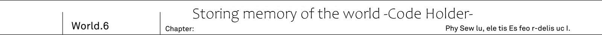
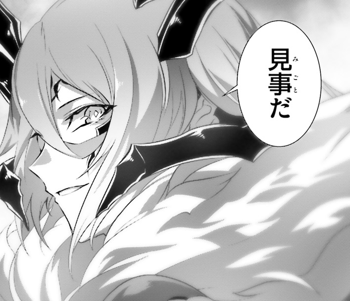
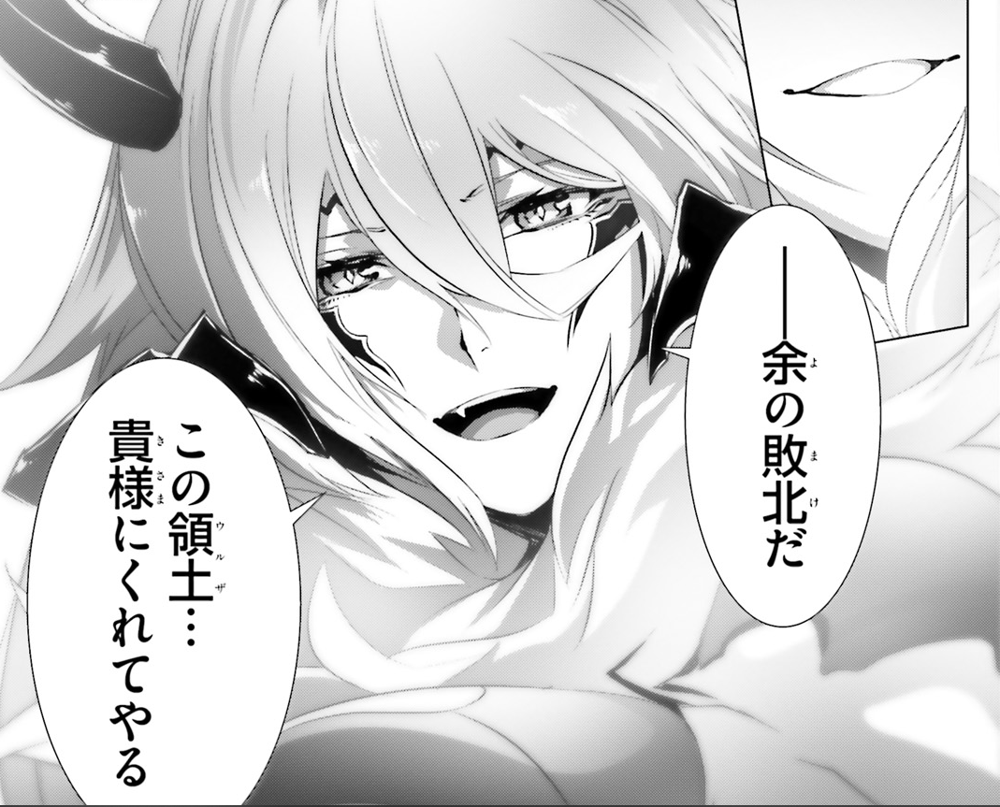
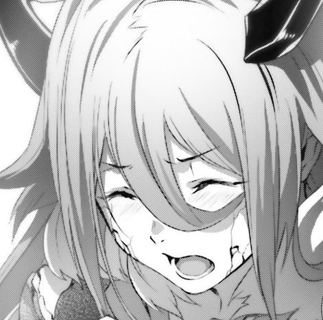

Urza Government Palace, 20th floor.
Through this vast floor, lukewarm air was swirling.
In what looked like a dark waves.
Dark Empress Vanessa magic power spread through air.
It became highly dense and materialized.
It could be said to become embodiment of solar maximum.

_She already fired so much magic in fight against Rinne._

_Yet she still possess this much magic power._

But he was already ready to face it.
After all she was the succubus that make all other demons to yield to her.
Such infinite supply of magic power is not something to be surprised about.

"I'm going to end it, Vanessa."

"Come at me!"

At the same time as Kai brandished his sword, Vanessa raised one of her hands.
Both understood situation, as they both were injured.
Kai was injured by Vanessa's magic, and Vanessa was injured by Rinne's curse.
So both of them  had to settle it quickly.

"I cannot imagine what you can do, but feel free to struggle.
Until I'll crush you!"

It was pride of demon hero Vanessa.

"Devil killing Star!"

From within magic circle, that was swirling in air, appears meteorite.
It was massive lump of blue energy, and with roaring sound it started to descend.

_She is going to blow the whole building with it._

_Does she intend to blow away not only me with Rinne, but even Resistance people!?_

Enormous meteorite covered his field of view.
As he looked up at thing that is going to bring his certain death...

"Yeah, let me show you a proof."

Kai raised his shining sword Code Holder overhead.
On behalf of Prophet Sid, he is going to prove that this sword ended Great War in another world.

"This is my answer, Code Holder!"

Flash of colour of dawn appeared.
With single flash of sword, he cut blue demon star.
Then it broke off.
Cutting the star with Code Holder make the star to broke apart, and multiple fragments fall like meteor shower.

"Ha! You can cut my magic for sure!"

Despite gritting her teeth, Vanessa retained her smile of strong person.
She became convinced that this shining sword is the only reason that human survived so far.
And now was time for counter-measures.

"Bloom, flowers of underworld!"

Many hundreds thousands of flames were floating around.
These flames, that were part of star, now with Vanessa's magic words started to bloom.
And one by one its started to amass enormous amount of energy within.
A single touch would blow you away.

"Even for sword that can cut through magic, this number is not something it can deal with."

She was convinced of her certain victory.
Following Vanessa's will, these hundreds flames, that looked like a flowers, rushed forward at Kai.

"Fall..."

"Turn it off!"

Suddenly buzzing sound could be heard.
And then the whole power supply of Government Palace was cut off.
All lights went off and the whole floor was covered by darkness.

"...What!?"

"Perfect timing, Saki, Ashlan."

Kai took out communication device, and the destination of his call was 17th floor, where Saki and Ashlan were.

[As for our withdrawal. If it turns out impossible to beat Vanessa, we should cut of power in the whole building?
With that demons will become confused and we can use it to escape. Is that ok?"

[Yeah, I'll signal you.]

So at Kai's signal, both turned off power in entire building.

"At first I intended to escape."

"...I see now."

Vanessa instantly understood Kai's plan.
Why would he choose a cover of darkness -
Humans are the only one that lack magic power.
Thanks to that there is no way to pinpoint his location.
Then how about Kai?
Dark Empress Vanessa magic was glittering, illuminating her position.

"With me being only one visible in this darkness, do you intent to sneak attack on me?"

Then how about wiping away the darkness with her flame flowers?
But that would be already late, Kai was already on the move and his sword is going to reach Vanessa before that.

"...Regrettable."

She laughed with scorn at darkness.
Succubus's claw pointed in the middle where faint light was shining.
There was light of Code Holder, but it was faint and Kai's figure couldn't be seen.
In this darkness Sid's sword was like creating dawn horizon.
It was standing out too much.
Trail of light showed Kai's movements.

"There you're! You're done!"

At where Vanessa's finger pointed -
Pale fire flowers fired off in direction of Code Holder's light.
It wasn't a number that could be cut.
Huge pillar of fire arose.
And then Vanessa saw a illuminated figure.
It was Rinne.
Young girl, who was hold Code Holder, calmly run through underworld flowers.

"It cannot be!?"

"Who is done, you said?"

Vanessa heard a voice behind her.
She felt chills.
Never before feeling such fear, she started turning her head back.
There was running towards her Kai.

_I see it now._

_In this darkness Code Holder light would become a easy to spot marking._

Therefore Kai, in order to take advantage of darkness, passed Code Holder to Rinne, since she can take Vanessa's magic.
And instead he took a roundabout way to her back.

"Finally you were able come this far."

He was within a reach of palm.
At this distance Vanessa couldn't use magic, since she would be also inflicting harm on herself.

"And here I thought you were just a mere weakling."

Dark Empress Vanessa faced him.

"Splendid."

It was different from before.
For the first time Demon hero gave honest praise to human.

"Using darkness.
Taking advantage of it being originally human stronghold, you deprived me of sight.
Not only that, you even passed away your sword, that was your trump card, to create this strategy.
Such bold move."

"..."

"It deserves a honest praise.
First time for anyone to reach so close to me...
But, you miss one thing."

Humans have their knowledge and wisdom.
Using advantage of knowing Government Palace well, he created darkness.
And using his own weapon, Code Holder, made a decoy.
With that he was able come this close.

"So what are you going to do?"

Demon Hero asked Kai, who was approaching her.

"You threw away own sword.
Even if you hide something up to your sleeve, it would not be enough to defeat me.
You lack a certain strength for that."

With magic protection, Vanessa was able to withstand dragon punch of Rinne.
At this range even grenade wouldn't be able to harm her.
Therefore it was fatal mistake for him to abandon his Code Holder.

"You'd think so."

"What!?"

"I told you, didn't I? I'll show you our essence."

With his last step, he leaped towards Vanessa's bosom.
Spreading his legs, he leaned in.

"10 years. 10 years I have been training for the day when I'll have to defeat demons."

He was bare-handed.
At MDA Kai had a duty to learn anti-four races martial arts.
Suddenly she felt strong impact.
As if a similar to her blasting magic.
Using his whole body Kai blew away Vanessa using Iron Lean.

"...!?"

Thanks to protective magic Vanessa wouldn't sustain injury, but impact itself was enough to shake her entire body.
For a moment she lost her balance.

"...This...is...how...?"

That was her miss.
Who would expect, who would imagine human would challenge demon hero bare handed.

"You bastard, wasn't that... Sword... supposed your trump card!?"

"Yeah well, I have no intention to rely on hero's sword alone."

Vanessa made a mistake thinking that without sword or gun humans were harmless.
That was cause of her defeat.

"Time to end it, Vanessa."

Kai caught the Code Holder, that Rinne threw towards him.
In front of this beautiful shining sword, Vanessa, who lost her balance, softened her tone and said:

"...This is my loss. I give you my <ruby>domain<rt>Urza</rt></ruby>."

And then.

Golden flash appeared and Vanessa has been cut down.

He felt impact through the sword.
Code Holder passed through magic barrier and for certain he felt that he cut her.

_Did I defeat her?_

_With this I can be certain._

This attack certainly reached her.
But despite that both Kai and Rinne were on their guards.
Vanessa, who received strike from Code Holder, was standing on her knees with her consciousness in place.

"..."

But something was wrong.
Her wings were closed and she was looking down in silence.
She didn't even hurry to try to heal her wounds.

"H-hey, Kai, isn't something wrong with her?"

"...Yeah."

All of her killing intent has disappeared.
It seems Vanessa will to fight itself was at its end.
But something was strange...

"...Sid."

From Succubus charming lips, he heard a name of person that shouldn't exist in this world.

"...Sid... That's right, Sid, the prophet... How can I be in such pitiful state?"

Vanessa stood up.
Her whole body shook, and her head remained looking down.

"World Reincarnation... Overwritten world... Right.
I remember now, that Sid.
He did mention like that."

"Vanessa!? What is it!?"

Sounds of cracks could be heard.
Half of Vanessa body became petrified and started to collapse.

"Listen, human."

Demoness opened her eyes.

"The world has changed.
Sid called it _World Reincarnation_.
And there is someone who tampered with the world.
Look for him!
He should be among three remaining hero."

"You know about Sid? And world alternation? You know this much...!?"

"<ruby>He<rt>Sid</rt></ruby> predicted that some strange phenomena is going to happen with world.
That's why."

Demoness claw, painted with black, pointed at Kai's sword.

"Sid left this sword behind.
In anticipation to this situation, I've hidden this sword.
Key to correcting false world."

"This sword!?"

Kai stared at the Code Holder in his hand.
That was the reason for it to be in Demon Graveyard?
But one question remained.
Why she kept the sword of Sid, whom she hated?

"Why... Aren't you enemy of Prophet Sid!?
Records of Great War stated that much!"

"Right, without doubt I had to cross swords with him. But..."

Her body started to collapse.
Enduring it demon hero stood here and took a breath.

"It is something you do not know.
There were hidden, forbidden _records_."

Kai swallowed his breath with feeling of dread.
He felt like he touched hidden taboo of the world.

"...Zero Code is quite troublesome magic."

Her body started to crumble.
White fragments of her petrified body started to fall down.
This was certainly not caused by Code Holder.

"But with this, your victory is assured. Splendid, human..."

She took deep breath and then...

"...Ah damn, it is so vexing!"

Beautiful succubus took off her mask of demon hero, and said as if she reverted back to her forgotten old _self_.

"It is my defeat. Crushing defeat.
I have no intention to make excuses."

"Vanessa?"

"You better prepare yourself.
If there will be next time...
I'll face you as succubus and will make you cry with love.
Mark my words!"

She smiled.
Her beautiful body started turning into mist without leaving back even a single thread of hair.

"Next time... We'll... have more fun..."

Her entire body dissolved.
These were last words of demon hero.

_TL Note:_ Somehow it makes the saddest moment of this volume.
