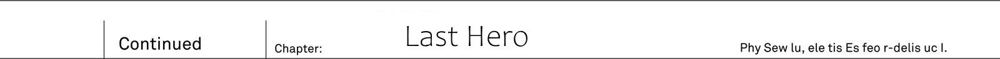

Southern part of the great continent.
In Yurun Federation, there was a mountain near its border, and on top there was a waterfall which was considered sacred among spirits.
It was an unexplored region known as [Iguazu Fall Great Waterfall].

It was the breeding grounds for mysterious spirits.
Even though humans, who lost their territories, continued their attempts to invade, they had to withdraw every time spirits counterattacked.
And on the cliff, from where the great waterfall could be seen...

"Long time no see, Rikugen Kyouko.
Aren't you quite early?"

There was a lone beastman.
This beastman's fur had colour that of blazing fire, and as he announced himself to the enemy he appeared on opposite side.
Delighted, he spoke fluently in human language.

"You're not accompanied by your subordinates.
Looks like you were in a quite a haste rushing here."

[...]

Face to face with the fully blue slime.
If one would try to describe her with analogies, she was transparent blue like the [ocean], solidified into a jelly in human shape.
Spirits hero [Spirits Sovereign] Rikugen Kyouko...
The deep blue and semi-transparent girl was glaring at the cryptids hero without a single word.

"For Vanessa to drop out the first was quite unexpected.
For such a careful demon, she made quite a blunder.
Don't you think so?"

It was Fang King Rath=IE.
The cryptids hero, who was regarded as coming from ancient beast lineage, didn't stop his ridiculing manner of speech.

"Alfreyja was quite a disappointment."

[...]

"There are four races, each with own hero.
But only two are remaining now.
It is quite lonely now, don't you think?"

This question wasn't pointed towards to Rikugen Kyouko.
But towards the monster, that soon enough followed the small beastman.
It was a rasterrizer...
Obviously different from the fellow cryptids, the monster was being caressed by the Fang King Rath=IE with affection.

It was different from Heaven Lord Alfreyja.
Rasterrizer liked it pretty much.
Like a faithful dog gladly accepting its master's caressing.

"Alfreyja's end was quite unsightly.
Thoughtlessly trying to resist this pup's power and failing to control it.
His intolerance brought his doom."

_TL Note:_ Last sentence is a bit hard to understand `器の小ささが招いた敗北だった`

[...]

The spirits hero still remained quiet even now.
And towards such silent treatment.

"Listen, Rikugen Kyouko. Being the sage of this world, you should understand this, right?"

The cryptids hero spread his hands and declared:

"Spirits shall disappear from the face of this world today."

-------------------------------------------------------------------------------

Afterword
---

Why did angel fall?

Fallen angel - as name suggests, it is an angel that has fallen from heaven.
This time it is the theme of this volume.
Still, to add some twist to it, in this novel I explored another meaning behind angels losing their wings.
Why does fallen angel acquire the strength?
And then why the price for it are wings?
I hope you were able enjoy this second volume.

Well then, I thank you for choosing to read “Why does no one remember my world?” Volume 2.
First of all thank you, fortunately the first volume was well received, from now on I'll be able to continue this series.
It makes me really glad, thank you very much!

The story so far is just a prologue, and I want to continue working on it.
The second volume advanced the plot quite a lot, but I think the pace it is going at right now is all right.
With that, the world in my work is still having lots of secrets remaining, so I want to continue with the same pace in next volume.
In addition to that, the next volume is scheduled for 24th February.
Right now as I'm writing this afterword I'm in the middle of working on next volume.
I wonder if we'll come closer to discover another mystery of the world in my next work.
And while you're waiting for the next year, if it is ok, allow me to introduce another of Sazane series.

"The Last Battlefield Between You and I, or Perhaps the Beginning of the World’s Holy War"

This is a heroic fantasy story about clash between young swordsman and witch heroine.
The main hero and heroine are mortal enemies, so what is going to happen to them? - This is the main theme of this work.
There have been only two volumes published so it should be easy to pick up.
Same as "Naze Boku" it was quite well received, and it is a story that I want to continue working on together with Naze Boku.
It would make me glad if you'd go to pick it at your book store.
And exactly one month later, on 17th November, 3 Volume is going to be published, so timing is perfect to pick it up!

Well then, there are not much pages left.
At last allow me to use this opportunity to express my gratitude.
To neco-sensei who made these stylish and cool looking colourful illustrations.
Reiren is so cute, by all means continue working on 3 volume illustrations too...!

And then to my editor N-kun.
For editing my manuscript and designing cover, also for giving me advices thank you very much.

And above all, to you my dear reader, thank you.

I wish for us to meet on next November in "Kimi Boku" 3 Volume and then next year February in "Naze Boku" 3 Volume.
The story will become even more exciting so please look forward to it!

_On the night of autumn, Sazane Kei_

https://twitter.com/sazanek #There are occasionally announcements of upcoming publications.

TL Afterword
---

Well then, here is the end of second volume.
Once again I tried my best to give the best possible translation with my knowledge of japanese and english.
Still as I'm certainly lacking in that regard, I found some help recently.
I made quite a lot of self-editing for the first volume and I was amazed by how many foolish mistakes I made.
But now I have someone to help me editing TL, and hopefully Potla-kun will stick with it up until the end of Naze Boku.

Nevertheless despite volume 2 starting to expand on story, it is still quite far from even properly starting.
I'd say up until volume 4 it is going to be but a prologue to the story.
Sazane-sensei style makes me wish to kill myself occasionally when I'm TLing this work, but I still really like it.
It would be certainly easier to just read, but I wish to TL it properly, so I started slowing down my pace and carefully translating each sentence.
This is one of the reasons why my TL pace is lowering gradually.
Another reason is that now I'm going to wait for Potla-kun to edit my TL before making it public.

Now more on my own impression.
To be honest I don't really like the resolution of this volume.
I mean the fight with Alfreyja was decent, but comparing to Vanessa it was lacking certain impact.
And I have feeling that Alfreyja was meant to never appear again after this volume, but recently I spoiled myself a bit of 7th volume.
Guess what? Alfreyja is there!
You can even see how he looks: https://twitter.com/DoumanAsh/status/1160492191673962497

Other than introducing new heroine, they story didn't advance much yet.
But at least it makes you think that there will be much more to the story, than just beating the shit out of remaining two heroes.
After all 3 and 4 will cover it, but you cannot really end story there.
And considering what happened with Alfreyja, I highly doubt that Rath=IE is the one who is behind it.

Well anyway, to be honest recent 7th volume really fired me up, but I'll try to keep my cool and slowly translate the next volume.
Hopefully my TL is a bit better now.

Well, last, but the most important topic.
Rinne got new rival, this time it is quite a strong contender.
After all over999 years old waifu with archaic speech usually means THE BEST GIRL for me.
But regardless I'm Jeanne boy!
So right now Jeanne -> Reiren -> Rinne (yes, I'm sorry Potla-kun, I know you like Rinne and since she is main girl you're certainly gonna be happy in the end, but still let me dream!)
Continuing on: I really like how neco-sensei drew Reiren, she is definitely cool and cute, yet remains somewhat more non-human than Rinne.

Ok, thanks for bearing with my TL.
And I hope you'll like Potla-kun edits (he joined half-way through my work on second volume, but hopefully he'll find time to edit the first half too)
