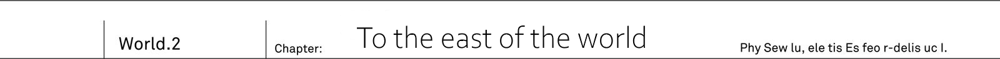
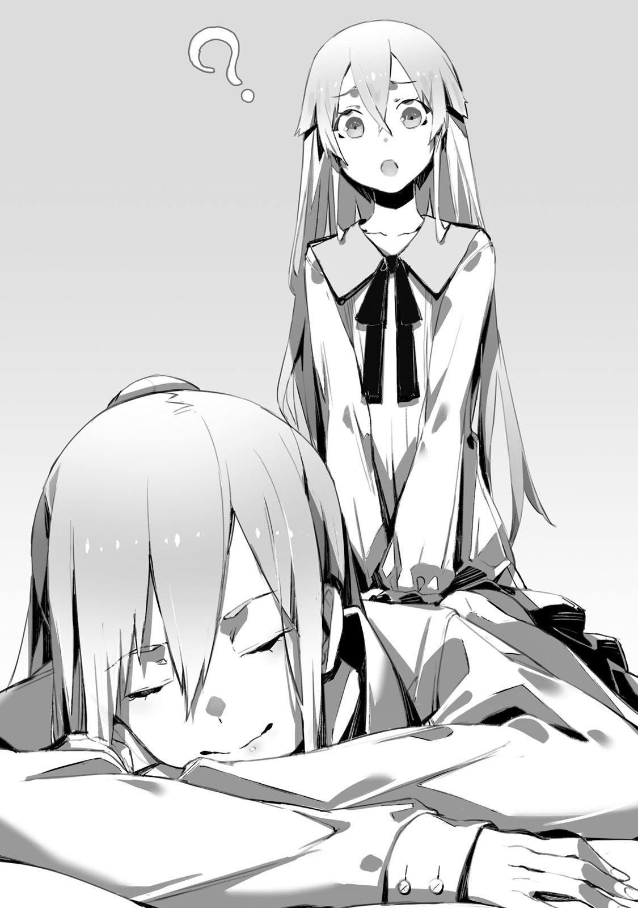

Urza Federation - Eastern mountain range.
There was still snow at mountain top.
Simple bare soil, without much of even weed, was their road, surrounded by white mountains.

"Achoo!"

"Kya!? Hey, Ashlan, that's disgusting!
If you're going to sneeze inside a car, at least cover your mouth."

"Cannot be helped, I have to drive the car.
Cannot just leave my hands from handle."

As Ashlan's sneeze scattered within car, angry Saki voiced her complaints

"This is the worst...
Guys are so indifferent about spitting around their saliva while sneezing."

"Think it is good idea for me to leave my hands from handle?"

"Then you should rather just keep your sneeze."

"Ah, here it goes.
Woman sure love start arguing for no reason.
Good grief."

A tall young man, who was sitting on driver's seat, made a big sigh.
His name was Ashlan Highrol.
He was year older than Kai, and in addition to his somewhat facetious look he had quite high profile.
But even so, rather than saying he had good physique, it would be more accurate to say that he was too tall and that's all.
In true world he was Kai's colleague, while in this he served as senior soldier to Resistance.

"Kai, maybe you could say something too?"

"I don't mind you sneezing, but keep your eyes on the road.
And be sure to drive carefully."

Kai answered to his former colleague while watching over him handling car.
After all in the true world, he never saw Ashlan driving, so seeing it now was making him uneasy.

_He would never go into car without medicine against motion sickness._

_And so he was always leaving driving to either me or Saki._

But in this world Ashlan already got over his motion sickness.
All for the sake of surviving in the world, conquered by demons, where driving skills are essential.

"I'm still surprised that Ashlan is driving car."

"Huh? Are you referring to that me? The one in your old world, who would get car sick and wouldn't be able to drive at all?"

"Yeah."

"Really, that's unreal. Just look at me."

He looked quite used to driving.
While keeping distance from other military cars, he easily continued to drive through the rough road.
He seemed to be even more skilled at driving than Kai.

"Feels like I lost to Ashlan."

"That much is natural for Resistance soldier. Even Saki can do it."

"Ashlan, what is with this even Saki.
If I'm serious then I could drift 100km through this mountain road."

From back seat could be heard voice of orange haired girl - Saki Miscotti.
Like Kai she was 17 years old, she had naturally unruly short hair, and big eyes like that of cat.
Under the corner of her mouth could be seen small claws adding to her charm.

_TL Note:_ I don't really get why this yaeba is so popular, I mean normally our fang teeth are not supposed to be like that... but it is Japan.

"Achoo."

"Again!? Ah so disgusting...
What's with all of this sneezing?"

"It is cold, I'm telling you.
We are so high in mountain zone, and just look at these mountains.
Despite current season there is still lot of snow."

Ashlan was pointing towards front.
Beyond the big road, they could see mountain top which was slightly blurry with blue.
It was reflecting the light like it became part of the sky and it was covering vast territory.

Ladda Krein Highway.
It was known as one of the most longest roads, that led to Io Federation.

_Since we're high in mountain zone, the temperature is quite low._

_Wonder how much longer will it take us to arrive at Io, Ashlan might catch cold by the time we arrive._

Both Saki and Ashlan were part of expedition.
Since they acted together during capital retake, it is been decided to continue it like that.

"Ashlan, let's switch on next stop. It would be good for you to take a little rest."

"Ah? No, it is fine. Look at Rinne-chan doing her best despite being dressed so lightly.
If I'd catch cold that would be really uncool."

"Fue..."

On back seat besides Saki was sitting young girl with golden hair.
She was just looking outside through window all this time, and absent mindedly looked turned towards them.

"Me?"

"Yep, that's right, looking at Rinne-chan being so lightly dressed, it might cold, right?"

"Nope, I'm totally fine."

_TL Note:_ Rinne-chan is more cool than you think Ashlan-kun...

Rinne answered with serious look on her face.
She was wearing elven dress.
While it was certainly thin, but Rinne body carried blood of multiple races so her body was pretty tough.
Of course her toughness included cold resistance.

"Putting that aside, Ash?"

"Oh, is that my nickname? I'm glad."

"Forgot your name."

"Ashlan Highrol, be sure to remember.
Ah but you can forget the name of Saki behind... oi, it is painful!"

"Also what's with this [Rinne-chan], don't get carried away."

Said Saki who was pulling Ashlan's hair from behind.

"Your intentions are pretty obvious.
That's why these man..."

"Treating kindly a cute lady is a way of gentlemen.
Ah so what is it, Rinne-chan?"

"Look at the road while driving.
Listen to what Kai is saying."

"Sure!"

Under orders of the cute girl, Ashlan vigorously gripped the handle.
Meanwhile Rinne once again looked outside.

"Hey, Kai, I do not feel it at all."

"You're talking about demons?"

"Yup, after all we're outside of capital so it should be demon territory."

What Rinne mean wasn't difficult to guess for him.
After all Kai was thinking the same.
Thirty military cars was running through the mountain road.
If demons would be somewhere nearby, there is no way they would miss the engine sound.

"I've been thinking the same, but it seems that demons do not live here."

He handed the map to Rinne.
It was one of the materials from Resistance Army.
And Ladda Krein Highway was marked with white, blank colour.
It meant that no race was living here.

"After all demons prefer to live in cities that they took from humans.
No demon would live in such mountains.
Well, maybe only standing watch."

The same was with the [Graveyard] where Rinne was sealed.
Since it was far from cities there was not a single demon out there.

"But the road is cracked over there, see?"

Rinne pointed towards middle of road.
In the center it is been torn apart and smashed into pieces.
The way the this destruction site might look quite different from what happened to capital buildings.

"This is not work of demon magic?"

"I think it might be done by magic beasts.
Look the way it is damaged looks like footprints."

Saki was the one to answer.

"Even if demons do not live here, it might become home to the beasts that they brought with them...
Saying that myself now, I'm starting to feel scared."

Young girl with orange hair shivered.

"Food is scarce here.
For car full of humans crossing roads with hungry magic beast is just like inviting it to attack.
Rinne saw that thing too, right?"

"Magic beast in that building?"

"Yeah, that big monster that looked like rhinoceros."

The one who was loitering inside of government palace was magic beast Jabberwock.
Once Vanessa was defeated, it disappeared.
But it wouldn't be strange for it to escape to here.

_But magic beasts hold magic power._

_So Rinne will be able to detect its presense._

Getting ambushed is highly unlikely.
Moreover thirty cars are loaded with soldiers, and if even one would spot something unusual, he would notify whole armoured caravan.

"I'm sure you know it, but you should drive at full speed if we spot it."

"Sure thing, so let's find it quick... Oh, but well it might be better not to.
Reaching border without incident would be ideal."

They continued to follow the road to Urza national border.
Since they departed early morning from capital Urzak, it is been already 10 hours.
And most likely it would take another 10 hours to reach the border.

[My friends, we already halfway through the highway.]

Jeanne's voice could be heard from communicator by the seat.
And as a commander Jeanne was riding on the car in the middle.
While Kai's car was right behind it.
Cadillac one.
Once it was a personal transport to the king of Urza.
And it was so called [Moving shelter] armoured car that could defend against demon magic.
Jeanne together with her bodyguard Fairin were riding it.

[According to map, two kilometres ahead should be resting point where we can stop.
While it is likely overgrown with weed since humans no longer live there, but we should be able to take a break there.]

"Finally..."

Ashlan made a big sigh while gripping handle.

"As one would expect my shoulders are really stiff from driving nearly 10 hours straight."

"Hey, Ashlan, don't lose focus so quickly."

"I know.
You know two more kilometres and we will not see such beautiful road any longer?"

The road was following alongside snowy mountain range.
And while they followed by hills...

"..."

Suddenly Rinne stood up.
She had to bend as she couldn't to stand fully within car.

"Ash, open window."

"Eh? What is it, Rinne-chan?"

"Quickly."

"S-sure!"

Window by back seat quickly slid down.
Rinne looked out if window, not even bothered by sudden cold wind blowing inside.

"Rinne?"

"...Kai, above! It comes from sky!"

What was coming - is not something he'd ask now.
There was no time for it is what he got from Rinne's tone.
He quickly moved to car's ceiling to slide car's roof.

"Hey, Kai!?"

"Ashlan, you continue driving, Saki, prepare weapons."

"Eh? W-wait Kai?"

He looked up from the opened roof.
There within clouds in the sky was small black dot.
To him it looked like someone spilled ink onto blue sky.

_What is this black dot?_

_It is moving... and coming here?_

It was coming from the same spot as sun.
And in several seconds it turned out to be a gigantic winged monster.
It was cryptid that was supposed to be sealed in graveyard, just like demons...

"Dragon!?"

"It is Wyvern!"

Saki screamed from the back seat.
With its gray body and occasional moss growing, it looked like pterosaur.
As it specialized in flying, it's forefoot were almost non-existing.

"...This is wyvern?""

This huge monster glided above their heads.
Even just from it passing by, he could feel wind pressure.
It was cryptid known as king of the sky.
But he was surprised by its flying speed.

"What is meaning of it, isn't it supposed to be demon territory?
Why cryptid is here!?"

"Warning to everyone! It is dragon, dragon in the skies!"

Kai shout into communicator.

[All cars, advance at full speed!]

Jeanne commanded.
Soon the slowly running wheels started increase their speed.
And they hurried further down the road with cloud of dust behind.
They absolutely couldn't  stop.
Cars were running at full speed, and people who were walking started to run with all of their strength.
It was major rule when facing soaring dragon.
Against dragon's claw even armoured car wouldn't be a problem.
If you stop, it will immediately target you from sky.

[Shoot!]

Gunshots were fired by soldiers from the opened roof on cars.
But neither automatic rifles nor machine guns would even scratch such beast.
Dragon scales were on par with steel armour.

_According to MDA's records..._

_Among cryptids dragons were the only one who you shouldn't fight openly._

Regular guns were ineffective against them.
Artillery would be necessary in order to bring it down, but no car in this caravan would load it.

[30th, 29th!?]

Jeanne scream was heard.
All 30 cars were running at full speed.
When Kai looked back he could see that last two cars made some loud noise and started turning.
If they were continuing running, it had only stop them.
Wyvern crushed into two last cars in the column.
With its big body, it could carry quite a lot of kinetic power.
Both cars rolled over road like pebble, and finally stopped after landing horizontally.
Doors were crushed and white smoke could be seen from engines.

[30th, 29th! Respond!]

Despite the orders, both cars reminded silent.
And there was no sign of soldiers trying to leave through crushed doors.

"What with this monster!?"

Saki, who setting up gun on roof, shouted, which was almost like a scream.

_This is dragons._

_Among cryptids they are one of the superior species._

It didn't poses magic power like demons, but instead used peerless strength and stamina to crush enemy.
Which was both extremely simple and yet brutal.

"Saki, grenade launcher!"

Ashlan shouted from the driver seat.

"Against such big body handgun would be worthless, use something bigger and tear down it's wings!"

"It piled together with stuff in tray behind, we have to stop..."

"Move, Saki."

Blond girl jumped out of sunroof.
Under wind from dragon wings both her hair and clothes were waved.
She jumped over to tray.

"Rinne!?"

"Kai..."

Rinne looks back with a smile.
She pointed her slender finger at flying wyvern.

"Fire."

"...Leave it to me."

He aimed Drake Nail and placed his finger on trigger.

"Volt Bullet."

At the same time as Kai said it, the atmosphere around Drake Nail suddenly changed by appearance of electric current.
From the ground fired multiple small electric lances, aiming at wyvern who already set eyes on new target.

_TL Note:_ It is not mistake they call it wyvern, yet it is also called dragon so I assume they refer to family of species rather than to regular fantasy dragon.

[...!]

Dragon roared.
It wings, which it was so proud of, got burned by electricity and it's huge body fell down on ground.
This was Rinne magic.
Volt bullet doesn't exist in first place and Kai only aligned his declaration with Rinne's magic start.
If one would be paying attention then he would notice that Kai never pulled the trigger in the end.
But in this chaotic situation everyone eyes were on wyvern, so no would be paying attention to Kai's finger.

_TL Note:_ Deja vue?

_Ah but there is one who would be paying attention._

_She should know that it is not result of firing my bullets._

Fairin, who was also known as Dragoon.
Female warrior who took upon herself role of Jeanne's bodyguard.
She most likely would be watching the spectacle from another car.

"Is it down with this?"

"Nope, this much wouldn't bring it down."

Rinne muttered, and hearing that Kai left through sunroof alone.

"To defeat this big one, I'd need far more power and it might roll in other cars.
So we need to do our best to drive it away."

"Jeanne, stop all cars!"

Kai yelled into communicator.

"Leave fallen wyvern alone now, do not shoot it.
With such serious injuries it should just run."

[Everyone, you heard him, stop and stand by. I prohibit firing your weapons.]

28 cars suddenly stopped.
All soldiers swallowed their breath and watched wyvern to rise up.

[...]

With bloodshot eyes it stared first at Kai, then Rinne.
Which continued for several seconds.
In front of Rinne who was standing on tray, and Kai who was holding ready his Drake Nail, Wyvern started flapping wings.
With it's burnt wings it flew and disappeared in direction of sun.

-------------------------------------------------------------------------------

Under curtain of darkness, the sky was painted by colour of thin ink.
They set up 15 tents away from the main road where they encountered wyvern.
And then put nightlights on top of the roofs.

"First unit, have four hour rest.
Second unit, continue setting up equipment.
Third unit, continue keeping guard.
That's all."

In front of the tent, their commander issued orders.
With that soldiers scattered around.
Some went to tents to have a nap, while others were inspecting cars.
And some, carrying machine gun, were making patrols could be also seen.

"Hey, Kai, let us sleep already..."

Rinne pulled his clothes while rubbing her eyes.

"We can already go to sleep in our tent."

"We do not belong among these soldiers so we're going to break the order by mixing in.
Though only us having full sleep would seem unfair."

Hopefully they'll forgive us for driving away wyvern - saying so to himself, he headed to the tent.
It was military type tent with windproof sheet for 10 persons.
If they would be of small build like Rinne then it would fit 12.
For 3 people sleeping it was quite big.

"By the way there are also woman only tents..."

"Don't wanna."

"Thought so."

The same situation was at government palace.
Since there were lots of unwanted attention from soldiers, he asked to prepare a separate room for Rinne.
But at nights she would come along to his room.
Though from Rinne's point of view people around her belonged to another race.
And she was extremely honest about being unable to sleep without him by her side.

"Huh, I see. This tent is for us only."

He peeked into tent and only saw Kai and Rinne luggage.
There was no sign of other's.

"Having such big tent for ourself is making me even more guilty."

"Jeannya comes too."

"I see, it is Jeanne's.
It makes sense for commander... Wait, what you said now, Rinne?"

"Originally it is our tent."

Clank of metal could be heard.
In their rear was silver haired commander, behind her was bodyguard Fairin.

"Jeanne's tent?"

"That's right. Sorry that it is not yours only tent.
The expedition baggage is quite limited as our cars cannot carry too much."

"...Ehm, I didn't mean it like that."

"Kai."

With the girl's voice, armoured knight whispered to him.

"For me and Fairin sleeping together would be suspicious.
Commander and his female bodyguard.
Sleeping in alone in single tent would bring unwanted rumours."

"...Then?"

"So it is better to sleep in tent with other men.
Unless it is Kai I'll get exposed pretty quickly, so cooperate with me."

"I s-see."

In government palace she had private room, so it wasn't difficult to hide the fact that she is a young girl.
But here in expedition it was quite difficult task.

"...Kai, I have something to say too."

"Hm? To me?"

Fairin beckoned him step outside of tent.
It was quite unusual for this female warrior to call anyone, other than Jeanne, by name.

"I'll be standing guard outside to make sure to keep unwanted company awway."

"Understood, want me to take over later?"

"One sleepless night wouldn't bother me much.
It is about Jeanne-sama.
I'm sure you understand but she is going to take her armour off."

"Obviously."

"She'll be lightly dressed in front of you, which would be very unbecoming for her."

"..."

"Do not misunderstand. If I'll hear Jeanne's scream in the middle of night..."

"Think I'll do it!?"

"I know, but it is my duty to warn you as her guard."

Fairin was grinning.

"I'm leaving Jeanne-sama to you."

"...Got it. Rinne, Jeanne, I'm entering."

Kai entered the tent.
There were two girls illuminated by the lamp inside.
Rinne was already in her favourite pyjamas, and Jeanne took off her armour and was wearing some man pyjamas.

"I s-see. While Fairin called me over, you already changed."

"What's with Fairin?"

Jeanne was still with her hair tied.
While she was quite tall for a girl of her age, but without armour she looked quite slender.
So man pyjamas didn't make much of disguise and looked baggy on her.

"Did Fairin say something?"

"No, nothing. It is already resolved."

He closed entrance so there was no need to worry about seeing Jeanne from outside.

"Ah, wearing something more light for a change makes me happy.
Being in armour for the whole day, and in such cramped car, made a bit sick after sitting still so much."

"You're having it hard, pretending to be a man."

"Yeah, how about you try to pretend to be a girl?
Just thinking about it is already hard?"

Jeanne was stretching on tent's floor, her face down and deeply breathing.

"Jeannya, what are you doing?"

"My body is so stiff so I'm trying to ease it
Rinne, if you don't mind could press your finger against my back.
I'd be happy if you could give me a massage."

"? Like that?"

Sitting next to lying down Jeanne, Rinne did as she was told.

"Right, just a bit stronger... Mm... W-wait a bit too strong... Ah, yep, it feels good.
Please continue up to my shoulders."

"It feels good?"

"Yeah, afterwards I'll give you a massage too."

With a pure bliss on her face, Jeanne was relaxing.
And while looking over two girls...

"Jeanne, while you're relaxing I have something to talk about."

"Hm?"

"About today's incident with wyvern."

"There were no victims from two crashed cars, just some light wounds.
They are already being treated in medical unit tent.
It is a shame about cars but we'll have to abandon it.
Their engine is dead."

"I heard it from Ashlan."

On their way to border, 10 people already got injured which was beyond their expectations.
If they'll be lucky they'll arrive to border before sunset.

"I didn't expect to see any other race except for demons here.
Since we watched for magic beasts, no one would expect surprise attack from the sky."

"...Same here, first time seeing that cryptids would enter Urza territory."

While receiving massage from Rinne, the silver haired girl expression became more serious.

"I heard that cryptids are not very organized as a race.
While they do control south territories, they tend to split into separate groups.
I wonder if this stray dragon comes from there."

"Still it is quite unusual for it to cross border."

Vanessa left border defence to her most trusted subordinates.
Hero ranked demons, led by succubus queen Hinemarill.

_And now these three should have left border._

_Is it coincidence that dragon flew through border?_

The timing of these events was too good.
Or so Kai thought.

"These cryptids, they could hear about demon hero being defeated. And that wyvern could be a scout to assert that."

"..."

Jeanne was silent.
And Rinne, who was doing massage until now, stopped and looked at him.

"I hope your prediction will be off on this one.
We just took back capital and now getting cryptids to attack it now..."

"How about to return back?"

"No."

She gave a prompt reply.

"Defence forces are well equipped in capital.
We already placed large howitzers around government palace.
Even if wyvern such as that would attack, it shall not fall easily.
Well, as long as cryptid hero is not leading them..."

Taking a breath she turned around to face tent's roof.

"Let's stop our talk here. Too much worries can be pretty tiresome."

"Yeah."

"And last and most important thing I'd like to say, Kai."

While remaining in lying position, silver haired girl somewhat embarrassedly averted her eyes.

"When I go to sleep I have it somewhat rough, so sorry if I'll kick you in the middle of night."

"...You still didn't get over it."

It was her bad habit that Jeanne had until twelve years old in real world.
Kai still had unpleasant memories of when he got kicked by her in the middle of night at camp.

"As for our sleeping positions, it would be dangerous to put me in the middle, so Kai will be in the center.
Rinne will be on your right and me on the left.
This way only Kai shall suffer."

"I'm not thrilled about assumption that I'm going to get kicked."

Taking a deep breath, he lied down.

-------------------------------------------------------------------------------

Ladda Krein Highway.
From behind dark mountains strong sunlight appeared.
Under bright sun, even with closed eyes, you couldn't help but feel dazzled.

"Wow, so bright, damn it is so dazzling to look at."

From their now usual driver, Ashlan, they heard complaining voice.

"Hey, Saki, where are my sunglasses?"

"In your own breast pocket most likely."

"Oh, really so... Now it is easier.
After living underground for so long I somewhat forgot that morning sun could be this dazzling."

Ashlan who put on sunglasses turned back towards them.

"How is it, Rinne-chan? Am I cool in sunglasses?"

"...Meh, you're suspicious."

"Uh I see.
After all I'm just too good-looking.
It is cute how shy you're.
By the way, Kai?"

Then he turned towards Kai.

"Why are you looking so tired this early morning?"

"...I couldn't sleep. Rather I just got more tired."

"Didn't you spend the whole night in tent?
Since you're Jeanne-sama escort you shared such big tent together."

Ashlan only slept four hours.
Then as he had to stand watch and inspect equipment, Kai, who spent the whole night in tent, could be viewed only with envy.

"Me and Rinne are guards after all, how can we do our job while sleeping?"

"True, did you stay up the whole night?"

"...Yeah. Something along these lines."

The second part of the sentence could be heard by him alone.
He was in tent alone with two beautiful girls.
Moreover some might be even envious of him sleeping in between these too, but for Kai it was a disaster.

_First Rinne glued so hard to me._

_And then Jeanne's sleeping posture was just too brutal._

In the end while half asleep Rinne just stick close to keep and used his right hand as pillow.
So he couldn't move carelessly without waking her.
Moreover Rinne who leaned so close to him, while turning around, touched him with her soft skin.
It was difficult to not be aware of it.

_TL Note:_ Seriously though I remember sleeping three/four people in single bed just fine

"And even Jeanne..."

"Hm?"

"No, it is nothing."

As for Jeanne's bad sleeping habits, he thought it would be better to keep it for himself.
That Jeanne who would send kick while turning over - was actually calmly sleeping.
Maybe because of tiredness but he could hear her breathing very well during the whole night.
Now he thought he was naive.
Instead Jeanne tightly grasped his hand in between of her chest and slept in such charming position.
While slender, he could feel quite well developed chest.
What's more from time to time he could hear joyful sleep talking [Fufu, Kai, what are you doing, it is ticklish]

For Kai it was now his secret memories.
Of Rinne on the right who used his hand as pillow, and Jeanne on the left clinging to him.
As two girls were so close, he could hear their breath and occasional sleep talk.
What's more their soft skin was kept in touch with him.
There was no way to sleep for him.

"...I couldn't help but feel tensed."

"Oh, you sure had it hard.
Guards have no time for rest."

Ashlan was chewing gum to keep himself awake.

"How about you sleep now?
The road will be quite calm until border, as long as there is no uninvited guests like yesterday wyvern."

28 cars were running through this road.
Due to yesterday attack, from time to time they would check skies from sunroof.

"Hey, Kai, what is that?"

Rinne who took off from back seat pointed towards gab in between mountain range.
Right now they were coming out to the other side of mountains and there was standing something that looked like a city wall.

"National border."

Said Saki who was holding map.

"The thing Rinne is pointing is wall that serves as national border.
Long ago it is been built to defend against invasions from other races.
But just like that it became national border, it would seem."

The wall was made of something brick-like.
It wasn't clear whose work it was, but the wall continued alongside mountain slope.

"There was something like that?"

"Oh, how unusual for Kai to now know something that I know."

"...In my world none was left."

In true world its were demolished.
World, where four races were sealed away in graveyards, had no need for walls.
There were some concerns about preserving cultural heritage, but as it made inconvenient to cross national borders, it was decided to demolish walls.

"That's why for me it is first time seeing."

"I'm seeing it first time myself too.
But well there is nothing fun about it. Just look there, it is already worn out."

Saki, who looked out of the window, narrowed her eyes.
There was big hole inside of wall.
It should've been made by enormous strength and no trace of broken pieces could be found any longer.

"It didn't collapse naturally..."

"Might be demons, or maybe angles and elves.
Hey, Saki, watch out properly now, we're near foreign gods territory."

Io Federation.
Once they pass the great wall, it will be territory of foreign gods.
There were angles who could rival demons in magic power.
And then there were elves and dwarves who hold equally powerful magic tools.
Last was fairies who could meddle with nature
The alliance of these four races were called foreign gods.

[My friends, we're about to cross national border. On the other side of the wall will be Io Federation.]

Voice of their leader could be heard from communicator.
Her strong voice was being transmitted to all 28 cars.

[We'll be heading to 8th ward Cassiopeia, within Io capital.
At the present moment, there is Io Resistance headquarters.]

They finished descending from mountain slope.
Like small fort were standing solemn national border gate.
Roof was already collapsed, and several holes could be found in walls.
Through leading car advanced.

[My friends, as you know foreign gods reside in vast forest.
We ought to avoid dangerous encounters until we meet up with Io Resistance.]

"...Heard it, Ashlan?"

"As long as we stick behind car ahead everything will ok."

Said Ashlan while taking out new gum.
Despite his carefree remark, Kai could see his expression to stiffen.

[Foreign gods are even more cunning than we, humans, are.]

It looked like it spoke to inner thoughts of Ashlan.
And Jeanne's voice was tensed as if she spoke from personal experience.

[Fairies are capable of magic that interfere with nature, so they are capable of hearing us from afar.
As we're crossing the national border, they are likely aware of it already.
And elven magic weapon surpasses our own in both range and fire power.]

There was no way to know when they are going to attack expedition car column.
And Ashlan, who was so tensed, definitely was aware of the danger.

[Let us proceed carefully.
To face our next opponent we would require calm mind rather than bravery.]

They were going to challenge foreign gods - who were known to be the worst possible enemy for humanity

_TL Note:_ I'm still not sure how to TL `人間の上位互換`
