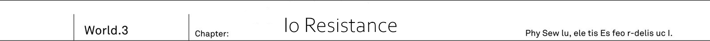
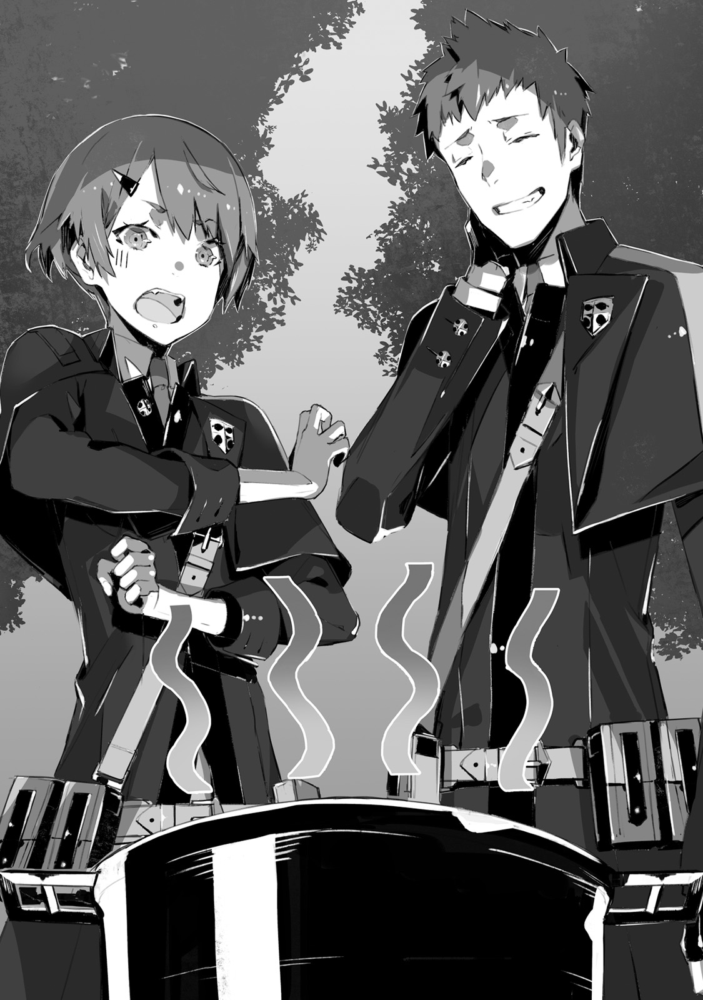

Continent's eastern part -
Third of it is covered by mountains, while the remaining parts are assumed to be covered by forests.
The reason for it to be assumption is quite simple.
It was one of [unexplored regions] which humans are yet to step on and investigate.
Taking as example world's largest forest Ciel Mi, humanity only investigate at most 20% of it.
There are even reports indicating that there dozens of undiscovered animals, insects and plants.
And this gigantic sea of trees is current domain of Foreign gods.

"Angels built themself palace above clouds,
Fairies set up themself a village near beautiful lake,
Elves and dwarfs made forest itself their home...
Well that's what I heard though."

Said Ashlan, while trying to recall it.
As they were driving through ruins of small buildings, the car had to slow down to avoid damaging wheels from all of the rubble lying down.

"In fact, foreign gods doesn't seem to like human cities.
Contrary to demons, they do not live in human settlements at all."

"I heard there are not many guards around... I hope it is actually true."

Saki was looking out of sunroof while tightly grasping machine gun.

"If we find them then first to attack will win.
After all comparing to demons guns are quite effective against them."

Said Kai who looked ahead through front window, while trying to calm down Saki, who certainly was putting too much strength into her grasp.

"It will turn ugly if you'll shoot humans by mistake."

"...Uh."

"I haven't saw real thing yet, but are they so alike?
I mean foreign gods and humans appearances."

"Ah, yup, might be alike."

Rinne, who was by Saki side, interjected.

"Since they hold magic power, they have completely different scent, so foreign gods can easily recognize humans.
But for humans it might be easy to mistake them for their own."

"And in reality there were such cases of accidental shooting."

Elven race was especially similar.
While they can be recognized by their pointy ears and pale light skin, looking from afar they are quite like humans.

_Among fairies there are some who look just like human childern._

_And dwarfs might look just crooked old man._

And at times when you're unable accurately determine who is the person, just relying on rough silhouette might easily lead to friendly fire.

"Just thoughtlessly shooting at any moving shadow in these ruins might lead to big accident."

"Of course, even I understand what is this place"
_TL Note_: says Saki. Note that in japanese it is easy to distinguish who is talking by seeing their pronoun. For example Saki uses `アタシ`
But I find it impossible to translate, so I'll be just noting it down for convenience.

Io Federation outskirts.
There was 8 ward Cassiopeia hold industrial area.
Before humanity have been defeated by foreign gods and had to withdraw, there were factories that produces the newest weaponry.
And Io Resistance HQ was within depths of this ward.

[Stop] - came Jeanne's order.

One by one cars started to stop, not in the building shadow, but in the middle of vast road full of small wreckage, under sunlight.

"Is that really ok? Stopping at place where we're so easy to be spotted..."

"Right, if it would be demons they'd destroyed us alongside ruins, no questions asked.
I hope foreign gods are not here."

Both Saki and Ashlan were looking around in worry.
For these two who grew up in underground city in constant battles with demons, it was unthinkable to leave cars in broad day.

[We'll have to follow Io Resistance instructions and our destination is here, in depths of the ward.]

They followed outside of car.
Feeling the wind, which was rising the cloud of dust, Kai once again looked around.
Ruined buildings became quite old under weight of time and were covered in moss.
And from the cracks on road surface could be seen growing plants.

"It certainly feels similar to Urza capital ruins, but it gives off even stronger vibe of being abandoned by humans..."

The difference was the existence of the plants.
Numerous buildings were covered by moss, and its walls were entwined with vines.
Big chunk of ground was covered by grass that somewhat resembled green carpet.

_A bit more and it would be completely green._

_Feels like If I'd stop looking for a second, the ruins would just dissapear._

There were unknown to Kai plants.
Within deep blue flower blossoms and bright red vines, he could see big orange fruits.
But its colour looked like that of poisonous tropical plants.
At the bottom were they could find multiple sweet looking purple fruits.

"It looks like a small forest."

"Hey, Kai, this is quite sweet and good."

Almost falling through, in Rinne hands were small red fruits.

"Here is Kai's part."

"...Just in case, is this safe for <ruby>human</rt>me</rt></ruby> to eat? It is not poisonous?"

"Yup, but your tongue becomes numb."

"That's just poison! Spit, spit it out, it will be bad if eat it!"

"But it is so sweet and delicious..."

"Are you a child? Ok, I'm confiscating it."

He took fruits from Rinne hands and threw it into the grass under his foot.

"Muuu...? I'll be fine, I ate stuff like that already."

"Where?"

"In elven forest, far before my fight with Vanessa."

Rinne nonchalantly muttered these words.
Hearing it, Kai suddenly looked at the ruins.
Yet unknown plants were flourishing through buildings and ground.

"Kai? What is it?"

"I see now. These are... Plants from elven forest...!"

Foreign gods lived in forests, and they disliked buildings made by humans.
So one would wonder how they would expand their territories.
Just by covering it completely in forest.

Humans of Io Federation lost to foreign gods.
But contrarily to demons, they didn't immediately move into abandoned by humans cities.
Instead foreign gods started planting there their forest.
There is no need to stand watch, they could just wait until city will be consumed by forest.

"And so it will become foreign gods habitant..."

"That's right."

Sound of footsteps trampling over rubble could be heard.
Soon female bodyguard Fairin stood besides Kai, with her master behind.

"I heard that Io's capital progressed far more with this [greening].
And elves and fairies are already been spotted there."

"And here...?"

"Io Resistance periodically burns down the plants to prevent the [greening].
After all this is where their headquarters."

In the shadows between buildings he could see burned down overgrown vines.

"Jeanne-sama, please go ahead, there is Io Resistance headquarters."

"Understood."

Fairin pushed her through back, and her subordinates followed suit.
Then cheers could be heard.
Moreover applauses resounded through the area surrounded by buildings.

Io Resistance soldiers saluted.
Hundreds, no, thousands of them were lined up on plaze.
There were too many of them to even fit their field of vision.

"Really!? I didn't hear about such cool welcoming party."

"Shh! They'll hear you, Saki.
Still hearing such big applause, what can I say?
That's just cool.
Doesn't it feel like welcome for real heroes?
Was Urza Resistance so popular?"

"After all defeat of demon hero would make everyone around world notice us."

Both Saki and Ashlan were looking excited.
In the middle of these applause, a single soldier step forward towards Jeanne, who was leading them.

"Welcome to Io Resistance.
Let me welcome your honourable army."

It was old looking soldier whose hair was streaked with grey.
While his sunburn face was full of old age wrinkles, his body, under uniform, looked quite well trained.
Fitting exactly to image of experienced soldier.

"I'm staff officer Tsekhman Bakkhai.
It is my honour to meet you, Light Knight.
Your fame already reaches far.
And the news of that demon hero Vanessa defeat brings us a new hope."

"I'm Urza Resistance Commander Jeanne.
I thank you for your welcome."

They exchanged handshakes.
Even for a girl Jeanne was quite tall, but staff officer Tsekhman was even more taller.
Among his fellow soldiers he had quite prominent physique.

"And you too, it is been a while, Fairin."

After greeting Jeanne, he shifted his gaze towards female bodyguard.
Wild smile appeared on his face.

"We both were able to live this long.
Are you in good health, dragoon?"

"Thanks to my master excellence.
Moreover, I'm not that old to say that I lived this long.

"Excellent."

They didn't exchange handshakes, instead they knocked each other fists.
It didn't look like a polite exchange between officers, but rather exchange between veteran soldiers.

"Fairin, is staff officer Tsekhman your acquaintance?"

"We fought... Excuse me. Go ahead, Jeanne-sama."

With a serious nod, Fairin took a step back.

"Staff officer, I'd like to have a talk with Commander Dante-dono at once.
We need to grasp the current situation in Io Federation and start establishing our cooperation."

"As you say."

He respectfully bowed.

"I'll guide you to Commander's office immediately.
As for your subordinates, we already preparing lodgings and storehouse for them."

"Understood. I'd like request to allow my bodyguards to accompany me: Fairin, Kai, Rinne."

Jeanne exchanged looks with these who had to follow her.
On other hand, Rinne, still not understanding the whole situation, was in the middle of relentlessly looking around.

"Hey, Kai, what are we going to do now?"

"We'll accompany Jeanne. Ehm and well then there will be strategic meeting so we'll have to participate."

"Even though Kai and me would be more than enough..."

"We still do not know situation.
Moreover we do not know location of foreign gods hero, so we have to gather information."

Foreign gods hero [Heaven Lord] Alfreyja...
Covered in multiple layered barriers, owner of so-called divine protection.
Known as [Unsinkable angel].
This was formidable enemy, who people says was able receive direct hit from Io Federation most powerful artillery without a single scratch.

_Even the most powerful weaponry cannot pierce through._

_For humans, it might not be exaggeration to say that it was [invincible] opponent._

If Dark Empress Vanessa could be called a strongest spear, then Heaven Lord Alfreyja would be said to be invincible shield.
This much preparations would be necessary.

"Let's go Rinne."

Jeanne followed Tsekhman who turned around.
Io Resistance headquarters...
Once a largest hospital of the ward, it became the headquarters to this Resistance army.

"Here is far more of [greenery]."

As Kai was walking toward hospital entrance, he could see front door being covered in elven forest plants.
It's walls were also covered by verdant moss.
From rooftop could be seen hanging vines with sharp thorns.
And windows, who were buried in greenery, would be difficult to open.

"Could it be you're leaving this greenery as it is on purpose?"

"Quite perceptive."

Staff officer who was few step away, stopped at once and turned toward Kai.

"There are two reasons for that.
First, if we completely remove all plants from the headquarters, it would send a clear message that there are humans.
Another one is that these plants are quite tenacious."

He took a vine, hanging on wall, and forcefully tore it off.

"It will grow back within week.
Regardless how much you try to burn it all down, unless you'll crush it's roots deep down."

"I see... They choose slow approach.
Quite different from demons."

Jeanne frown.

"Staff officer Tsekhman, just to be sure are these plants harmful?"

"No, we cut off all poisonous one, now the one that remaining are these with highest fertility."

"Thank you, that is relief."

"But..."

He looked at the second floor of hospital, covered in greenery, and sighed.

"Our general loath this scenery quite a lot.
After all this is what foreign god wishes.
Headquarters, which we could call our home, are being polluted this way."

Then he started to walk once again.
They were at first floor of hospital.
As one would expect during the day electricity was turned off.
For the most part, inside of the building there was no signs of plants.
They could see concrete floor and walls, with peeled off paint, as they advanced further.

"On our right is conference room, and back there on the left are training room and storage room."

"Understood, later one I'd like to get blueprints of the building.
Also map of the ward, and if possible I'd like to share it with at least commanding officers."

"We'll start preparations."

With a nod, old soldier turned around towards staircase.
But, as he was about to make a first step, Io Resistance staff officer stopped.

"Jeanne-dono... No, how about I'll ask you, Fairin?"

With a glint in his eyes, old soldier addressed Urza Resistance female warrior.

"How much you know about our Commander?"

"Io Resistance Commander name is Dante Guelph Alighieri, man, 29 years old.
Descendant of Io royal familiy.
While he does lead Io Resistance, due to his royal origin, rather than being Commander, he calls himself a [emperor]."

"And then?"

"Being so proud of his rank, he tends to be jealous, distrustful and spiteful."

_TL Note:_ Wow I'm surprised that guy is still alive...

She lowered tone of her husky voice.

"If times would be different, he'd become a king due his lineage.
With that, he considers lowering himself to a commander for a mere group of soldiers as unfitting and unbearable task."

"..."

"And he is going to point his anger towards Jeanne-sama.
Who achieved a great feat of defeating demon hero and taking back human territories.
And of course he cannot permit someone who becomes more prominent than him, the emperor."

"That's about it, Light Knight Jeanne."

He turned towards them with serious face.

"In my position, I can say nothing about our leader.
But I wish you to understand one thing: we welcome the help of your honourable army from the bottom of our hearts."

"Regardless what Dante-dono would say to me, right?"

"..."

"Understood, please guide us."

They proceed through stairs in silence.
Then, Kai felt blond girl poking him in the back.

"Hey, Kai, I didn't get most of it. What are they talking about?"

"We might not be welcomed by boss of this Resistance."

"Why? Aren't we great now that we defeated Vanessa?"

"It is difficult for me to explain.
Anyway, we'll see how it goes once we meet him.
Rinne, just giving heads up, but regardless how it might make you angry, you shouldn't start attacking."

_TL Note:_ Considering the guy's personality, I'd honestly wouldn't expect many come to his defence.

They took stairs to second floor.
Despite it being day time, the quiet corridor was cold and chilly.
The air was so chilling that even their insides were freezing.

"Your Majesty."

Once it was a cabinet of hospital's director.
And in front of it's door, staff officer stopped and called with a voice that echoed through the corridor.

"Commander Jeanne, from the Urza Resistance, came to see you."

"..."

"Your Majesty."

"Enter."

Staff officer pushed door open.
From within gab between opening door, light started to leak out, it was so bright that could burn Kai's eyes.

"So you came?"

Gigantic ceiling lights were shining with strong light.
Carpet of grape colour was spread onto floor and it definitely looked antique.
On walls were orderly lined framed pictures, and in the back could be seen cupboard with high class alcohol.

_What is this room?_

_It might as well look like a room of royalty from the true world._

A chubby man was sitting by quite fine desk.
He was emperor Dante.
His chubby body looked quite greasy.
He was glaring at them with a glint of sharpness in his eyes.
But it was a glance far from intellectual person.

"I'm Commander of Urza Resistance, Jeanne E Anisu."

"..."

"It is a honour to meet you, Dante-dono."

"It took you a while."

<ruby>knight<rt>Jeanne</rt></ruby> stood at the center of room.
All the while, that plump [Emperor] remained sited in his chair.

"I heard you were planning to arrive in the morning, yet here you're making me waiting?"

"On our way, we were attacked by wyvern.
Due to that we spent half of day on checking our cars and treating injuries."

"Your excuses don't matter."

_TL Note:_ Srsly how this guy is still alive?

It was quite snappy.
Kai's mouth was stiffen at the sight of immediate disregard of Jeanne's words.
Now he could see what staff officer meant.

"I heard they call you Light Knight, right?"

"I'm aware of that."

"...Hmmm."

As leaders of respective Resistance armies, they both should have equal standing.
And considering Urza Resistance being here to help, it should have a higher standing.
Maybe Jeanne was to quick to start with politeness.

_TL Note:_ Not sure I got it right `ジャンヌが敬語で接するのは、それが手っとり早いと踏んだからか。`

But...

"Why have you come to this country?"

As one would expect Jeanne frowned upon such question from emperor.

"Why, you're asking?"

"It seems you were able to drive away these demons and take back the capital of Urza."

"That's right."

"That's being the case, your next goal is to repeat the same dead here in my country, and take Io Resistance for yourself?"

"...Apologises, there seem to be some misunderstanding."

The malice coming from him was to a refreshing extent.
Despite that, Jeanne hold herself and shook her head.

"We came to this country on request of assistance from your honourable army."

"This is something my subordinates did on their own accord.
Without even letting me know."

"If you suggest... No, let us stop the pointless quarrel.
We are ready to fight together with you against foreign gods.
And I'm sure it is not your desire to let them retain their control over this country, right?"

"Of course."

"If that's the case, then whose achievement it shall become is a trivial matter, isn't it?"

Emperor clicked his tongue while remaining silent.
He was clearly irritated by Jeanne not responding to obvious provocation.

"I'd like to give you one advice."

"Advice, to me?"

"Suppose we defeat foreign gods and take back Io Federation.
Then whose achievement it is going to be?
That's not for me or you to decide.
This will be decided by our soldiers and people who witness the struggle."

"..."

"If you desire the achievement, then you ought to conduct yourself appropriately to your rank.
If you do so, then people naturally would sing praises of you."

"...Hmmm."

Once again clicking his tongue, emperor kicked the desk.

"Hey, Qubiley"

"Sorry for making you wait."

From the side door, appears slender woman and salutes them.
She looks to be about mid twenties with pale green long hair and golden, like full moon, eyes.
With her dignified facial features and gentle smile, Kai swallowed his breath seeing such beautiful staff member.

_That's quite unusual gradient hair._

_Never saw such hair in Urza, wonder if it is something specific to this region._

And her skin was surprisingly white.

"We have guests."

"You're ladies and gentlemen of Urza Resistance, right?
Coming so far away to help us, I thank you for that.
I'm Commander's aide Qubiley."

She made a respectful bow.
Being commander's aide meant that she was trusted by Dante.
In contrast with staff officer who was managing soldiers, her position meant to be by Commander's side all the time.

_TL Note_: She is either saint or spy, cannot really imagine any other reason for beautiful girl to stick with such swine...

"If you have any requests, please let us know through Resistance communication department.
And if you have business with His Majesty, I'd be happy if you'd come to me first."

"Understood. Then I'd like us to start discussing state of affairs in our conflict with foreign gods..."

"This is your job, Tsekhman."

"Yes, sir."

Old soldier gave strong response.

"Your Majesty, I'd like to start our discussion with Urza Resistance immediately.
In half of hour, I'd like to ask you to come to conference room on first floor."

"Yeah, I got it, I got it."

Emperor waved in annoyance towards them.
Which clearly show that he wanted them to get out as soon as possible.

"Then, Jeanne-dono, we should go first, I'll guide you."

"Understood, staff officer Tsekhman, I'll leave it to you."

As they left Commander's room and old soldier closed the door, they could hear a strong hit on the desk.

-------------------------------------------------------------------------------

Evening.
The buildings, which were surrounding hospital, were painted by dark red colour.

"But still Io Resistance got quite big headquarters.
They can create as much as they wanted of training grounds and storehouses, by using the whole territory of single ward."

"Right, and didn't they say the remaining would go for industrial plants and factories?" _TL Note:_ A bit unsure  here `おまけに生産プラントも工場ごと残ってるって言うじゃない`

Ashlan and Saki were stirring into boiling pot onto portable stove.
Both of them were in the middle of preparing soup, dyed red.
They were making people under open air.
As there was no space to prepare meal for Urza Resistance who came in rush to the aid, they had to both prepare and eat meals outdoors.

"Still... Can we actually eat it?"

Ashlan, who held in his hand big ladle, was scooping up boiling vegetables from pot.
These were blue root vegetables.
Kai never saw such vegetables, and its came from a back of the building.

"Cutting down and cooking these vegetables from elven forest will help us to protect from the [greening], so we kill two birds this way...
But I'm really worried about my stomach..."

"And these fruits too."

Saki ladle out a different fruit.

"...Rinne, is it really ok to eat? It has strong and somewhat sour smell."

"Yup, I've eaten it too."

Rinne was the only one who was watching over the pot with a grin.
Holding with both hands a camping plate, Rinne eagerly awaiting the dinner.

"Hey, Ash, is it still not done?"

"It needs to be cooked a bit more, so wait please Rinne-chan...
By the way, Kai, what are you doing there?"

"Checking a gun."

Step aside from cooking pot, Kai sat down on rubble and was holding in his hands grey assault rifle.

"I borrowed the gun from Io Resistance so I wanted to check what bullets does it use."

"It shouldn't be different, I think?"

"They use different caliber.
It is smaller, comparing to the gun you got, Ashlan, and instead it is designed to suppress the recoil of gun."

It could be due to difference between the enemies they had to face.
Demons got gargoyles with thick skin.
On other hand foreign gods got only bodies made out of flesh, which is not very tough.
Therefore, even lower caliber would work against them.

_Still elven spirit garments and angel barriers would be troublesome._

_But if this assault rifle will work, then my drake nail would too._

What Kai wanted to check is not just fire power of Io Resistance guns, but also his own Drake Nail power in comparison.

"Since this ward maintained half of it weaponry facilities, their situation is different from Urza.
Thanks to that they can keep their war potential.
Though the main reason is likely that they got that skilled old man."

"Staff officer Tsekhman, you mean?"

"Yeah, though Kai should know better since he was the one mostly talking with him.
And he also participated in daily strategy meeting."

"I think he is reliable soldier."

They only just met recently, but Kai already got impression that at his core, staff officer was both strong and intelligent soldier.

"He shared information on front with foreign gods and their army preparations, without trying to hide anything.
Staff officer... I think he actually was really looking forward for Jeanne's assistance."

"Staff officer you say?"

Saki was quick to note the change of Kai's tone.

"Saki, Ashlan, you'd be surprised to see that Commander."

"...Ah, we heard some rumours.
When we were making introductions with Io soldiers, we also touched the topic of their leader."

While holding ladle in one hand, Saki made a shrug.

"They said they are [envious].
You know like how, Jeanne-sama is young, good looking, gallant, and he got will to go to expedition to another country."

"So what did Io Resistance soldiers say?"

"They didn't exactly bad mouth their superior officer.
Just said that he is the [opposite of that Commander].
That's about it."

"...Only that."

During daytime when they held the strategic meeting, Commander Dante didn't say a word until the very end.

Soldiers ought to deal with all of the strategy - that was attitude of the royal lineage.
And Kai was at loss of words towards such extreme arrogance.

"It is only my opinion, but I think he doesn't hold high opinion about Jeanne.
And if I'll be honest, I wonder if he just cannot stomach Jeanne."

The knight, who defeated demon hero Vanessa and took back mankind territories, hold great achievement in this Great War.
For self-proclaimed emperor Dante, such feat would make Jeanne his greatest rival without doubts.

"And meeting itself was saved thanks to staff officer Tsekhman mediation."

"That old man is likely the most skilled soldier with the most battle experience among Io Resistance soldiers."

"What about Commander's aide Qubiley?"

"Ah, that's right! Kai, you saw her, right? That beautiful aide!"

Ashlan stood up in front of blazing fire. _TL Note:_ I'm not sure if Ashlan is more blazing right now

"She is really beautiful woman, right!?"

"...You're lowest, Ashlan. Kai, you don't need to answer that."

"That's not it, Saki.
This what we heard from Io soldiers too, right?
Their Commander Dante selects aide by their looks and makes the most beautiful girl to accompany him."

"She is..."

For a moment, he thought about it in silence.
He tried to remember times when he saw Commander's aide.
Once in Dante's office, and another time was at their meeting during the day.
He wouldn't disagree about beauty of that woman with quite unusual air about her.
And especially, the colour of her eyes and hair.
It was almost like out of fairy tail.

_TL Note:_ Isn't it obvious? :)

"And here is also Rinne."

"? Kai, what is it?"

"No, it is nothing. Just thinking you sure is looking enthusiastically at the pot."

To Rinne who looked back at him, Kai responded with a faint smile.

On the point of beautiful girls, Kai also thought that Rinne, with her mix of elven blood, had quite fascinating beauty.
Moreover, it would be difficult to not to mention bewitching Dark Empress Vanessa and Succubus Queen Hinemarill.

_In the first place there is Jeanne._

_In real world, she was known as [Valkyrie]._

Jeanne had naturally noble and dignified features.
But even though she is beautiful, she was in different class.
Nevertheless if he'd have to compare, then Commander's aide Qubiley beauty would be close to Rinne's.

"Hey, Kai, is Qubiley the woman who was next that guy?"

"I see, Rinne wasn't present at the meeting."

For her countless hours of talks among humans were too boring.
During meeting Rinne decided to spent time napping alone, behind the building.

"How unusual for Rinne to be interested in human."

"Mmm."

Blond girl titled her head.

"You know..."

"Here you are."

Husky voice shadowed Rinne's own voice.
Fairin walked with drawn sword in her hand.

"Fairin-sama!?"

"T-thank you for your hard work!" _TL Note:_ Not sure how to phrase `ご、ご苦労様ですっ！`

"At ease. I'm just dropping by."

Said female bodyguard to Saki and Ashlan, who were about standing up in hurry.
And then she casually squatted down and while keeping the sword in right hand...

"It is training sword, so it's edge is dull."

Noticing Kai's gaze, Fairin flipped the sword in her hand.

"I've been mingling with Io soldiers."

"Sparring?"

"Not something so serious, it is just the fastest way to learn about each other.
And since I won, tomorrow's joint session will directed by Jeanne-sama."

Fairin then pointed with her eyes towards 10 meters away from Kai's group.
Towards the Commander who was walking among each squad while they were having the meal.

_TL Note:_ Might need to revisit this one `食事中の各班を労い歩く指揮官の姿が。`

"Dante looks favourably at these below him."

Fairin said in a voice could be only heard by four of them: Kai, Rinne, and Saki with Ashlan.

"Since the defeat in Great War, there was no precedent of human cooperation crossing national borders.
And as it is our first attempt, we'll have bothersome power struggle between two armies."

There were Io Resistance who sought the aid, and Urza Resistance who answered their plea.
These there are two commanders.
But having two leaders would only create disorder among their subordinates.

"Resistance army consist of many humans, and humans only need a single head.
If there will be two heads, then four limbs will be confused."

Female warrior stabs her sword into ground and continues with hushed voice.

"Dante will be figure head with authority over headquarters.
But the actual supreme commander on battlefield, i.e. the one who is going to have full authority, will be Jeanne-sama.
If staff officer Tsekhman shall become responsible for army's tactics, then Io side will have no objection."

"...Jeanne?"

"This only my script, mine and staff officer."

Fairin answered with all seriousness.

"For Dante, the most important thing is his own skin.
He might be their Commander, but he had zero battle experience against foreign gods.
He is only giving off mark orders from his headquarters and his subordinates are quite tired of that situation."

"I can imagine."

"The rest will be up to Jeanne-sama. Whether it will be possible to win over soldiers of another country or not."

Female warrior stood up, and left the stabbed sword as it is.

"As for tomorrow Jeanne-sama decided to head to elven forest.
She is planning to explore the forest which became nest to foreign gods."

"Understood. Then me and Rinne..."

"Jeanne-sama will be on her own."

"Eh?"

"She will not take soldiers from our side at all.
Jeanne-sama will be guided by elites of Io Resistance.
There is no other way to earn their trust, aside from entrusting own life to them.
He understands that too."

With sound of 'hah', Fairin narrowed down here eyes and shrugged.
For Kai it was first time seeing such gesture from her.

"For me it is quite unsettling, but he didn't want to hear anything."

"Then you're going to stay at base too?"

"If Jeanne-sama will not return from the forest, I'm going to burn it all down and cut down remaining foreign gods.
I'm already resolved to it."

Fairin turned around and he could see her profile.
Her strong will to destroy the foreign gods were coming from absolute loyalty to the master.
Before Kai could say anything Urza's strongest warrior already returned back.

---

Io Federation, eight ward Cassiopeia.
On square, surrounded by building covered in green, cheers from Io soldiers could be heard.

"We've just returned. The elven forest was really amazing place."

Jeanne, who led Io Resistance elite soldiers, just returned.
They departed at very early morning, and although hour later, they returned at evening without a single injury.

"I did cause you some worry, but we made new discovery in elven forest.
Staff officer Tsekhman!"

"Yes, sir!"

"Start preparations for meeting. I'd personally make report about our discovery to every commanding officer."

"I'll start at once."

Old soldier was very vigorous while giving a bow.
He was certainly formidable man, but comparing to yesterday his gaze hold a new fire.
Likely due to influence of Jeanne's enthusiasm.

"Everyone, you did well."

Jeanne showed her appreciation to each member of elite squad.
The faces of Io soldiers were completely different, comparing to yesterday.
Among the soldiers who were greeting Jeanne, some even with tremble raised their voices.
Jeanne was completely different from Commander Dante.
Just after arriving here yesterday, on next day Jeanne went to scout elven forest, which emperor stubbornly refused to do.
And successfully returned back with Io soldiers.

"Their expressions clearly tell it. They want such Commander."

Kai said so, while looking at Io soldiers, surrounding Jeanne.

"But you hold a bit different opinion."

"..."

Fairin, who leaned against wall at the back of the building, remained silent since Jeanne return.
She slowly raised her head.

"And how do I look like?"

"As Jeanne left for reconnaissance into foreign gods territory, she came back hour later which made you worried."

"I'll lecture Jeanne-sama later on."

Fairin wakes up from her listless state.
Until her master's return, this bodyguard was waiting her return more than 10 hours without food.

"Rinne, I'm going to meeting, but what are you going to do?"

"Mmm... Again meeting?"

Rinne was lying on top of some wreckage while basking in sunlight.
The young girl, who was so comfortably napping, opened her eyes when she heard Kai's voice.
The only one who would remain calm, when so many soldiers were eagerly stomping the earth, would be Rinne.

"When we're going to fight angels and elves?"

"Once we'll finish preparations.
It was easy to attack Vanessa since she was staying in capital.
But it will be different with foreign gods."

Elven forest, dwarves hamlet, fairies hideout and angels garden.
All of these were unknown territories to humans.
It was obvious that carelessly trespassing would lead into trap.
So they had to carefully scout it.

"The meeting is all about just sitting..."

"Then are you going to be waiting here?"

"Yup, I might be disliked by that human... He again looking here." _TL Note:_ Without particles it is a bit unclear who dislike who, but I assume it from context.

"..."

Rinne was pointing...
At the second floor of Resistance's base.
Kai looked into direction of the window, which was covered by vines and moss.
But as it was dark, he couldn't see anything, but Rinne, who was of different race, could work it out thanks to her eyesight.

"Is that Dante?"

"Yup, he's been looking here since morning.
I ignored since it is unpleasant, but should I've told earlier?"

"...No, I think it is fine to pretend that you didn't notice."

He shook his head in response to Rinne.
Right now Io Resistance cooperation was necessary for them in order to fight foreign gods.
So he wanted to avoid instigating that man by prying too much into him.

"Well then, Rinne, I'll be back soon, so wait for me."

Kai waved to the girl, and walked towards entrance of hospital, which was their base.

**Perspective changes**

Plaza, surrounded by abandoned buildings, gathered soldiers on it.
And single man was looking at them from above at second floor of hospital.

"..."

The window's glass was covered by vines.
The reason why he was looking through small window like that was because he was aware that his subordinates don't think fondly of him.

"...Jeanne...!"

In the place he was looking at, more than hundred soldiers gathered around figure of young knight.
Who just returned from elven forest...
Which was south of 8th ward Cassiopeia and became a home to foreign gods.

"Going to scout in such place? Even though no knows just what kind of traps are awaiting there...!"

There was also risk of being captured and imprisoned.
And receiving torture, disgrace, and even losing life.
Considering the danger, it was unthinkable for Commander himself to lead scouting party.

"Is this Light Knight sane!?"

He kicked the wall with all of his strength.
As dull sound resound through the room, Io Resistance's leader [Emperor] Dante bitterly gritted his teeth.
The general who wouldn't move.
The king who would remain on his throne.

"This is savior who defeated demon hero?
What kind of man could do such feat?
Leader of organization that recklessly stands in vanguard!
You completely clueless of your position as general!"

There two points that was intolerable for him.
First was foolish act of Urza Resistance Commander.
At first it might look like brave act, but from Dante's perspective it was nothing more than recklessness.
It was far off from <ruby>his<rt>Dante</rt></ruby> own aesthetics.

But there was one more thing.
Even more unforgivable...
Seeing such Jeanne to behave like that, his soldiers livened up.
They surrounded silver haired knight with cheers, to praise the feat.

"All of them have elven plants instead of brains!"

"...Your Majesty."

He heard a voice of beautiful aide, who stood by Dante's side.

"Qubiley, are you intending to rebuke me...?"

"I wouldn't dare."

Female soldier respond with graceful smile.
This woman's smile would be a water that quenches terrific fire.

"People outside are but a bunch of ordinary people.
They are not worthy of clouding His Majesty's heart."

"..."

"They've been only hit by that knight Jeanne's ardour right now.
There will no need for Your Majesty to attend tonight's meeting.
I'm alone will attend it."

"Qubiley, it would seem you're the only decent subordinate, that I have."

Others were just rowdy soldiers.
Only his aide was the one who understood noble ideals.

"They will soon remember who is the king of this land.
And this outsider knight is definitely not the one."

But the next day, third since the arrival of Urza Resistance to Io Federation, Jeanne's support grow far beyond Dante's imagination.

During yesterday exploration of elven forest, they deduced elven patrols route from footprints, they discovered.
Soon, the information spread among Io soldiers, and Jeanne's support already reached the point where it would threaten Dante's position.

"...These barbarian soldiers!"

He hit the desk with his fist so strongly that it even shook glass on it.
It was the worst possible scenario for when person, who was known as savior of Urza Federation and hero who defeated demon hero, would come, which had potential to shake his own position.
To say more, the degree of influence was quite beyond his expectations.
These simple minded soldiers were so quick to open up their hearts to foreign Commander.

"Regarding the bodyguard known as Fairin, according to information from Tsekhman..."

Commander's aide Qubiley was gracefully giving her report.
In contrast with red, like tomato, Dante, her skin was so beautifully white that it looked transparent.

"Her existence also plays a big role in Jeanne's support.
From her teens she was wandering soldier who joined Resistance Armies all over the world.
And there are records of her serving in south country, where she took down medium sized drake on her own.
It already became a legend."

She was a dragoon who run through battlefield with dragon fang and was feared by demons.
And her name was heard even here in Io.

"Even skilled soldiers have some submissive tendencies towards these who achieved deeds on battlefield.
And there are lot of people among our army that think, as the master of that dragoon, he is trustworthy."

"I understand it!"

Cracking sound could be heard.
Dante smashed the glass, he was holding, and barked.

"I belong to Io's royal lineage and if times would be better people would already kneel before me.
Just why... They have to give me so much trouble!"

"Your Majesty."

Beautiful lady placed unfamiliar map on his desk.
This was...

"Routes through elven forest...?"

"Yes, these are the one Light Knight took yesterday.
So here comes my plan, which originally might not sit well with Your Majesty though."

Towards her master who looked in doubts at map, his aide only gracefully smiled.

"If it will be successful, then Your Majesty's position will once again become firm."

**Perspective changes back**

Io Resistance headquarters first floor.
As the meeting has ended, Jeanne exited room and clenched her fists.

"The best possible outcome."

"Taking the risk to jump into exploring elven forest had it's effect."

Fairin, who was besides Jeanne, nodded in agreement.
Unexpectedly they turned towards the end of corridor.

"Bodyguard squad, it is soon our time to shine. Do not neglect your preparations."

"...Finally it is time."

In the dark corner of the corridor, Kai swallowed his breath.

"You heard them, Rinne."

"Fu-fuii?"

The young girl got up in confusion.
During less than hour meeting, Rinne was able to soundly sleep while standing.

"Y-yup! Ehm, Kai, what is it about?"

"Resistance army is going to commence attack on elven forest.
And as you heard, we're Jeanne's bodyguards, so I think we're going to fight together."

Which meant front lines.
Light Knight Jeanne took a lead of Resistance vanguard.
It was her style to bear full responsibility.
And her bodyguards were no other than Kai and Rinne.

"Why like that? I'm alone is ok, as long as I'm with Kai, it will be all right."

"...I'm really thankful for Rinne's positivity."

Half of Kai's response was with wry smile
But other half out of honest relief he had from her words.
He knew how reliable Rinne was, more than anyone else.
Moreover seeing her so cheerful was encouraging.

"Jeanne? You said it was the best possible outcome."

"As you can see."

Soldiers were exiting meeting room.
Including commanding officers of Io Resistance Army who attended joined meeting.
Among them was staff officer Tsekhman, who upon noticing Jeanne's gaze, made small node.

"Io Resistance soldiers were inclined to admit me as battlefield commander of our combined forces.
But of course Dante was placed as supreme commander."

Being admitted as battlefield commander, didn't only bring her a new rank.
It meant that they were ready to trust their lives to Jeanne.
Experienced soldiers were careful so they wouldn't easily bend in front of rank or fame.
Which meant that admitting Jeanne hold a deep meaning.

"That's great, Jeanne."

"It was worth risking my life.
To be honest it was really scary going into elven forest day before yesterday...
Well, that's our inside story. Io side doesn't have to know it."

Embarrassing smile floated on Jeanne's face.
Seeing her like that - overlapped with the image of his childhood friend in real world.

_She've been called Valkyrie too after all._

_During MDA's time, she was called like that not only by collegues, but even superiors._

From early childhood she have been studying military strategy from veteran.
And several generations her lineage carried commanding aptitude.
Moreover she had both beauty and bravery.
In this world she was probably the only one who would be able channel it into authority, after polishing.

"There is only one concern I have..."

Jeanne looks back at empty room once last person leaves.

"Kai, Rinne, right now among people who left the room, did you notice who were missing?"

"Dante."

"The one called Qubiley, right?"

Both answers were correct.
But while Kai noticed absence of Commander, Rinne answered with his aide.
Which he found strange.
Usually Rinne wouldn't bother to keep track of humans.
But then he thought back, and it wasn't the first time to happen.

[Hey, Kai, is Qubiley the woman who was next that guy?]

[How unusual for Rinne to be interested in human.]

"Both are correct. Dante didn't come to attend today's meeting.
And his aide, who was attending until yesterday, too was absent due to urgent business.
Well, Tsekhman, should report details of the meeting..."

"Wait a second, Jeanne."

He interrupted words of knight who was frowning.

"Rinne, does something worry you about that Commander's aide?"

"...I'm not sure."

Mixed race girl's face looked troubled.

"You know, her smell? Mm, but I'm not all that confident about human's smell...
I do not want to cause troubles to Kai by making mistake."

"I don't mind, feel free to speak."

"It is quite suspicious. You know... She doesn't smell like human."

_TL Note:_ Told you, it was obvious.

To these words...

"Let us hear it in details."

Fairin was the first to react.

"We should go to the conference room, it will be troublesome if someone else hears us."

**Perspective changes**

Io Resistance headquarters, Commander's office.

"Your Majesty, did you call for me?"

Luxurious looking chandelier was lit and brighten up deep night, when even plants were asleep.
Military boots were firmly standing on carpet of grape wine colour.
Staff officer Tsekhman straighten up himself.
Commander Dante was sitting by his desk, and glared at him while being in posture of resting his chin on his hand.

"Your Majesty..."

"Tsekhman, thank you for your work during today's meeting."

The words of gratitude were coming from female aide who stood by Commander's side.

"I'm sorry that both me and His Majesty were unable to participate.
I felt ill today."

"No, it is ok, I'm glad to see your recovery."

Ill? There is no trace of that - Tsekhman did his best to suppress these words.

_What a creepy girl._

_I cannot see what is she even thinking._

This year he would become 50 years old.
Even though his strength declined, he was already in soldier line of work for 32 years
And Tsekhman had pride in his eye for people.
So what about this woman?
Four years ago she had been suddenly summoned to Commander's side as his aide.
His impression was that she had no aptitude for leadership and her non-disappearing smile was but a mask.

"...So then, what you wanted to talk about?"

"I have good news. Staff officer."

Looking as she has everything prepared, woman gave signal to Commander who was sitting nearby.

"His Majesty made his decision.
His Majesty intends himself to go to south, where elven forest is.
Namely Foreign Gods territory."

"Wha!?"

"Commander Jeanne-dono already took part in the war.
So His Highness decided that we should not let lose such opportunity."

That was something unreal.
For the emperor, who for several years hasn't even moved from his position.

"Tsekhman."

Plum Commander stood up in relaxed manner.

"I know it.
My soldiers loyalty is already started bending towards that Commander."

"...T-that...!"

"It is annoying, but surely if I'll face battlefield myself, you'll admit me.
I'm going to head to where foreign gods are."

"..."

He was at loss of words.
After all it sounded like Emperor wanted to just repeat Jeanne's deed.
Even if he'd try to imitate Jeanne, it is not like he would get the same respect.
That was staff officer honest opinion.

"...For me as both staff officer and your subordinate, your bravery is very reassuring.
But I would like to hear the goal.
Once we'll arrive to elven forest, what will be our plan?"

"Our goal will be elves and angels.
I intend to catch prisoner."

"What!? How you intend to achieve it?"

"We discovered their traces.
And our vanguard unit already finished scouting the elven forest.
Just now I received their report."

He didn't hear about such report at all.
Considering his long experience as a soldier, he should be first in line to be consulted regarding such important strategy.

"..."

"Are you worried? About His Highness."

He heard calm and gentle voice of Commander's aide.
As if she saw right through his inner thoughts.

"Operation is planned to start 2 hours later.
At night 0 o'clock we're to depart from this place."

"In the middle of night!? B-but on such short notice, Urza Resistance would...."

"Tsekhman, think why would I depart so late in night?"

There wasn't much to think about.
It was in order to be ahead of Urza Resistance.
Or to be accurate, to outplay Commander Jeanne.
For emperor the most important thing was to make achievements for [himself].

"...Understood."

He bitterly bowed.

"But Your Highness, if we are going to elven forest, we ought to be in full force.
I request permission to accompany you for me and my men."

"I permit it. But I prohibit you from leaking our plans to Urza side...
Let's see, how about letting them know once we arrive."

"...Yes, sir."

Notifying them after they arrive to forest would only mean that Commander Jeanne, who is going to chase after their back, will arrive too late.

_TL Note:_ Nice plan, Qubiley :D

_But was it His Majesty's plan?_

_I feel like it is someone's incitement. If there would such person around His Majesty..._

Tsekhman looked at graceful and beautiful lady by Dante's side.
He bit his lips.

"Once we're ready, we'll depart."

"Yes, Your Majesty. With me and staff officer by your side, there is nothing to fear."

Beautiful girl smiled while saying these sweet words.
Two hours later.
Commander Dante, together with close aides, took the core of Io Resistance Army and departed far into elven forest, deep in the night.

[We arrived at elven forest. Now commencing elf's capture strategy.]

Came report from the emperor early in the morning.
And since that, it was last contact with his elite unit.
