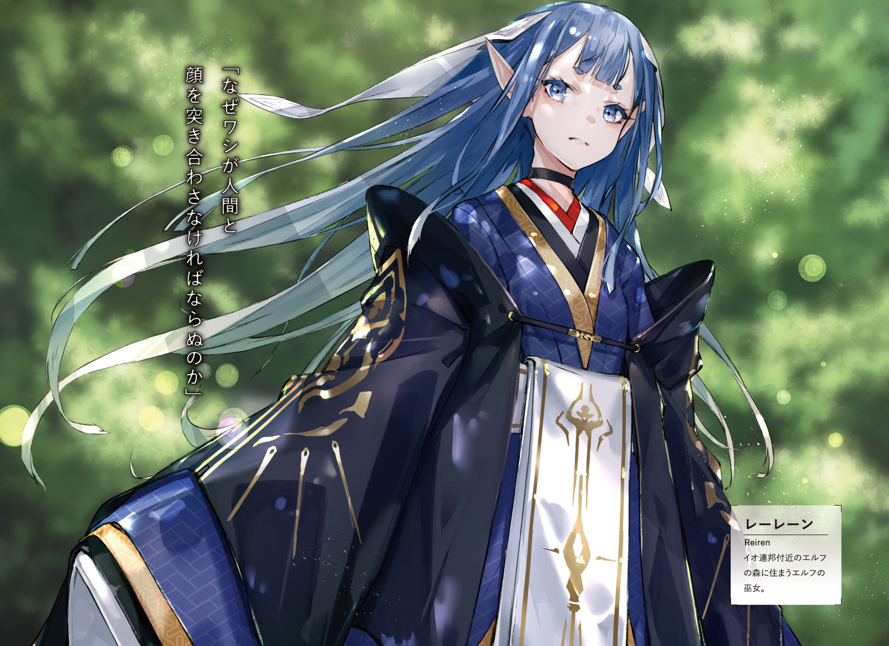

South part of Io, [Strange Marsh]
It was covered by deep blue glass.
The sound of engine was reverberating through these muddy lands.
Through dirt and glass, Urza Resistance military car was going towards the forest.

"I wonder why they call this place is called [Strange Marsh]?
It is just quiet marsh.
And there are no big monsters.
Even our car can pass through it without a problem."

"Beyond this point is..."

"Likely because you can see elven forest on other side of it."

Kai, who was sitting on passenger seat, and Saki, who was sitting in back, both started saying in response to their driver's grumbling.

"There are elven traps, guarding beasts of fairies and dwarf's guardian statues.
Even Io Resistance wasn't able carefreely explore this place."

"Putting aside this marsh, even I know about elven forest."

Three cars were moving together and Ashlan was driving the leading one.

"Anyway, so <ruby>emperor<rt>Dante</rt></ruby>-dono dashed into such dangerous place?
I don't get the way of thinking of these great people.
But this time it totally has no meaning."

Young man, who was tightly grasping wheel, furrowed his brows.

"They contacted us early morning, but since then there was no more contact with them.
No idea whether they were annihilated or captured, but they definitely should be able to predict it before even going."

"Right, besides both staff officer and commander's aide were with them..."

Saki's tone was heavy one.
Commander Dante suddenly took both of his trusted men and dashed into elven forest.
After that all contact with them was lost.
One would only suspect it as a joke.
Was it <ruby>Commander<rt>Dante</rt></ruby>'s own decision?
Or was it someone's else idea?
Soldiers, that were left behind at Resistance stronghold, were shocked by it.

"So, we're the one who is going to clean after him?"

Quite heavy sigh could be heard from Ashlan.

"Io's commander has been long lost, and we, who is going to search for him, are going to be missing too..."

"Aaa...Stop it, Ashlan! Don't wanna hear it."

Saki covered her ears and screamed.

"Hey, Rinne, you think so too, right?"

"...M?"

"Oh, are you not feeling well? As one would expect.
Jeanne-sama put a lot of effort to setup joint front with Io Resistance,
and that self-important Commander flushed it all in toilet.
Cannot believe it, you think so too right?"

"Yeah, as one would expect this time..."

Kai responded instead of Rinne.

"We just have to confirm it on spot."

If Commander Dante alongside his staff officer and soldiers were annihilated, then damage to the Io Resistance would be immeasurable.
And majority of people, like Saki and Ashlan, were thinking that <ruby>emperor<rt>Dante</rt></ruby> rush actions were the reason.

_It is troublesome, we cannot blame Dante alone._

_It is hightly likely that there was someone behind putting this idea into his mind._

This was suspicion shared by only four people.
Kai and Rinne here, and Fairin and Jeanne who were riding car behind.

"I'm sorry, Kai."

Rinne leaned over towards him, from back seat.

"I wish I could notice it earlier..."

"Rinne, you did nothing wrong. Just telling us about it was more than enough."

"Hm? Oi, oi, what's wrong, Rinne-chan?"

"It is all right, Ashlan.
Rinne is just worried  about current situation in her own way.
You better look in front of you instead.
There is swamp all over the place."

There was bottomless swamp, which was difficult to see under all of this grass.
If car would stuck there, it would be quite difficult to get out.

"You worry too much, we already can see it."

[Lead car, go to the right.]

Jeanne said over communication device.
And as per the instruction, Ashlan moved wheel to the right.
From the front window, they could see sea of tress that filled the horizon.
Ancient [Elven forest].
Since the dawn of history, it was unexplored territory for humanity.

"! Hey, look there!"

Saki's shrill voice could be heard.
She stood up and pointed towards where were four cars being parked.

[...These are Io's transports.]

Tension could be felt in Jeanne's voice.
Yesterday at early morning, <ruby>emperor<rt>Dante</rt></ruby>'s party stopped here and went into forest.

[We're getting off here.
Radio unit, notify our base.
We discovered what we presume to be Commander Dante's group transport. And...]

All three cars stopped.

[Now we commence the search.]

 
 

There were gigantic and ancient trees, which age was several hundred years.
Its roots were so deep that would be on par with height of adult.
And its trunk were so big that would fully cover your field of vision at short distance.
Trunk itself looked old: dry and cracked, and tree's roots were starting to wither at their ends.
Despite that leafs looked freshly and vividly green even now.
The reason was that these ancient trees were homes to foreign gods since ancient times.

"Elves and angels are always emitting small amount of magic power.
And since it continued like that for many hundred years, these trees grew big like that.
Well, it is mostly what people say..."

In front of forest that goes by name Elven Forest, was knight, who was leading group of people, turned around.
At front lined up Urza's elite forces, and behind them were Io's garrisoned forces.
These were soldiers who is going to carry out search within the forest.

"Captain Franz, Commander Dante passed through here?"

"Yes, early morning yesterday, Commander departed to the forest without any prior notice."

Captain, who had hollow cheeks, advanced further in with grim look on his face.
He already had 5 years experience of exploring the forest.
And a few days ago, he decided to help Jeanne's with search through the forest.

"Commander brought staff officer and his aide, together with dozens of our elite forces, and entered the forest..."

"As the one who has deep knowledge about this forest you suggested against, but your suggestion was denied."

"I'm very sorry..."

"I only confirmed the fact, there is no need to apologise."

Jeanne fixed her gaze on a animal trail.
Towards the road, in between enormous trees that stood like a wall, which was entangled by ancient tree's roots.
And there were Fairin and Rinne, who already stepped onto the road.

"Kai, here, here! Come quickly!"

"Yeah, but wait a bit, I need to prepare."

General purpose assault bayonet [Drake Nail]
Elven and Drake bullets.
Kai was loading in both kind of bullets and after confirming it being loaded, put on black bayonet.
Behind him were Saki and Ashlan, who were holding machine guns with grim look on their faces.

"Sorry for making you wait, Jeanne-sama...!"

"Corporal Saki, Corporal Ashlan, both are ready."

"Good."

In response to their salute, Commander gave short reply.

"Inform our comrades from Io Resistance.
Six of us will enter the forest in pursuit of Commander Dante with whom we loss all communication...
But, that's not a rescue operation. First we'll have to confirm his current situation."

_TL Note:_ You know, I think there is no need to save some retard like Dante...

There can be no rescue operation until <ruby>emperor's<rt>Dante</rt></ruby> condition will determined.
Whether he lost in forest, or have been caught by foreign gods, or maybe killed together with all of his people.
There were a lot possible scenarios to consider.
So their first goal was to confirm what happened.

"Corporal Saki will be reporting on hourly intervals.
Then as planned, Captain Franz, you should proceed to constructing the base.
This place is vital to our operation.
It shall become a line that connects us and hundreds of our soldiers at the headquarters.
You are not to abandon this place."

"Yes, sir!"

"And then you are to defend the base."

"Understood."

Jeanne's elite forces, who were accompanying them until now, saluted.

"Fairin-sama, we're leaving Jeanne-sama to you."

"It is just a simple walk.
It is nothing like our operation during capital's re-take...
Well then, Jeanne-sama, let us proceed."

Female bodyguard pointed towards inside of forest, and then started walked towards it.

"I'll be taking a lead.
Following me, Kai, Jeanne-sama, Rinne, corporal Saki, and then corporal Ashlan.
You should not be apart from the person ahead more than 3 meters."

"Understood."

Carrying his Drake Nail, he followed her.

 

They were in ancient forest, and sunlight could be seen through trees.
The ground was painted by colours of fallen leafs and flowers, young greenery were sprouting.
And breeze here felt pleasant.
Comparing to the ruins of the capital, the view here wasn't so bad with all these enormous ancient trees lined up in distance.

_It should be easy to spot wild animals._

_What we should be careful about are elven and dwarven traps._

Elven traps would be magical, while dwarven traps tends to be more physical devices like poisoned arrows or pitfalls.
But, that was a talk for when they'll be deep in the forest.

"We're going to advance for about 1 hour.
It should be safe as long as we take the road I took three days ago."

"Understood."

Fairin, who was holding her shamshir in the right hand, responded.

"Corporal Ashlan, Corporal Saki, how is our rear?"

"N-nothing out of order."

"We'll put our lives into ensuring safety...!"

Both responded with tension in their voices.
Commander Dante's party was already lost.
So if they'd be careless, the same fate would await them.
Understanding that, both were quite tensed.

"You should proceed with confidence.
After all you were part of unit that was responsible for assault on <ruby>dark empress<rt>Vanessa</rt></ruby>.
I trust you.
You're among few that I can rely on with certainty."

Jeanne shown a faint smile.
At Resistance headquarters, soldiers were obviously shaken.
Rather than by <ruby>emperor's<rt>Dante</rt></ruby> disappearance, they were more shaken by loss of contact with the de-facto commander Tsekhman.

"Rather than leaving it to them, I ought to move myself.
Besides...
There might someone else who sneaked their way into Io Resistance."

These words were said so that both of them, who were so vigilant, wouldn't hear.

"We need to confirm Qubiley's identity, so I haven't notified Io Resistance about Commander's aide."

"Yup, I'm not sure myself too."

Rinne, who was behind Jeanne, quickly responded.
All the while carefully looking at ancient trees.

"Still it is quite strange, she looks exactly like human."

There was single question that they had about Commander's aide Qubiley - does she belong to foreign gods races?
When Rinne saw Qubiley first time, she had some suspicions.
Elven feature was their long ears, and angels could be recognized by their wings.
Dwarf's skin is like a solid rock.
And fairies had bluish skin colour with childish bodies.
But as for her, there were no signs of such characteristics.
So it was a wonder why she was suspicious (to Rinne).
I.e. why she had peculiar smell and faint magic power.

"I felt she smell differently, but it is really only small difference.
There are lot of people around, so I wasn't not very confident."

"One more thing, Rinne, you said that you felt magic power from Commander's aide?"

"Yup, very weak magic power.
But foreign gods should have holders of far superior magic power, so I think she's the weakest among elves."

Was <ruby>commander's aide<rt>Qubiley</rt></ruby> a elf?
Cutting own ears, and disguising both her smell and skin.

"...For angels their wings are the organ that produce magic power so she wouldn't cut it.
And for both dwarfs and fairies disguising as human would be a very difficult task.
Therefore she is likely to be elf in disguise."

Jeanne muttered almost like whispering.
Though it was Kai's conjecture since when he heard Rinne's story day before yesterday.

[It is quite suspicious. You know... She doesn't smell like human.]

"<ruby>Emperor<rt>Dante</rt></ruby> might be arrogant, but he is not reckless.
This time it is not his own decision, but rather third's party instigation.
While it is certainly his own fault, I feel pity for him."

Said Jeanne who carried on through the road full of fallen leafs.

"And Rinne, thank you for providing us with such valuable information."

"Yup!"

_TL Note:_ You know what is strange, I wonder why Jeanne is not surprised at all by Rinne.
I mean sure Fairin has suspicion about Rinne, but I'm pretty sure Jeanne has no idea,
so it is actually kinda weird that she accepts the fact that Rinne can easily spot non-human and magic.

Rinne raised her voice, most likely out of happiness for being praised.

_It makes me worried though._

_I wonder if Jeanne hasn't noticed Rinne's true nature already._

Deep inside Kai already had cold sweat.
Humans are not able to sense magic.
Kai was racking his brain about how to explain the fact that Rinne could sense magic.
But the explanation was that Rinne received special training in true world.
And since there was special weapon like drake nail, so such special training wouldn't be all that surprising.

"Rinne, it might be absurd but I'd like to ask you one more thing."

Jeanne turned towards Rinne who was tagging along behind

"You were able to sense Qubiley magic power at Io's headquarters, so can you sense it here in forest?
Ideally would  be if you understand her current location."

"...That would a bit difficult, I think."

With serious face Rinne started to look around as if to show what she mean.

"You know this forest is completely filled with weak magic power.
Most likely it belongs to elves, drawfs and fairies.
So what I mean is that I can only understand that there are foreign gods."

"Finding someone in particular will be difficult?"

Listening to this conversion reminded Kai about another possible way to use [magic perception].

"Rinne, I'd like to ask you one thing, too. If you don't mind."

"Yup, what is it?"

"Can you sense elven's traps?
Most likely there should be lots of magic traps set across the forest."

Even if they couldn't sense Qubiley.
Their search would be much easier, if they could detect all these traps in the forest.

"You don't even need to detect precise location. Just [here is suspicions place] would be enough."

"Very well, I'll try my best!"

This time Rinne gave strong reply.

"Elven traps are quite ingenious so dealing with all of them would be impossible, but...
Kai, here, look."

Blond girl went towards road's side.
As he was thinking that she was going around the ancient tree, half of her body popped from tree's tree trunk side, beckoning him.

_TL Note:_ A bit unsure how to phrase it better, she basically went behind tree and then beckoned him to take a look

"See this tree. Ah, but be careful not to touch it."

"!?"

He stood put and held his breath.
There was magic circle.
On the tree's trunk was floating magic circle, which was shining with faint white light.

_Demons magic had purple colour._

_So this white belongs to foreign gods._

Magic circle was flashing again and again.
Regardless how long they waited, it wouldn't activate.
Which confirmed that it was attached to the tree itself.

"Elven trap was in such place?
Three days ago when we passed through here, neither me or Io soldiers noticed it."

"Jeanne, it would be better not to get too close to it."

Kai said towards knight who was staring at the trap.

"This kind of magic activates upon touch.
For insects or small animals like lizard it would be ok, but if human will touch it is definitely will get activated."

"...I'm curious what kind of trap is it, but I guess it would be better to not activate it?"

Jeanne had serious look on her face.
Behind were Saki and Ashlan timidly avoided looking at trap's shining.
And female bodyguard was walking around alone.
She was intensely looking at the ground, and then moved brushes aside with her shamshir.

"...It seems I found it."

She extended her hand and picked a single pistol out of the brush.

"Jeanne-sama, I think this is standard equipment of Io Resistance.
And there are no traces of it to be exposed to nature for a long time.
Most likely it has been dropped here very recently."

"So you mean Dante's group were...?"

"They activated the trap and were killed. Or perhaps captured?"

Jeanne receive the gun from Fairin.
After taking a look at it, knight pulled out the magazine.
Dropping the remaining bullets out of it, she looked at their number.

"All bullets are in place.
So they weren't attacked by elven forces in the forest.
Did they just carelessly walked into the trap?
...But to me it seems that it wouldn't be difficult to avoid such trap."

"No."

Kai, who stood besides Jeanne, pointed above their heads.

"Not this one, I bet it is the one above our heads."

He pointed at branches and leaves through which was flowing sunlight.
Jeanne, who looked there, opened her eyes wide and held breath.

"...This is real deal!"

On over hundreds of tree's leaves were floating circles.
Rather than one big magic circle, like on the ancient tree's trunk, small magic circles were stuck on each and every leaf.
And what's more troublesome is that together with sunlight filtering through trees, it was difficult to notice these circles light.

"Quite clever: hiding light of magic circles in sunlight filtering through trees."

Fairin took a breath with mix of surprise and admiration.

"I [see] now that it is been pointed out, but otherwise it would be nearly impossible to spot.
...Jeanne-sama, it seems emperor's group were done by it."

The trap, that was carved onto big tree, was but a decoy.

"Damn... That's really bad taste. Every leaf has the magic trap on it."

"Hey, Kai, will we be ok looking at it?
I hope we ain't going to be blown away by it all of the sudden?" _TL Note:_ Saki

"Well, I don't know that much, but just in case, Saki, Ashlan, you better to move away."

Both backed away in hurry.
And even more far behind, Rinne carefully stepped back.

"Kai, that's cool. I didn't notice it too."

"It was a pure luck.
I only remembered that elven magic traps tend to be multi layered."

In MDA's records it was stated that elves tend to place double or threefold layered traps.
And most likely it wasn't for humans, but rather demons, cryptids and spirits.

_That's why I've been looking nearby for it._

_I'm too was close to carelessly pass by it._

Cold sweat was followed along his cheeks.
If Kai wouldn't remember battle records from the true world, then Dante's situation would repeat itself.

"Ah, Kai, I think I found something."

Rinne beckoned him.

"Here, smell is strong."

"...Smell?"

"Most likely it is elven path."

Blond girl pushed aside brushes and there it was.
Not even 10 meters away from the animal trail, which Jeanne shown, there was thin road with many twists.

"There was such road? And even so close, to the road we took..."

"It is well hidden behind brushes and trees.
So it is not surprise that Jeanne-sama didn't notice it, and the same about Io soldiers."

Fairin looked back at the road.

"I see, they are observing humans from there?
It would seem Io Resistance scouting was exposed."

"They are formidable enemies in completely different sense than demons...
Rinne, are there any traps on this road?"

"Hm, I think none."

Rinne followed road, entangled by trees roots.
The sweet scent of forest was so strong that it was almost chocking.
Ground and hundreds of various plants completely covered the area, but Rinne's sense of smell would still be able to spot foreign gods.

"Ah."

And then she stopped at the place where roots started to disappear.
There was a clearing within the forest.
On the naked from grass ground was drawn a big magic circle.
With multiple complex patterns it looked like beautiful work of art.

He remembered it.
Comparing to previous trap, its size was much bigger.
And complexity of its patterns was on entirely different level.
As soon as he saw it, Kai remembered something similar from MDA's records.

"[Judgement gate].
It is teleportation device of foreign gods...!"

"I remember it from Urza.
Demons were using teleportation.
This magic is different from a trap.
Even if human would touch it, it is not going to activate."

Jeanne held her hand over the light circle.
And then she carefully placed  her foot on it, but nothing changed in the light circle.

_TL Note:_ I'm not sure it is actually good idea to test it yourself, Jeanne...

"As I thought it is only usable by foreign gods.
Most likely it leads to elven den, so it would be great if we were able to activate it."

Jeanne sighed.
Under her foot the circle's light started to become brighter.
And then all of the sudden it risen in the middle of air.

"What!?"

"Jeanne-sama, please move away, it is starting!"

Fairin rushed towards her master.
But both were already wrapped into the light.
And then it expanded towards Kai and Rinne.
Up until it covered even Saki and Ashlan.

_What is meaning of this? It is supposed to be activated by foreign gods only._

_There are none here and yet... Ah I see!_

It was Rinne.
He met a gaze of confused Rinne.
Her body has foreign gods factor.
But who would expect that it would catch even Rinne by surprise.

"Kai!"

"Rinne! Can you..."

Stop activation of this magic?
Is what he tried  to say, but soon enough his vision became pure white light.

-------------------------------------------------------------------------------

In depths of ancient [Elven forest].
Intense light fell onto his eyes.
Kai stood alongside with Rinne in clam and lighted by sun clearing.

"Jeanne-sama, are you injured?"

"...No problem."

There were Jeanne and Fairin.
And away from them were Saki and Ashlan, who fell on their backs.

"Ashlan, you shameless, you used this opportunity to grab my ass!"

"No-no, your ass just placed itself under my hand!"

"Silence, do not raise your voice within enemy positions."

Fairin words quickly silenced both of them.

_This is?_

_Doesn't look much different from before teleportation._

Ancient trees were growing nearby, and the place was hidden by surrounding it brushes.

"Rinne, can we return back?"

"...Yup, if it reacted to me, then if I start it once again we should be back at the same place."

Rinne nodded and responded with low voice.
But then brushes shook at the same time.

"Oh, what a pretty butterfly! Wait, wait, become Silk's friend!"

The one who jumped out of brushes was small person of foreign gods.
With big golden eyes, gradient hair that changed from fluorescent green to light pink and height around Kai's waist.
She was wearing sorceress like long robe and hat, almost like out of fairy tail.

"...Fairin, is that...?"

"Please step back, Jeanne-sama.
It is without doubts a fairy.
But luckily she didn't notice us yet."

The girl, that was running around after butterfly, belonged to race of fairies.
Fairies were known to live up in a tree and they rarely go outside of forest.
So it was quite rare for them to appear in front of people.

"Wait, wait... Oh!?"

Fairy stumbled upon Ashlan's foot and rolled over.

"Ouch! What is with this stump...Oh..."

Fairy looked up at Ashlan.

_TL Note:_ Damn, Ashlan, cannot you at least be considerate of loli

Next she looked at Saki, then Kai with Rinne, and then at Fairin and Jeanne.

"From which forest are you, elves?
Oh, but I don't feel magic power from you?"

"Well, no, we're humans." _TL Note:_ Damn that's certain fail.

"...Fue?"

Fairy stared blankly at Ashlan, who blurted out on reflex.

"Human...Human...Hu...! Hyaaaaa! Human!? Don't eaaaaat me!"

"H-hey, wait!"

"Saaaaaaaaaaaaaaave me!"

She stamped ground with her short legs and quickly run away.
As she hid within brushes, from where she came, in few seconds there was no signs of her presence.

"Let's chase after, since she run so fast, there might be something."

_TL Note:_ No, I think she is just scared

Pushing aside all plants Jeanne advanced.
It was narrow path enough for single person.
Following the path, two enormous ancient trees stood, like a gate.
And then, in front of this gate, two young elven girls were standing with bows.

Both exchanged glances.

[Humans!?]

[How they came here!]

It was difficult to hear them, but that was definitely human speech.
They glanced with rising hostility towards them and started preparing their arrows.

"Jeanne-sama, move behind me. I'll restrain them."

Fairin readied her shamshir and prepared to launch towards them.
But, all of the sudden Urza strongest warrior narrowed her eyes and stopped.

"I see, you are no longer planning to hide your true nature."

"You surprised me. Who would think you'd chase us up to this hidden village."

There was beautiful woman with long light hair.
The one who was supposed to be lost alongside <ruby>emperor<rt>Dante</rt></ruby>, Commander's aide Qubiley.
But now she was walking out of two ancient trees.

"I'm glad to see you're safe and sound, Commander's aide. No, should I say foreign gods spy?"

"Qubiley will suffice, paladin Jeanne."

Her smile remained the same at face of Jeanne's sarcasm.
Accompanied by two elven guards on both of her sides, she had no desire to continue hiding the fact that she is elf.

"Allow me to ask this: how did you reach this place?
If you'd brute force your way through the forest, then guardian beasts would certainly make some noise."

"That's exactly right, I came here to in search our dear emperor-dono."

"For such human?
In my opinion as Commander's aide, comparing to such human, staff officer Tsekhman ten thousand times more superior."

"What happened to them?"

"I guided them to this forest.
All I had to do is to give a proposal to our great majesty Dante.
Then I entrapped them. So what do you think happened?"

Qubiley responded with sleek smile.
Facing her now, he could see her smile as quite beautiful, but it was obviously different beauty from that of human girl.

"Don't make such scary face, Commander.
They are all alive.
Since they breathed in quite a lot of my paralysis flowers, they will not be able to move even a finger for next few days."

"That's surprising. Wouldn't you want to use this information to negotiate with us?"

"I have something I'd like to ask."

Saying so, elf folded arms under her chest.

"Commander Jeanne, I actually wanted to have opportunity for us to talk like that.
Is it true that you defeated that monster in northern country?"

"If you mean demon's hero, then yes, it is not a lie."

"I couldn't believe it when I heard it first time.
I was wondering just what kind of strategy or weapon you would use to defeat such monster.
But now, I can image the reason."

Her gaze was fixed not on Jeanne, but Rinne who stood behind.
For elf it would be obvious that Rinne holds great magic powers, and of course that she is not human.

"As you might already guess, behind me is elven village.
And frankly speaking I suspect six of you are far more dangerous that the whole Io Resistance forces."

"Because we defeated demon's hero Vanessa you mean?"

"Yes, truth to be told I don't want you to live, but I'm afraid there will be lot of casualties if we try to harm you.
It would be not desirable for us to be attacked by other races while we're exhausted."

Elven girl took a short pause.

"Therefore I have a proposal.
First we'll turn in humans, this much is obvious."

"You mean, you'll release captured humans?"

"In addition to that, we'll guarantee your safety and will swear not to attack you until you'll leave the forest."

"...And what you ask in return?"

"It is quite simple matter, at least for you who defeated demon's hero.
At the forest's north there is angel palace."

Qubiley pointed towards deep within forest.

"Please go to angel palace and fight angels."

"..."

Jeanne and Fairin both gulped.
Saki and Ashlan became speechless in amazement.

"Hey, I don't get you, you know?"

Rinne raised a question to voice her doubts.

"Are you going to betray your race?
Aren't bonds within foreign gods supposed to be strong?"

"Angels already betrayed <ruby>us<rt>elves</rt></ruby>."

Qubiley's smile disappeared.
And she squeezed her next words from her tightened lips.

"I'll explain situation, please follow me."

 
 

Elven hidden village.
It was place where foreign gods were living and the only thing that was known about it is that it is not present on mankind maps.
In short it was [unexplored region] for humans.

"It is first time for humans entering this village.
You shouldn't expect welcome, but feel free to be proud."

Elven village was the village made on ancient tree.
Branches that connected ancient trees were used as floor.
And the same tree's branches were combined to create small houses.
Looking above, they could see altar which was watched by around hundred elves.
Qubiley turned around.

"Light Knight Jeanne, you're wearing elven dress under your armour, right?"

"...That's right."

Symbol of knight Jeanne wasn't her armour, but rather the thin and light silk dress under it.
Spirit light battle attire.
It was one of the elven treasures.
Holding the greatest power to resist magic, it could play a role of trump card against wielders of magic like demons.
And it would seem the elven spy spot it out immediately.

"Where you got your hands on it?"

"Along the Urza's borders.
It was part of our spoils that we took during our surprise attack on demons, which in turn took it from you.
Well, it is more than 10 years old story though."

"That makes me relieved, if you'd took it away directly from us, then Reiren-sama wouldn't overlook it."

Kai narrowed his eyes at the sound of unfamiliar name.
Shortly after, three elves descended using ladder from up of the tree.
Two of them were armed man, with the one in the middle who had appearance that of young girl around 15-16 years old.
But contrary to her small build, her ears were far longer than that of others two.

_The longer elf's ears, the longer he lived._

_And the one in the middle should be the eldest here._

She was wearing seven layered kimono, similar to Jeanne's silk spirit garments.
And the elven girl had long and beautiful gradient hair, which was almost reaching the ground.
Her young looking face radiated the light of certain intelligence.
And her personality was also peculiar.

"How provoking."

Elven girl grimaced upon seeing Kai's group.

"Why ought we to mingle with Urza's humans.
Our village is already dirtied with their smell.
This vulgar race should leave right now."

"Reiren-sama."

"But this is only my dissatisfaction, which for now I'll keep to myself."

_TL Note:_ Sure, we believe you Reiren-chan.

The elven girl, who has been introduced by Qubiley, sighed.

_This prideful attitude..._

_Fits image of foreign gods._

If demons were known for their love for battles, foreign gods were known for their high pride.
But, once you put it into perspective.
Someone like that who speak frankly is far easier to deal with than for example Qubiley who pretends to be human with her beautiful smile.

"I'm village's shrine maiden, Reiren.
I heard from Qubiley about thou.
Thou are ones who defeated that demon hero."

The elf looked at Kai's party once more.

"That monster once had a fierce battle with Heaven Lord Alfreyja-dono.
At that time the outskirts of our forest turned into ashes.
And for thee to defeat that Vanessa is simply unbelievable..."

"If it is so unbelievable, I would say what we heard is equally unbelievable."

Jeanne looked up the trees.
There were appearance of elves, fairies and dwarves.
There were several hundreds of them, carefully listening to conversation between <ruby>shrine maiden<rt>Reiren</rt></ruby> and <ruby>knight<rt>Jeanne</rt></ruby>.

"Is it true that elven elder have been captured by Heaven Lord Alfreyja?"

"If it wouldn't be, then we wouldn't even talk about it."

Shrine maiden took a seat on big leaf that was laying out.

"Heaven lord has changed.
Once such calm and strong person, who illuminated the path for foreign gods like a sun..."

"Elves are no longer necessary to him?"

"The same about dwarves and fairies.
We are beneath angels."

Foreign gods were consisting of four races.
And everything went wrong once Heaven Lord Alfreyja suddenly declared that they are not equals, but beneath angels.

"Of course it was unacceptable.
After discussing among three races, elven elder alongside representative of each race headed for angel palace,
in order to appeal directly to Heaven Lord, but..."

"They didn't return."

"Correct. However if we are to go to the palace uninvited, then rift with angles shall become unrepairable."

"So that's why we are the one to do it?
So the idea is while humans invade the palace and rampage there, elven elder could coincidently escape.
Regardless of whether we'll be successful or not, it will not affect elves."

"That's right, if thou shall be crushed, we shall pretend to know nothing.
But if, thou are to free our elder, we'll release captured humans."

"...Fairin."

Jeanne exchanged glances with female bodyguard nearby.

"Do you think it is feasible?
For six of us marching into angel's den and freeing captured elder under strict guard."

"Impossible. It is likely we'll be surrounded and completely annihilated."

Bodyguard replied without hesitation.

"In first place there is no proof to what they said.
And it is possible that if six of us go there, we'll be met by coalition of angels and elves."

Kai had a similar suspicions.

_It could be a clever scheme to deal with us who invaded their village._

_Using angel forces they could trap us. Which would be a certain way to crush us._

Their explanation about captured elven elder by itself was not enough for a trust.

"I'll put my own neck on the line."

All of the sudden the former aide of Io Resistance Commander said.

"Qubiley? What!?"

"In any case until they'll reach the angel palace they'll require someone to guide them.
And this duty will be mine."

Former Commander's aide put her hand on the chest.

"While on our way to the palace, if you think we lied to you, then feel free to do whatever you want with me.
Whether you'll take me hostage or cut into pieces, you're free to do as you wish."

"Rejected. It is just not enough" _TL Note:_ `却下。天秤が釣り合わないな` she talks about balancing weights, but I'm not sure how to put it in english. TODO

Fairin outright denied her declaration of being ready to put her own life.

"We have six people here, and not to mention twenty more hostages.
It is quite arrogant for you to say that your life alone would suffice."

"..."

"Either increase head count, or think of a better alternative."

"So imprudent."

Young girl, who was sitting with her legs crossed, raised her knees.

"So what thou means is that rather than Qubiley, it is me, shrine maiden, who ought to accompany thee.
If I lied to thee then my own life shall be in danger."

"If there were no lies in your words, then it should be fine to accept such proposition."

"But is that actually good idea?
Despite my appearance I'm representative of my race.
In thy words would be millennium rank.
Do not expect it to be easy to take my life."

The elven girl, who was dressed in seven layered spirit garments, was without doubt far stronger than Qubiley.
Her accompanying them would only increase the danger. _TL Note:_ `同行させれば、常に寝首を搔かれる危険も内包することになる。` Last sentence is a bit unclear to me in exact meaning.

"I do not think you're stronger than demon's hero."

"...Human, I say thee are pretty good."

In response to Fairin, elven shrine maiden Reiren responded with belligerent expression.

"Isn't it a fine idea, I shall accompany thee.
We'll sneak into the angel palace and I'll guide thee to their prisons.
This ought to satisfy thee?"

"Shrine maiden!?"

"Please wait, if something would happen to shrine maiden in such situation..."

"Alfreyja-dono has changed already.
And there are no guarantees that elder will come back to us.
If we are to remain put, then it would only assert that elves submitted to angels.
Am I wrong?"

Shrine maiden raised her voice so that her comrades above would hear.
It's volume was enough to even shake leafs of ancient tree.

"Fairies and dwarves, they are yet to make a move.
If we are to offend Alfreyja-dono then it shall lead us to civil war.
This plan is but mine alone.
In worse case my life alone shall be at stake." _TL Note:_ `最悪の事態にはワシの命一つでどうにでもなる` I rephrased last sentence, need to re-think?

"Shrine maiden..."

"The talk is over. Everyone, return back!"

Elves, dwarves and fairies started to disperse.
Likely to return back to their duty of defending vast forest.

"With this there should be objections."

Young girl stood.
Her seventh layered spirit garments fluttered together with her light gradient hair.

"Remember it, human commander.
This convent between elves and thee.
Make absolutely no mistake.
If thee shall lose nerve, thee shall not return back alive from this forest" _TL Note_: Might need to re-check `土壇場で怖じ気づいてみよ。この森から生かして帰さん`

"You don't have to say it twice."

"Splendid, then let us discuss small details.
And... It is annoying, but at least for today and tomorrow thou are my guests.
Oi, Silk."

She clicked her fingers.
At that sign fairy, who previously run away, came along.

"Prepare seats."

"Yes!"

With cheerful voice, the fairy started moving her fingers, as if stirring the air.
And at the same time under Kai's feet started to gather small wind.
It was strong enough to bristle their hair.
And as the wind floated, leaf of ancient tree fell at Kai's foot.

"Fairy magic?"

Big leaf was on the ground.
Not only for Kai, but Rinne, Jeanne, Fairin and Saki with Ashlan, each got own leaf from ancient tree.

_Did she just rise winds by moving only her fingers alone?_

_To bring these leafs here?_

The fact that that magic activation didn't even have a noticeable light was worthy of a praise.
It was quiet to a frightening extent, and such subtle wind was able to bring these leafs here.
This was the fairy magic.
It was delicate power, quite different from destructive magic of demons.

"Wow, so cool. Is it ok to seat here?"

Rinne looked in amazement at the leaf in front of her.

"We have to discuss small details yet, so seat down already.
I have no desire looking up while talking."

Once again sitting down with her legs crossed, shrine maiden Reiren told them.

 
 

Unexplored region [Elven hidden village].
Above his head sky has been painted by night.
In comparison with bright day when sunlight filtering three trees, night was completely dark.
The only source of light was lit bonfire in front of Kai.

"...How brave to sleep so soundly here."

Behind Kai, who was sitting on ancient tree's leaf, was Rinne.
She was asleep on multiple leafs that were spread on the ground.
Turned sideways, she was breathing in her sleep with a cute sound.
He wasn't sure how long it is been since she went to sleep.

_Even though there is a risk of being attacked by elves at night..._

_She isn't even slightest catious._

One could only wonder whether she trusted their story during day, or was it just her boldness.
Though he recalled that she was also soundly asleep during their stay in [Neo Vishal] hotel, despite it being full of humans.
So he suspected the latter, or maybe she was just confident enough to perceive attack from elves.

"Still awake?"

In the middle of the night he could see young elven girl, reflected in the fire.

"Both plants and animals are asleep.
Yet humans lit fire to keep themself awake.
It is beyond my understanding."

Said shrine maiden Reiren.
Then she turned towards soundly asleep Rinne.

"We have no intention to attack thee in the thy sleep.
As long as our contract is intact, I have no intention of harming thee."

"...Understood."

He sheathed back his bayonet, which he drew as precaution.

"Jeanne, commander of thine, said that the ones who defeated that Vanessa were thee and this girl.
Therefore I have something to ask."

"How did we beat her?"

"I'm not greedy to such extent.
Besides that's a leverage to keep elves in check, isn't?"

Responding with serious face, elven girl sat down in front of Kai.

"I only wish to ask you one thing:
The way thee defeated Vanessa, will it work on heaven lord Alfreyja too?"

Kai was wondering whether because she was talking with him, but she omitted honorific [dono] now.
Or maybe...

"I think it might or might not work."

"Hou?"

"When I thought together with Rinne, there were several factors mixed in.
If we'd to fight her once again, I'm honestly not sure about our win."

He lost count of how many times they were on a verge of defeat, and how many times luck was on their side.
And on of these [factors] was...

_That eerie and weird creature that I no longer want to recall..._

_Without doubt it was thanks to that monster's intrusion that I was able to defeat Vanessa._

That so-called rasterrizer monster attacked Vanessa, which turned it into 3 vs 1 fight.
And it's attack gravely wounded Vanessa.
Moreover it was thanks to Code Holder's effect that he was able to make final push against Vanessa.

"Leaving that aside I want to ask why?
Why you asked us to help free your elder.
If we meet angels there, we'll have to break through with force."

In worst case scenario they'll have to fight Angel's leader Alfreyja.
There was no necessity to fight, and even risking own head with such deal.
But right now he didn't hear Reiren's muttering something like that. _TL Note:_ `だが今のレーレーンの呟きはそう聞こえなかった` I'm a bit unsure here as it is kinda hard to grasp, whether it supposed to mean that Kai kept his thoughts about Alfreyja to himself, or whether she didn't mention it.

"And I heard you hold hopes for us to defeat foreign gods hero."

"I'll give a warning to thou."

Young elven girl, standing in front of fire, responded with low voice.

"If we'll be discovered it shall come to this.
Whether thee hopes or not, today's Alfreyja-dono will listen to no words.
So it shall become a fight for survival."

"..."

"If thee shall be winner, then we'll be rescuing our people in captivity."

"And if we lose?"

"Thee shall not return alive.
But so that we clear, I'm at most a guide.
I have no intention of turning against angels and creating ruckus while saving our elder.
Everything shall be thou, humans, deeds.
Understand this much."

"I understand that much. In first place I had no intention of fighting together."

If elves are to attack angel palace, then foreign gods will descend into civil war.
That was the reason why Reiren wasn't planning to participate in battle.
Moreover, the same could be said about dwarves and fairies.
If heaven lord Alfreyja wrath would fall onto elves, two other races had no reason to incur angels wrath.

_But if there is even a slight chance that it would come to this..._

_Does this shrine maiden intend to present her own neck in order to beg mercy?_

Not to humans, but Alfreyja.

"How vexing... Why must we accept help of humans?
Did our people fall so low?"

Under fire's light she smiled in self-derision.
And then elven girl stood up.

"We shall depart at early dawn.
There are no problems?"

"None, but Jeanne is yet to return back though?"

"If thee are uncertain then why not contact her over that communication device?
Both Jeanne with Fairin and thee are free to do as you will."

The girl who was now standing looked at him.

"No need to worry, they shall be back to village.
I have something I want to ask Qubiley.
Well, for the most part, it is about time she spent hiding among Io Resistance."

"..."

"Do thee find it unfair?"

"It is humans fault for not spotting Qubiley. There is nothing unfair about it."

There was nothing beautiful about Great War.
Moreover the whole surprise attack on demons in capital, done by Urza Resistance, wasn't fair and square too.

"By the way, about what you mentioned previous, what if by some chance we'll defeat Alfreyja?
What are you intending to do?"

"What? Are thee worried even about such things?"

The elven girl who was serious until now, looked back at him with a grin.

"This strategy of our is itself a treason against angels.
Are thee perhaps worrying whether I have ambition to become foreign gods hero once Alfreyja shall be slain by thee?"

"Yeah, after all you're cunning."

"Ain't thee quite sharp?
If thee wishes to survive tomorrow, keep it up."

Towards small back of young girl, who turned back and started leaving, Kai said:

"One last question."

"What is it? But I'm warning thou. If I hear some rudeness, I shall cut thee tongue."

"Do you know human by name Sid?"

"Who that could be?"

"No, never mind if you don't know. Sorry to keep you."

Her long hair shook and young started walking away.
Kai was waiting to make sure he is alone.

"She doesn't know. After all..."

Kai looked at the sky above.
As for other races, demon hero Vanessa knew about Sid.
And so it made Kai wonder about foreign gods.
If elven shrine maiden knew nothing then likely the same could be said about rest of elves.
But it might be different for foreign gods hero.

[He predicted that some strange phenomena is going to happen with world.]

[There is someone who tampered with the world. He should be among three remaining hero.]

Heaven lord Alfreyja had a sudden change.
This was something he heard from shrine maiden Reiren and that made his heart's beating uncontrollable alongside his thoughts.

_I don't think that hero's change is coincidental._

_That makes Alfreyja a prime suspect._

_TL Note:_ Personally I think Kai is too optimistic about it.

Changing to results of Great War in true world.
And then drawing a scenario where angels decided to dominated other races among foreign gods.
So far he could understand
But...

_TL Note:_ Might need to re-evaluate `そう考えることで合点もいくのだ。`

The means were unknown to him.
And he couldn't even imagine what kind of power could overwrite the world itself.

"I guess only Sid knew...?"

Watching fire alone, Kai clenched his fists.
